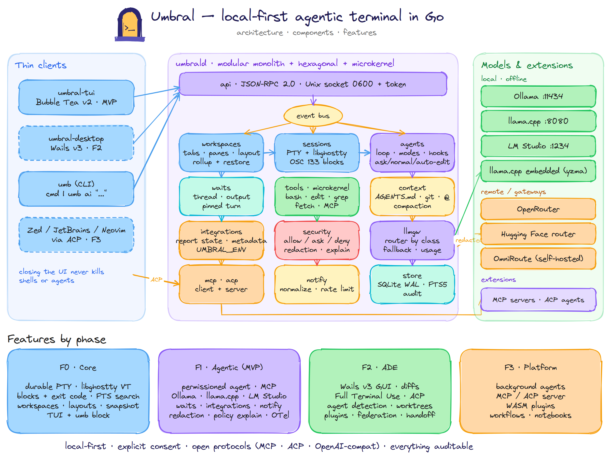
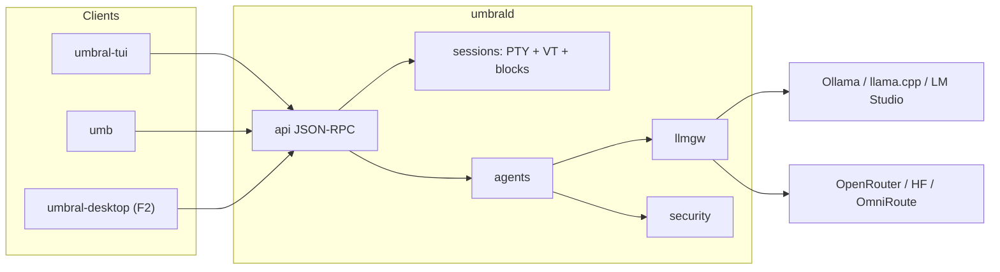

<p align="center">
  
</p>

<h1 align="center">Umbral</h1>

<p align="center">
  <b>A local-first agentic terminal, written in Go.</b><br>
  Command blocks, an agent with explicit permissions, and local models (Ollama, llama.cpp, LM Studio) as first-class citizens.
</p>

<p align="center">
  <a href="https://github.com/ecrespo/umbral/actions/workflows/ci.yml"></a>
  
  
  
</p>

> *Umbral* is Spanish for **threshold**: the stone step under a door, the exact point between inside and outside.

---

## Status

🚧 **Phase F0 in progress.** The quality gate passes with no critical findings; two change proposals
are pending ratification under [`changes/`](changes/), and only one of them blocks anything
(T-F0-14). Alongside the full SDD package (constitution, PRD with EARS, API, technical
design, data model, plan, tasks and Analyze), `umbrald` already exists: it owns durable PTY sessions
with a libghostty emulator, streams them over a 0600 JSON-RPC socket, records a block per command
from the shell integration, and searches 100,000 blocks in under a millisecond. Tasks
[`T-F0-01` … `T-F0-10`](specs/tasks/umbral-f0-tasks.md) are done. Next: the `umb` CLI, the TUI and
the workspace/pane orchestration surface.

## What Umbral will be

- **A modern terminal:**
  - VT emulation with libghostty;
  - durable sessions that survive closing the UI;
  - **blocks** per command (output, exit code, cwd, duration) with search.
- **An agent that asks first:**
  - reads blocks, files, git and project rules (`AGENTS.md`, `CLAUDE.md`…);
  - proposes and applies changes with explicit approval, in `ask` / `normal` / `auto-edit` modes.
- **Truly local-first:**
  - works offline with Ollama, llama.cpp or LM Studio;
  - whatever leaves the machine is redacted and logged.
- **Structure that scripts can drive:**
  - workspaces, tabs and panes owned by the daemon, with portable layouts;
  - one glance tells you which project is blocked, working or ready to review;
  - waits (`thread.wait`, `send --wait`) so another agent or a shell script can drive a thread.
- **Open protocols:** MCP for tools, ACP for external agents (Claude Code, Gemini CLI, Codex…) and OpenAI-compatible APIs for models.



<sub>Editable source: [`docs/diagrams/umbral-architecture.excalidraw`](docs/diagrams/umbral-architecture.excalidraw) (open it at excalidraw.com).</sub>



## Roadmap

| Phase | Content | Status |
|---|---|---|
| F0 Core | daemon, PTY, libghostty, blocks, search, workspaces and layouts, snapshot, TUI, `umb block` | ⏳ next |
| F1 Agentic (MVP) | permissioned agent, model gateway, MCP, redaction, waits, integrations, notifications, OTel | 📋 specified |
| F2 ADE | Wails v3 GUI, Full Terminal Use, Active AI, ACP, worktrees, SSH, Windows | 🔭 horizon |
| F3 Platform | background agents, MCP/ACP server, WASM plugins | 🔭 horizon |

## Documentation

| Document | Purpose |
|---|---|
| [`docs/ARCHITECTURE.md`](docs/ARCHITECTURE.md) | research (Warp, Wave, Crush, Zed/ACP) and conceptual architecture |
| [`docs/adr/`](docs/adr/) | architectural style (ADR-0001) and orchestration surface (ADR-0002) |
| [`specs/constitution.md`](specs/constitution.md) | non-negotiable principles |
| [`specs/`](specs/README.md) | PRD, API, technical design, data model, plan, tasks and Analyze |
| [`changes/`](changes/) | change proposals; two are pending ratification (`2026-09-structure-migration`, `2026-09-cli-surface`) |
| [`changes/_archive/`](changes/_archive/) | the eight folded proposals, kept as history |
| [`docs/GETTING-STARTED.md`](docs/GETTING-STARTED.md) | how to start development with Claude Code |
| [`assets/branding/umbral-icons/`](assets/branding/umbral-icons/README.md) | icons for Linux, Windows and macOS |

## Development

The project follows **Spec-Driven Development** in *spec-anchored* mode:

1. `specs/` is the current truth.
2. Every task cites its requirements (`REQ-XXX-NNN`).
3. Every test cites the requirement it verifies.
4. Changes to specified behavior enter as a Delta in `changes/`.

Read [`CONTRIBUTING.md`](CONTRIBUTING.md) and [`AGENTS.md`](AGENTS.md) before opening a PR.

```bash
python3 tools/sdd_check.py     # REQ → task coverage and schema validation
node tools/mermaid_check.mjs   # validates Mermaid diagrams (run npm install --prefix tools first)
```

## License

[Apache-2.0](LICENSE) © 2026 Ernesto Crespo
