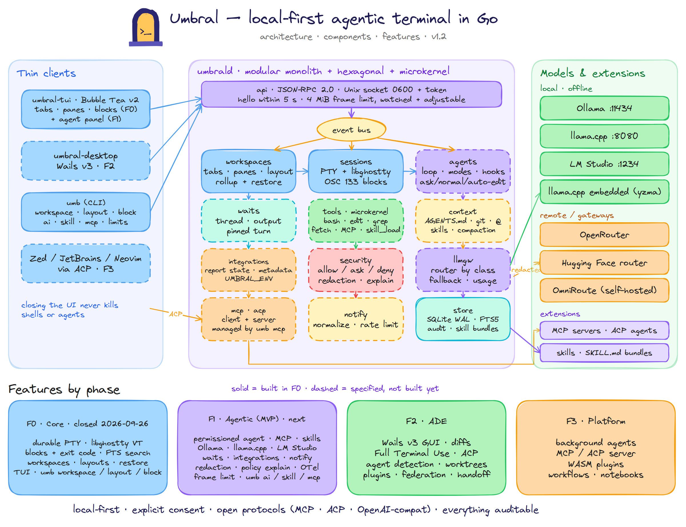
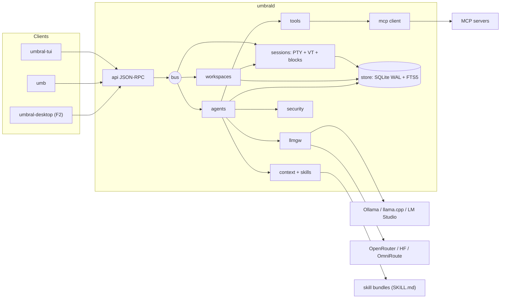

<p align="center">
  
</p>

<h1 align="center">Umbral</h1>

<p align="center">
  <b>A local-first agentic terminal, written in Go.</b><br>
  Command blocks, an agent with explicit permissions, and local models (Ollama, llama.cpp, LM Studio) as first-class citizens.
</p>

<p align="center">
  <a href="https://github.com/ecrespo/umbral/actions/workflows/ci.yml"></a>
  
  
  
</p>

> *Umbral* is Spanish for **threshold**: the stone step under a door, the exact point between inside and outside.

---

## Status

🚧 **Phase F0 is closed (2026-09-26); F1, the agent, is next.** The terminal core is built and
verified against a running daemon, and the full SDD package (constitution, PRD with EARS, API,
technical design, data model, plan, tasks and Analyze) stays the current truth.

**What works today** — tasks [`T-F0-01` … `T-F0-27`](specs/tasks/umbral-f0-tasks.md):

- **`umbrald`** owns durable PTY sessions with a libghostty emulator and streams them over a 0600
  JSON-RPC socket. Every pane gets `TERM=xterm-256color`, whatever terminal the daemon started from.
- **Blocks:** one per command from the shell integration (bash, zsh, fish), searched across
  100,000 blocks in a few milliseconds against a 200 ms budget.
- **The workspace tree:** workspaces, tabs and panes addressed as `w1`, `w1:t2` and `w1:p3`, and
  portable layouts that rebuild anywhere, panes, working directories and launch commands included.
  After a `kill -9` the tree comes back, and a stored command is typed at the prompt, never run.
- **`umb`** drives all of it from a script: `umb status`, `umb block …`, `umb workspace`, `tab`,
  `pane` and `layout`, and `umb api schema --json` publishes the protocol.
- **`umbral-tui`** — tabs, splits and a block list — passes its tests and its
  [manual checklist](docs/qa/f0-tui.md). A week of it as the main terminal is the release 0.1 gate.
- **Gates, not prose:** three of the four performance NFRs fail CI on a regression, and CI is green
  on Linux and macOS.

**Next, in F1:** first a handshake deadline (`T-F1-32`) and a frame limit the daemon enforces in
both directions, watches and lets `umb limits` adjust (`T-F1-33`); then the permissioned agent, the
model gateway, MCP servers managed with `umb mcp`, and skills installed with `umb skill`.

## What Umbral will be

- **A modern terminal:**
  - VT emulation with libghostty;
  - durable sessions that survive closing the UI;
  - **blocks** per command (output, exit code, cwd, duration) with search.
- **An agent that asks first:**
  - reads blocks, files, git and project rules (`AGENTS.md`, `CLAUDE.md`…);
  - proposes and applies changes with explicit approval, in `ask` / `normal` / `auto-edit` modes;
  - is extended with MCP servers (`umb mcp`) and **skills** (`umb skill`): local `SKILL.md` bundles
    whose descriptions it always sees and whose bodies it loads only when a task needs them, as
    untrusted content that can never widen a permission.
- **Truly local-first:**
  - works offline with Ollama, llama.cpp or LM Studio;
  - whatever leaves the machine is redacted and logged.
- **Structure that scripts can drive:**
  - workspaces, tabs and panes owned by the daemon, with portable layouts;
  - one glance tells you which project is blocked, working or ready to review;
  - waits (`thread.wait`, `send --wait`) so another agent or a shell script can drive a thread.
- **Open protocols:** MCP for tools, ACP for external agents (Claude Code, Gemini CLI, Codex…) and OpenAI-compatible APIs for models.



<sub>Editable source: [`docs/diagrams/umbral-architecture.excalidraw`](docs/diagrams/umbral-architecture.excalidraw) (open it at excalidraw.com).</sub>


```mermaid
flowchart LR
  subgraph Clients
    TUI["umbral-tui"]
    CLI["umb"]
    GUI["umbral-desktop (F2)"]
  end
  subgraph D["umbrald"]
    API["api JSON-RPC"]
    BUS(("bus"))
    WSP["workspaces"]
    SES["sessions: PTY + VT + blocks"]
    AGT["agents"]
    CTX["context + skills"]
    TOOLS["tools"]
    MCPC["mcp client"]
    GW["llmgw"]
    SEC["security"]
    STORE[("store: SQLite WAL + FTS5")]
  end
  LOC["Ollama / llama.cpp / LM Studio"]
  REM["OpenRouter / HF / OmniRoute"]
  EXT["MCP servers"]
  SKL["skill bundles (SKILL.md)"]
  TUI --> API
  CLI --> API
  GUI --> API
  API --> BUS
  BUS --> WSP
  BUS --> SES
  BUS --> AGT
  WSP --> SES
  AGT --> CTX
  AGT --> TOOLS
  AGT --> SEC
  AGT --> GW
  TOOLS --> MCPC
  MCPC --> EXT
  CTX --> SKL
  GW --> LOC
  GW --> REM
  SES --> STORE
  WSP --> STORE
  AGT --> STORE
```

## Roadmap

| Phase | Content | Status |
|---|---|---|
| F0 Core | daemon, PTY, libghostty, blocks, search, workspaces and layouts, restore, snapshot, TUI, `umb` for blocks and the workspace tree | ✅ closed 2026-09-26 |
| F1 Agentic (MVP) | handshake deadline and frame limit (`umb limits`), permissioned agent, model gateway, MCP (`umb mcp`), skills (`umb skill`), redaction, waits, integrations, notifications, OTel | ⏳ next |
| F2 ADE | Wails v3 GUI, Full Terminal Use, Active AI, ACP, worktrees, SSH, Windows | 🔭 horizon |
| F3 Platform | background agents, MCP/ACP server, WASM plugins | 🔭 horizon |

## Documentation

| Document | Purpose |
|---|---|
| [`docs/ARCHITECTURE.md`](docs/ARCHITECTURE.md) | research (Warp, Wave, Crush, Zed/ACP) and conceptual architecture |
| [`docs/adr/`](docs/adr/) | architectural style (ADR-0001) and orchestration surface (ADR-0002) |
| [`specs/constitution.md`](specs/constitution.md) | non-negotiable principles |
| [`specs/`](specs/README.md) | PRD, API, technical design, data model, plan, tasks and Analyze |
| [`changes/_archive/`](changes/_archive/) | the twenty-nine folded change proposals, kept as history |
| [`docs/checkpoints/`](docs/checkpoints/) | verified state at each milestone, including the [F0 closure](docs/checkpoints/2026-09-26-f0-closed.md) |
| [`docs/GETTING-STARTED.md`](docs/GETTING-STARTED.md) | how to start development with Claude Code |
| [`assets/branding/umbral-icons/`](assets/branding/umbral-icons/README.md) | icons for Linux, Windows and macOS |

## Development

The project follows **Spec-Driven Development** in *spec-anchored* mode:

1. `specs/` is the current truth.
2. Every task cites its requirements (`REQ-XXX-NNN`).
3. Every test cites the requirement it verifies.
4. Changes to specified behavior enter as a Delta in `changes/`.

Read [`CONTRIBUTING.md`](CONTRIBUTING.md) and [`AGENTS.md`](AGENTS.md) before opening a PR.

```bash
python3 tools/sdd_check.py     # REQ → task coverage and schema validation
node tools/mermaid_check.mjs   # validates Mermaid diagrams (run npm install --prefix tools first)
```

## License

[Apache-2.0](LICENSE) © 2026 Ernesto Crespo
