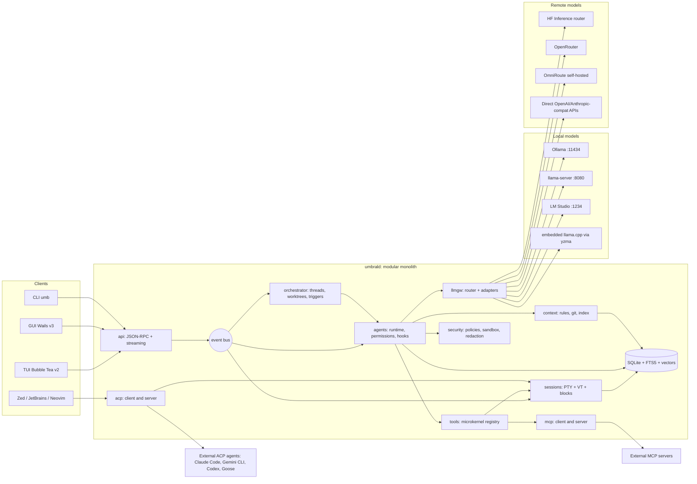
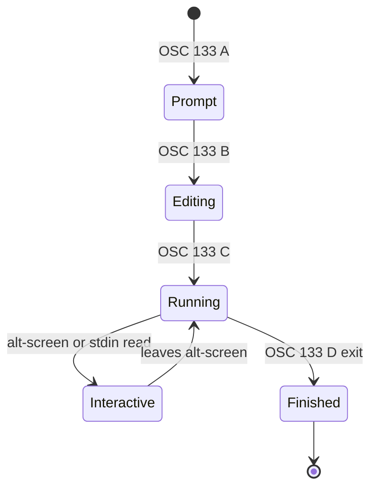
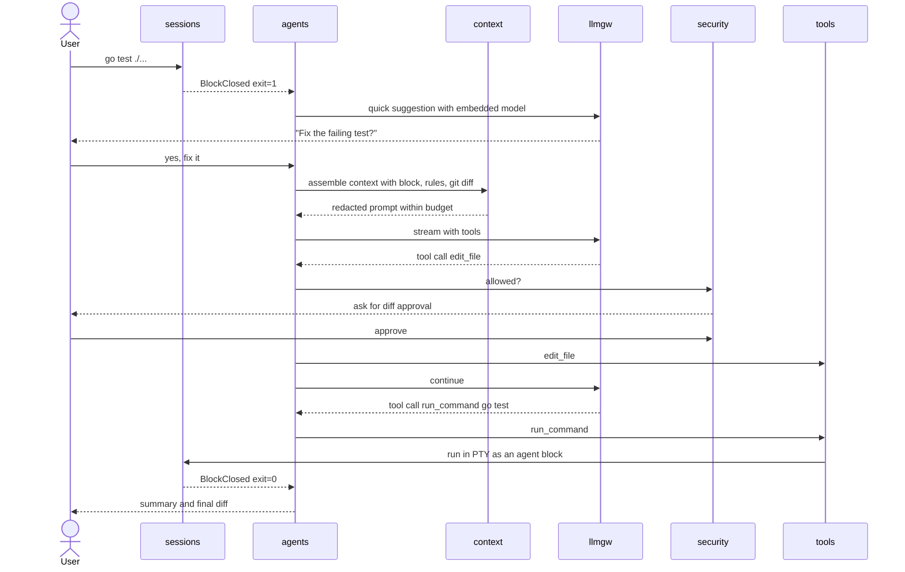
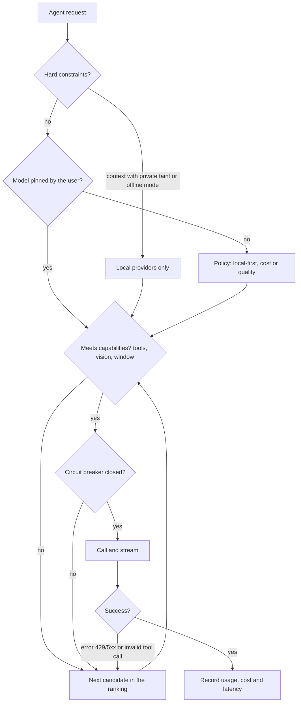

# Umbral — Agentic terminal (ADE) in Go, from scratch

> Conceptual architecture document · v0.2 · 2026-09-20
> Working name: **Umbral** (daemon `umbrald`, CLI `umb`). *Umbral* is Spanish for "threshold".

## 0. Executive summary

Umbral is a "born agentic" terminal: a modern terminal emulator (blocks, editor-like input, durable
sessions) whose core is a **local Go daemon**. The daemon hosts the PTYs, an agent runtime, a model
gateway and the ecosystem protocols (MCP and ACP). The interfaces (native GUI, WebView GUI or TUI)
are **thin clients** of the daemon.

Key decisions:

1. **Base**: local client-server (`umbrald` + clients), with the daemon as a **modular monolith**;
   **hexagonal** interior per module; **microkernel** for tools, providers and plugins; in-process
   **event bus**; **agentic** as the style of the agent layer.
2. **VT emulation**: `go-libghostty` (libghostty-vt bindings) as the reference engine, with a
   `vt.Emulator` port that allows a pure-Go fallback engine.
3. **Models**: a single `llm.Provider` port with adapters for Ollama, llama.cpp (`llama-server`
   and embedded through yzma), LM Studio, Hugging Face (inference router + GGUF Hub), OpenRouter,
   OmniRoute and any OpenAI/Anthropic-compatible endpoint. A **policy router** decides local vs.
   remote by privacy, cost, capabilities and health.
4. **Local-first**: everything works without an account or cloud; background agents run on your
   machine (or in your own containers), not on a SaaS orchestrator.

---

## 1. Catalog of features to replicate

Priority legend: **MVP** (first usable release), **v1**, **v2** (differentiators).
"Reference" column: where the capability exists today (Warp, Wave, Crush, Zed, OmniRoute, etc.).

### 1.1 Terminal core

| ID | Feature | Reference | Priority |
|---|---|---|---|
| T-01 | Full VT emulation (xterm-256color, truecolor, alt-screen, mouse, bracketed paste, Kitty keyboard/graphics) | Ghostty/libghostty | MVP |
| T-02 | Cross-platform PTY (Linux/macOS with pty, Windows with ConPTY) | all | MVP |
| T-03 | GPU rendering with correct ligatures, emoji and CJK | Warp, Ghostty | v1 |
| T-04 | Tabs, splits, workspaces, command palette | Warp, Wave | MVP |
| T-05 | Durable sessions: the shell survives closing the UI and SSH drops | Wave (Durable Sessions), zmx | v1 |
| T-06 | First-class SSH with a lightweight remote agent (`wsh`-style) | Wave | v1 |
| T-07 | Configurable themes, fonts and keybindings with hot reload | all | MVP |

### 1.2 Blocks and input

| ID | Feature | Reference | Priority |
|---|---|---|---|
| B-01 | **Blocks**: each command + output + exit code + cwd + duration is a navigable object | Warp, Wave, GenieTerm | MVP |
| B-02 | Input as a real editor: multiline, multi-cursor, undo/redo, mouse selection | Warp | MVP |
| B-03 | Universal input: automatic detection of shell vs. natural language | Warp (Universal Input) | v1 |
| B-04 | `@` to attach files, folders, symbols or blocks as context | Warp | MVP |
| B-05 | `/` slash commands and saved prompts | Warp, Crush | MVP |
| B-06 | Command/flag completions with descriptions, history-based suggestions | Warp | v1 |
| B-07 | Search within blocks, jump between blocks, share a block as an artifact | Warp | v1 |
| B-08 | Voice input (dictation → agent mode) | Warp | v2 |

### 1.3 Local agent

| ID | Feature | Reference | Priority |
|---|---|---|---|
| A-01 | Agent mode with plan → step-by-step execution → approval | Warp Agent Mode, Crush | MVP |
| A-02 | Built-in tools: bash, read/edit files, grep, glob, diff, web fetch | Crush, Claude Code | MVP |
| A-03 | **Full Terminal Use**: the agent drives interactive commands (REPLs, `psql`, `vim`, prompts) inside the PTY and the user can "take over" | Warp | v1 |
| A-04 | **Active AI**: proactive suggestions from exit codes, compiler errors and merge conflicts | Warp | v1 |
| A-05 | Code review: diff view, accept/reject per hunk, built-in editor | Warp Code, Zed | v1 |
| A-06 | Per-project rules files: `AGENTS.md`, `CLAUDE.md`, `WARP.md`, `CRUSH.md` + global rules | Warp Rules, Crush | MVP |
| A-07 | Switching models mid-session while keeping context | Crush | MVP |
| A-08 | Hooks (PreToolUse/PostToolUse…) compatible with Claude Code's | Crush | v1 |
| A-09 | Sub-agents (delegated tasks with their own context) | Crush, Claude Code | v1 |
| A-10 | Skills (folders of instructions + scripts loaded on demand) | Crush, Claude | v1 |

### 1.4 Context

| ID | Feature | Reference | Priority |
|---|---|---|---|
| C-01 | Blocks as context (attach output/errors) | Warp, Wave AI | MVP |
| C-02 | Reading scrollback and widgets/panes | Wave AI | MVP |
| C-03 | Codebase context: symbol index (LSP + tree-sitter) and semantic search | Warp Codebase Context, Crush (LSP) | v1 |
| C-04 | Git context (branch, diff, status, recent history) | Warp Active AI | MVP |
| C-05 | Persistent memory per project/user (local knowledge base) | Warp Drive as context | v2 |
| C-06 | Context-window management: compaction, summaries, token counting | Crush, Claude Code | MVP |

### 1.5 Protocols and extensibility

| ID | Feature | Reference | Priority |
|---|---|---|---|
| P-01 | **MCP client** (stdio, streamable HTTP, SSE) with dynamic loading mid-session | Warp, Crush | MVP |
| P-02 | **MCP server**: expose the terminal (blocks, PTYs, sessions) as tools for other agents | differentiator | v1 |
| P-03 | **ACP client**: host external agents (Claude Code, Gemini CLI, Codex, Goose, OpenCode…) in Umbral's UI | Zed | v1 |
| P-04 | **ACP server**: let Zed/JetBrains/Neovim use Umbral's agent | Crush-like | v2 |
| P-05 | `umb` CLI to pipe into the agent (`cmd | umb ai "..."`), control panes and variables | Wave `wsh` | MVP |
| P-06 | Sandboxed plugins (WASM) and a settings file programmable by user and agent | Warp settings file | v2 |

### 1.6 Multi-agent orchestration

| ID | Feature | Reference | Priority |
|---|---|---|---|
| O-00 | Workspace / tab / pane model owned by the daemon, addressable from CLI and API, with portable layouts and rollup state | Herdr | MVP |
| O-0A | Server-owned waits: wait for a thread state or for output, with the turn pinned | Herdr | MVP |
| O-0B | Integration surface: injected environment, external state reports, display metadata with TTL | Herdr | MVP |
| O-0C | Bootstrap snapshot plus sequenced events, and capability negotiation between client and daemon | Herdr | MVP |
| O-0D | Third-party agent detection by process and declarative manifests with local override | Herdr | v2 |
| O-01 | Several agent threads in parallel with a status/attention panel | Warp 2.0, cmux, Superset | v1 |
| O-02 | Isolation with one **git worktree** per agent | Superset | v1 |
| O-03 | Background agents triggered by cron, webhooks, CI or file events (a local Oz) | Warp Oz | v2 |
| O-04 | Multiple clients on the same workspace (shared session, permission queue, LSP, MCP) | `crush serve` | v1 |

### 1.7 Knowledge and collaboration

| ID | Feature | Reference | Priority |
|---|---|---|---|
| K-01 | Parameterized workflows (documented command sequences), versioned in the repo | Warp Workflows | v1 |
| K-02 | Notebooks (command + output + prose) exportable to Markdown/Obsidian | Warp Drive | v2 |
| K-03 | Environment profiles (env vars, aliases) | Warp Drive | v1 |
| K-04 | Live session sharing (read-only / control) | Warp Session Sharing | v2 |

### 1.8 Security and privacy

| ID | Feature | Reference | Priority |
|---|---|---|---|
| S-01 | Permission engine per tool/command/path (allow/ask/deny) with an approval queue | Crush, Warp | MVP |
| S-02 | Secret redaction before sending context to any LLM | Warp Secret Redaction | MVP |
| S-03 | Network log / audit of everything that leaves the machine | Warp Network Log | v1 |
| S-04 | Execution sandbox (Landlock/bubblewrap on Linux, containers for background work) | Codex, Oz | v1 |
| S-05 | Secret storage in the OS keyring | Wave | MVP |

### 1.9 Models

| ID | Feature | Reference | Priority |
|---|---|---|---|
| M-01 | Local providers: Ollama, llama.cpp, LM Studio | Wave, Crush | MVP |
| M-02 | Hugging Face: Inference Providers router + GGUF downloads from the Hub | — | v1 |
| M-03 | Meta-providers: OpenRouter and OmniRoute | Crush (OpenRouter) | MVP |
| M-04 | Generic OpenAI- and Anthropic-compatible endpoints | Crush | MVP |
| M-05 | **Embedded** inference (llama.cpp inside the binary, no server) for small tasks: NL/shell detection, titles, summaries | Fantasy/Kronk + yzma | v1 |
| M-06 | Policy router: local-first, privacy, cost, capabilities, fallback | OmniRoute, OpenRouter | v1 |
| M-07 | Auto-discovered model catalog (`/v1/models`, `/api/tags`) with metadata (context, tools, vision, price) | catwalk, OpenClaw | MVP |

---

## 2. Architectural drivers

| Attribute | Concrete requirement | Implication |
|---|---|---|
| Input/render latency | key → glyph < 10 ms; smooth scrolling with MB/s of output | VT and rendering off the agent's path; native parser; GPU or WebGL rendering |
| Resilience | closing/crashing the UI does not kill shells or agents | PTYs and agents live in a daemon, not in the UI |
| Privacy | able to run 100 % offline with local models | local-first gateway, redaction, egress audit |
| Extensibility | new providers, tools and agents without touching the core | microkernel + open protocols (MCP, ACP) |
| Portability | Linux (Wayland/X11), macOS, Windows | PTY and rendering behind ports; per-platform builds |
| Security | an agent must not exfiltrate or destroy without consent | explicit permissions, sandbox, least privilege |
| Non-determinism | small local models fail at tool calling | schema validation, repair, retries, model fallback |
| Operability | debugging "why did the agent do X?" | OpenTelemetry traces per turn and per tool; persistent transcript |

Assumptions: a single developer/small team at first; distribution as one binary per platform; no
requirement for an own cloud.

---

## 3. Go technology stack (per layer)

| Layer | Recommended | Alternatives | Notes |
|---|---|---|---|
| PTY | `github.com/creack/pty` (Unix) + `github.com/aymanbagabas/go-pty` (includes ConPTY on Windows) | `os/exec` + own ConPTY | Wrap it in a `pty.Spawner` port |
| VT emulation | `go.mitchellh.com/libghostty` (libghostty-vt bindings, cgo, static linking) | `github.com/charmbracelet/x/vt` (pure Go, experimental), own parser | Handles are not thread-safe: one owning goroutine per terminal |
| Shell integration | Bootstrap scripts for bash/zsh/fish/pwsh that emit OSC 133 (A/B/C/D), OSC 7 (cwd) and OSC 633;E (command line) | Warp-style DCS hooks | Foundation of **blocks** |
| Native GPU GUI | Gio (`gioui.org`) or Ebitengine + guigui | Fyne (less suited to a heavy terminal) | Shaping with `go-text/typesetting` |
| Hybrid GUI | Wails v3 (beta, stable API) + web frontend with xterm.js (WebGL) | Wails v2 (stable) | Ideal for diff viewer, markdown, file tree |
| TUI | Bubble Tea v2 + Lip Gloss + Bubbles + Glamour (markdown) + ultraviolet | tcell/tview | "Headless-friendly" client, also for SSH |
| Agents / LLM | `charm.land/fantasy` as the main adapter | `cloudwego/eino`, Genkit Go, `tmc/langchaingo`, official SDKs `openai-go` / `anthropic-sdk-go`, `ollama/api` client | Always behind our own `llm.Provider` |
| Embedded inference | `github.com/hybridgroup/yzma` (llama.cpp via purego, no cgo; CUDA/Metal/Vulkan/ROCm) | `hybridgroup/gollama.cpp` | Loads the llama.cpp library at runtime |
| MCP | `github.com/modelcontextprotocol/go-sdk` (official) | `mark3labs/mcp-go` | Client and server |
| ACP | `acp-go-sdk` (Go SDK listed by the ACP project) | `ironpark/acp-go` | JSON-RPC 2.0 over stdio |
| Persistence | Pure-Go SQLite (`modernc.org/sqlite`) with FTS5 | `ncruces/go-sqlite3` (WASM) | Blocks, transcripts, audit |
| Vectors | `chromem-go` (pure Go) | `sqlite-vec` (cgo), external Qdrant | Semantic search over code/blocks |
| Code | Own LSP client (like Crush) + `tree-sitter/go-tree-sitter` | LSP only | Symbols, outline, semantic chunking |
| UI↔daemon RPC | JSON-RPC 2.0 + streaming (WebSocket or SSE) over Unix socket / named pipe | gRPC + ConnectRPC | Same protocol for GUI, TUI and CLI |
| Internal bus | Typed in-process pub/sub (channels) | Embedded NATS (if multi-host) | Events: BlockClosed, ToolCalled, PermissionAsked… |
| Config | TOML (`pelletier/go-toml/v2`) + JSON Schema + `fsnotify` | HCL, Starlark (programmable config) | Settings editable by the agent with approval |
| Secrets | `zalando/go-keyring` | `99designs/keyring` | Never in plaintext |
| Sandbox | `landlock-lsm/go-landlock`, bubblewrap, Podman/Docker for background work | seccomp, `sandbox-exec` on macOS | Per permission profile |
| Plugins | WASM with `wazero` (pure Go) | subprocesses + MCP | Untrusted plugins → WASM |
| SSH | `golang.org/x/crypto/ssh` + auto-deployed remote `umb` binary | OpenSSH ControlMaster | Durable remote sessions |
| Observability | OpenTelemetry Go (GenAI conventions) + `log/slog` | Langfuse via OTLP | Tokens, cost, latency per provider |

---

## 4. Three candidate architectures

All three share the **same daemon** (`umbrald`); they differ in the UI client and therefore in the
render path.

### 4.A Native GPU (Gio / Ebitengine + libghostty)

- Cells rendered straight from libghostty's `RenderState` to the GPU.
- Maximum performance and a single binary with no browser.
- Cost: building in Go the widgets the web gets for free (diff viewer, rich markdown, file tree,
  editor). There is a public proof of concept (gostty: Go + libghostty + guigui).

### 4.B Hybrid (Wails v3 + WebView)

- Go for the daemon and logic; UI in TypeScript (Svelte/React/Solid) with WebGL xterm.js or a
  libghostty emulator compiled to WASM.
- Shortest time-to-market for the "ADE" surfaces (diffs, chat, notebooks, settings).
- Cost: extra WebView↔Go latency, dependency on WebKitGTK on Linux (GTK4 + WebKitGTK 6.0 by
  default in v3), more memory than native (but far less than Electron).
- It is Wave's path (Go + Electron) moved to a native WebView.

### 4.C TUI-first (Bubble Tea v2 inside any terminal)

- Umbral as an agentic multiplexer (tmux + agent) running inside Ghostty/Kitty/etc.
- Minimal cost, works over SSH, ideal for servers.
- Cost: no control over rendering or input (no truly clickable blocks, no graphical multi-cursor);
  nested emulation adds a layer.

### 4.D Comparison

| Criterion (1-5) | A Native | B Hybrid | C TUI |
|---|---|---|---|
| Latency/performance | 5 | 3 | 4 |
| ADE UI richness (diffs, markdown, panes) | 2 | 5 | 3 |
| Time-to-market | 2 | 4 | 5 |
| Memory usage | 5 | 3 | 5 |
| Remote use over SSH | 2 | 2 | 5 |
| Technical risk | high | medium | low |

**Recommended strategy**: daemon + **TUI (C) as the first client** to validate the core (PTY,
blocks, agent, gateway) in weeks; then **client B (Wails v3)** as the desktop product; **A** only if
B's latency metrics fall short. Since all of them speak the same protocol to the daemon, no step is
thrown away.

---

## 5. Recommended architecture

### 5.1 Container view



**Why a daemon**: it separates the lifecycle of shells and agents from the window's (durable
sessions, multiple clients, background agents) and makes GUI, TUI, CLI and IDEs interchangeable. It
is the same pattern as `wavesrv` in Wave or `crush serve` in Crush.

### 5.2 Daemon modules and boundary rules

Each module is a Go package with `domain/` (pure types and rules), `ports/` (interfaces) and
`adapters/` (implementations). Rules enforced in CI (with `go-arch-lint` or a test that inspects
`go list -deps`):

1. `domain` imports nothing outside the stdlib and other `domain` packages.
2. A module only knows another through its **published ports** or through **bus events**.
3. `llmgw` does not know `agents`; `sessions` does not know `agents`; `agents` depends on the ports
   of `sessions`, `tools`, `context`, `llmgw`, `security`.
4. Only `cmd/umbrald` does the wiring (composition root).

| Module | Responsibility | Events it publishes |
|---|---|---|
| `sessions` | PTYs, VT emulation, shell integration, blocks, SSH, durability | `BlockStarted`, `BlockClosed`, `ScreenChanged`, `SessionExited` |
| `agents` | agent loop, threads, modes, permissions, hooks, sub-agents, compaction | `TurnStarted`, `ToolRequested`, `PermissionAsked`, `TurnFinished` |
| `tools` | tool registry (built-in, MCP, WASM), schemas, execution | `ToolExecuted` |
| `context` | rules (AGENTS.md…), git, LSP, semantic index, memory, token budget | `IndexUpdated` |
| `llmgw` | model catalog, router, adapters, normalized streaming, cost | `ModelHealthChanged`, `UsageRecorded` |
| `mcp` / `acp` | protocol clients and servers | `McpServerConnected`, `ExternalAgentAttached` |
| `orchestrator` | multi-agent, worktrees, triggers (cron, webhooks, files, CI) | `BackgroundRunFinished` |
| `security` | allow/ask/deny policies, sandbox, redaction, egress audit, keyring | `EgressRecorded`, `PolicyViolation` |
| `store` | SQLite, migrations, FTS5, vectors | — |
| `api` | JSON-RPC for clients, local auth by token/socket | — |

### 5.3 Blocks: shell integration

The bootstrap Umbral injects into the shell emits OSC sequences that the parser intercepts (in
libghostty, through effect callbacks) to delimit each command:

| Sequence | Meaning | Use in Umbral |
|---|---|---|
| `OSC 133;A` | prompt start | opens a "prompt" block |
| `OSC 133;B` | prompt end / input start | marks where the command begins |
| `OSC 633;E;<cmd>` | exact command line | command text without parsing the screen |
| `OSC 133;C` | command executed, output starts | block moves to `Running` |
| `OSC 133;D;<exit>` | command finished + exit code | block moves to `Finished`, `BlockClosed` event |
| `OSC 7;file://host/path` | current cwd | directory and SSH context |



A block stores: id, session, command, cwd, host, start/end, exit code, output (zstd-compressed
chunks in SQLite) and a plain-text snapshot produced with libghostty's `Formatter` (no escapes),
which is what gets sent to the LLM.

Full-screen programs (vim, htop) are marked `Interactive` and are not split into blocks.

### 5.4 Agent runtime

**Loop per turn** (each thread is a goroutine with its own cancellable `context.Context`):

1. `context` assembles the prompt (filter pipeline, §5.5).
2. `llmgw` streams; deltas are forwarded to the client through the bus.
3. For each tool call: validate against the JSON Schema → `security` decides allow/ask/deny →
   `PreToolUse` hooks → execute → `PostToolUse` hooks → result into the history.
4. Stop conditions: a response without tool calls, step limit, token or cost budget, user
   cancellation.

**Modes** (inspired by Warp/Claude Code): `ask` (read-only), `plan` (proposes a plan, does not
execute), `auto-edit` (edits files, asks permission for commands), `full-auto` (only inside a
sandbox or disposable worktree).

**Full Terminal Use** (A-03): the `terminal.interact` tool does not write "blindly" into the PTY:

- `send_keys(session, keys)` uses libghostty's `KeyEncoder` to encode keys correctly.
- `read_screen(session)` returns the plain text of the current screen (not the byte stream).
- `wait_for(session, regex | idle_ms | exit)` to sync with interactive prompts.
- An **input ownership lock** (`Human | Agent`) prevents both from typing at the same time; the user
  "takes over" with a shortcut and the agent pauses, observing.

**Active AI** (A-04): a `BlockClosed` subscriber with `exit != 0` (or compiler-error / merge-conflict
patterns) asks a **small embedded model** for a one-line suggestion; if the user accepts it, a thread
opens with the block attached. Rate-limited and configurable per project.



### 5.5 Context engine (pipes & filters)

`collect → redact → rank → budget → render`

- **Collect**: global and project rules (`AGENTS.md`, `CLAUDE.md`, `WARP.md`, `CRUSH.md` and their
  `.local` variants), blocks attached with `@`, git state, LSP diagnostics, semantic index results,
  project memory, active skills.
- **Redact**: gitleaks-style rules + entropy for tokens, keys, `.env`; *taint* marks on untrusted
  content (web fetch output, third-party MCP).
- **Rank**: recency, semantic relevance, explicit user references first.
- **Budget**: the context window comes from the chosen model's catalog entry; a reserve for the
  answer; automatic compaction (history summary) past a threshold.
- **Render**: Go templates (`text/template`) per model family.

Code index: symbol-based chunking with tree-sitter, embeddings with a local model (e.g. through
Ollama or LM Studio `/v1/embeddings`), stored in `chromem-go`; updated with `fsnotify` and honoring
`.gitignore`. It fits a graph-first workflow: if the repo already has `.codegraph/`,
`graphify-out/` or `lat.md/`, the `context` module consumes them as additional sources instead of
re-indexing.

### 5.6 Model gateway (`llmgw`)

Almost the whole ecosystem speaks **OpenAI Chat Completions**, so the `openaicompat` adapter covers
most providers; native adapters exist only where they add something the compatible protocol lacks.

| Provider | Default endpoint | Adapter | Why native (if applicable) |
|---|---|---|---|
| Ollama | `http://127.0.0.1:11434` | native `ollama` (`/api/chat`) + `openaicompat` (`/v1`) | `keep_alive`, `num_ctx`, `think`, `format` with JSON Schema, `/api/tags` and `/api/pull` (including `hf.co/...` models) |
| llama.cpp | `http://127.0.0.1:8080/v1` | `openaicompat` | Started with `--jinja` for tool calling; `json_schema`/grammars for structured output; `-hf repo` downloads GGUF from the Hub |
| Embedded llama.cpp | in process | `embedded` (yzma) | No server: NL/shell auto-detection, titles, Active AI suggestions |
| LM Studio | `http://127.0.0.1:1234/v1` | `openaicompat` + `lmstudio` REST (`/api/v1/models/load`, `unload`) | JIT model load/unload; also exposes Anthropic-compatible Messages and `/v1/responses` |
| Hugging Face | `https://router.huggingface.co/v1` | `openaicompat` | `model:provider` suffix to pin a backend (cerebras, together, fireworks…); `GET /v1/models` for discovery |
| OpenRouter | `https://openrouter.ai/api/v1` | `openrouter` (through Fantasy) | Server-side fallback, provider preferences, prompt caching, data policies |
| OmniRoute | `http://127.0.0.1:<port>/v1` (self-hosted) | `openaicompat` | Intent aliases `auto/*`, quota-based fallback, token compression |
| Generic OpenAI/Anthropic-compat | configurable | `openaicompat` / `anthropic` | DeepSeek, Groq, z.ai, vLLM, TGI, LiteLLM… |

> Note on "omniRouter": the name matches two different projects. **OmniRoute**
> (`diegosouzapw/OmniRoute`, MIT, self-hosted gateway) is the one that fits this design;
> `omnilabs-ai/OmniRouter` is a different Python project with an OpenAI-compatible API. Since both
> expose `/v1/chat/completions`, the same adapter works for either.

**Policy router** (evaluated per request, not per session):



Practical rules:

- **Task classes**, not a single model: `fast` (embedded/small), `code` (main model), `plan`
  (reasoning), `embed`. Each class has its own fallback chain.
- **Meta-providers** (OpenRouter, OmniRoute) already route on their own: they are treated as one more
  candidate and our own fallback inside them is disabled to avoid cascading retries.
- **Hardening tool calling with local models**: validate arguments against the schema; if that fails,
  one retry with a repair message; if it fails again, move to the next class or force structured
  output (grammar in llama.cpp, `format` in Ollama).
- **Catalog**: built at startup by querying `/v1/models` and `/api/tags`, merged with an embedded
  metadata catalog (window, price, capabilities); refreshed live.

### 5.7 Protocols

- **Own API** (`api`): JSON-RPC 2.0 over a Unix socket (`$XDG_RUNTIME_DIR/umbral.sock`) or named
  pipe; streaming through notifications. One local token per client.
- **MCP client**: servers declared per user or per project; connection and tool discovery
  **mid-session**; permissions per server and per tool; tools prefixed `mcp_<server>_<tool>`.
- **MCP server** (differentiator): Umbral publishes `list_sessions`, `read_block`, `search_blocks`,
  `get_screen`, `run_in_session` (always with approval). That way Claude Code, Claude Desktop or
  another agent can "see" your terminals with explicit permission. Local socket only, never exposed
  to the network by default.
- **ACP client**: Umbral launches external agents as subprocesses and speaks JSON-RPC over stdio.
  The agent's requests to create terminals materialize as **Umbral blocks** (visible, auditable) and
  their permission requests enter the same approval queue.
- **ACP server**: Umbral's runtime is offered as an agent for Zed/JetBrains/Neovim.
- **`umb` CLI**: `cmd | umb ai "explain"`, `umb block last --json`, `umb open file`,
  `umb var set K=V`, `umb run --agent fix-tests`.

### 5.8 Multi-agent and background orchestration

- **Parallel threads** with an attention panel (who is waiting for approval, who finished, who failed).
- **Isolation**: every thread that writes works in its own `git worktree` under
  `.umbral/worktrees/<thread>`; when it finishes it offers diff, merge or PR.
- **Local triggers** (a local Oz): cron (`robfig/cron`), incoming HTTP webhooks (optional, with an
  HMAC secret), file changes (`fsnotify`), end of a CI job queried through the GitLab/GitHub MCP.
- **Background execution** inside a Podman/Docker container with the repo mounted in a worktree,
  restricted network and a token/cost budget per run.
- Agent definitions as versionable files:

```yaml
# .umbral/agents/flaky-tests.yaml
name: flaky-tests
trigger: { cron: "0 22 * * 5" }
model_class: code
sandbox: container
permissions: { edit: allow, bash: ask, network: deny }
prompt: |
  Run the suite 3 times, identify flaky tests and propose a fix on a branch.
output: { pr_draft: true, notify: desktop }
```

### 5.9 Persistence

SQLite (WAL) at `$XDG_DATA_HOME/umbral/umbral.db`, on native disk (never in FUSE folders).

| Table | Content |
|---|---|
| `sessions`, `blocks`, `block_chunks` | terminal history; `blocks_fts` (FTS5) over command + plain-text output |
| `threads`, `messages`, `tool_calls`, `approvals` | complete, auditable transcript of every agent |
| `models`, `usage` | catalog and consumption per provider/model |
| `egress_log` | every outgoing request: destination, bytes, payload hash, provider |
| `workflows`, `notebooks`, `memories` | local knowledge |

### 5.10 Security

| Threat | Mitigation |
|---|---|
| Prompt injection from command output, web or MCP | tool content treated as data; *taint tracking*: with tainted context, destructive or network tools always ask for approval |
| Secret exfiltration | redaction first, local providers forced for context marked private, `egress_log` |
| Destructive commands | pattern policies (`rm -rf`, `git push --force`, `kubectl delete`), `full-auto` mode only in a sandbox |
| Malicious MCP servers | allowlist, pinned versions, execution in a subprocess with Landlock, review of tool descriptions |
| Other processes accessing the daemon | socket with 0600 permissions + per-client token |

### 5.11 Observability

- One OpenTelemetry trace per turn; spans per model call (GenAI attributes: model, input/output
  tokens, provider) and per tool.
- Metrics: p50/p95 latency per provider, invalid tool call rate per model (key to choosing local
  models), accumulated cost.
- Exportable to any OTLP backend (Jaeger, Langfuse, Grafana).

---

## 6. Go contracts (shape, not production code)

```go
// internal/llmgw/ports/provider.go
package ports

import (
	"context"
	"encoding/json"
	"iter"
)

type TaskClass string // "fast" | "code" | "plan" | "embed"
type Privacy int      // PrivacyAny | PrivacyLocalOnly

type Capabilities struct {
	Tools, Vision, Reasoning, JSONSchema bool
	ContextWindow, MaxOutput             int
}

type ModelInfo struct {
	ID, Provider      string
	Local             bool
	Caps              Capabilities
	PriceInPerMTok    float64
	PriceOutPerMTok   float64
}

type Request struct {
	Model          string // "ollama/gpt-oss:20b", "openrouter/moonshotai/kimi-k2"...
	System         string
	Messages       []Message
	Tools          []ToolSpec
	ResponseSchema json.RawMessage // optional structured output
	MaxTokens      int
	Class          TaskClass
	Privacy        Privacy
	ThreadID       string
}

// Normalized Event: TextDelta, ReasoningDelta, ToolCallDelta, Usage, Done.
type Event interface{ isEvent() }

type Provider interface {
	Name() string
	Models(ctx context.Context) ([]ModelInfo, error)
	Stream(ctx context.Context, req Request) (iter.Seq2[Event, error], error)
	Health(ctx context.Context) error
}

type Router interface {
	// Returns ordered candidates; the gateway walks them with a circuit breaker.
	Route(ctx context.Context, req Request) ([]ModelInfo, error)
}

// internal/tools/ports/tool.go
type Risk int // ReadOnly | WriteFS | Exec | Network

type Tool interface {
	Spec() ToolSpec // name, description, JSON Schema
	Risk() Risk
	Run(ctx context.Context, args json.RawMessage) (Result, error)
}

// internal/sessions/ports/emulator.go
type Emulator interface { // main adapter: libghostty
	Write(p []byte) (int, error)
	Resize(cols, rows int) error
	PlainScreen() (string, error)
	EncodeKey(k KeyEvent) ([]byte, error)
	Close() error
}

// internal/security/ports/policy.go
type Decision int // Allow | Ask | Deny

type Action struct {
	Tool    string
	Risk    Risk
	Target  string // path, command or host
	Tainted bool   // the context contains untrusted content
}

type Policy interface {
	Decide(ctx context.Context, a Action) Decision
}
```

> Note: the shapes above use `float64` prices for brevity; the specs (Constitution Art. 6) store
> costs as micro-USD `int64`.

---

## 7. Provider configuration (example)

`~/.config/umbral/models.toml` (secrets are referenced from the keyring, never in clear text):

```toml
[router]
policy = "local-first"          # local-first | cost | quality
offline = false                 # true = local providers only
max_cost_usd_per_thread = 1.5

[classes]
fast  = ["embedded/qwen3-1.7b-q4_k_m", "ollama/qwen3:4b"]
code  = ["ollama/gpt-oss:20b", "lmstudio/openai/gpt-oss-20b", "omniroute/auto/best-coding", "openrouter/moonshotai/kimi-k2"]
plan  = ["hf/openai/gpt-oss-120b:cerebras", "openrouter/moonshotai/kimi-k2"]
embed = ["ollama/nomic-embed-text"]

[[providers]]
id = "ollama"
type = "ollama"
base_url = "http://127.0.0.1:11434"
[providers.options]
num_ctx = 32768                 # the default is too short for agents
keep_alive = "30m"

[[providers]]
id = "llamacpp"
type = "openai-compat"
base_url = "http://127.0.0.1:8080/v1"
# started with: llama-server -hf <gguf-repo> --jinja -c 32768

[[providers]]
id = "lmstudio"
type = "lmstudio"               # openai-compat + load/unload REST
base_url = "http://127.0.0.1:1234"

[[providers]]
id = "embedded"
type = "yzma"
lib_path = "~/.local/share/umbral/llama/"   # llama.cpp build with Vulkan
models_dir = "~/.local/share/umbral/models/"

[[providers]]
id = "hf"
type = "openai-compat"
base_url = "https://router.huggingface.co/v1"
api_key = "keyring:umbral/hf_token"          # fine-grained token with Inference Providers permission

[[providers]]
id = "openrouter"
type = "openrouter"
base_url = "https://openrouter.ai/api/v1"
api_key = "keyring:umbral/openrouter"

[[providers]]
id = "omniroute"
type = "openai-compat"
base_url = "http://127.0.0.1:3000/v1"        # set to your instance's port
api_key = "keyring:umbral/omniroute"
```

---

## 8. Local hardware profile (ThinkPad P14s Gen 6 AMD)

With a Ryzen AI 9 HX 370, Radeon 890M, XDNA 2 NPU and 96 GB of RAM:

- **Default `code` class**: `gpt-oss:20b` on Ollama, with LM Studio or `llama-server` as the
  alternative when finer control over the backend is needed.
- **GPU backend**: on an AMD iGPU, llama.cpp with **Vulkan** tends to be the most predictable path;
  ROCm support for this iGPU is more fragile. Check in the logs whether Ollama actually offloads
  layers to the GPU; if not, use `llama-server` with Vulkan behind the `openaicompat` adapter.
- **Large models**: unified memory opens the door to ~100B-class quantized models (e.g.
  `gpt-oss-120b`), depending on how much memory is assigned to the iGPU; validate tokens/s before
  putting it in the `plan` class.
- **NPU**: llama.cpp and Ollama do not use the XDNA 2. If an OpenAI-compatible server is brought up
  for the NPU (for example AMD's Ryzen AI stack), it joins as one more `openai-compat` provider,
  ideal for the `fast` or `embed` class without competing with the iGPU.

---

## 9. Repository structure

```
umbral/
├── cmd/
│   ├── umbrald/            # daemon composition root
│   ├── umb/                # CLI (pipes, pane control, agents)
│   ├── umbral-tui/         # Bubble Tea v2 client
│   └── umbral-desktop/     # Wails v3 client
├── internal/
│   ├── bus/
│   ├── sessions/{domain,ports,adapters/{pty,ghostty,shellinteg,ssh}}
│   ├── agents/{domain,ports,runtime,modes,hooks,subagents}
│   ├── tools/{ports,builtin,mcptools,wasm}
│   ├── context/{rules,git,lsp,index,memory,budget}
│   ├── llmgw/{ports,catalog,router,adapters/{openaicompat,ollama,lmstudio,openrouter,anthropic,yzma}}
│   ├── mcp/{client,server}
│   ├── acp/{client,server}
│   ├── workspaces/{tree,ids,layout,restore}
│   ├── waits/
│   ├── integrations/{reports,metadata}
│   ├── notify/
│   ├── orchestrator/{threads,worktrees,triggers}
│   ├── security/{policy,sandbox,redact,egress,keyring}
│   ├── store/{migrations,sqlite,vectors}
│   └── api/
├── shell/                  # OSC 133/7/633 bootstrap for bash, zsh, fish, pwsh
├── ui/desktop/             # TypeScript frontend for the Wails client
└── docs/                   # constitution, PRD, specs, ADRs (SDD)
```

---

## 10. Phased roadmap

| Phase | Scope | Exit criterion |
|---|---|---|
| F0 Core | daemon, PTY, libghostty, OSC 133 bootstrap, blocks in SQLite, workspace/tab/pane structure with portable layouts, snapshot with sequenced events, minimal TUI, `umb block` CLI | `vim`, `htop` and `tmux` work; blocks with correct exit codes in bash/zsh/fish; a script builds and restores a layout using only the CLI |
| F1 Agentic MVP | runtime with built-in tools, permissions + queue, `AGENTS.md` rules, `@`/`/`, gateway with Ollama, llama.cpp, LM Studio, OpenRouter and openai-compat, MCP client, secret redaction, waits, integration surface, notifications, `policy.explain` | "fix this error" works offline with `gpt-oss:20b` end to end, and a script drives a whole thread without polling |
| F2 ADE | Wails v3 client (per-hunk diffs, editor, tree), Full Terminal Use, Active AI with an embedded model, HF + OmniRoute, policy router, parallel threads with worktrees as a daemon primitive, ACP client, third-party agent detection, plugins with a declarative manifest, multi-machine federation, live PTY handoff, durable sessions + SSH, OTel | three agents in parallel (one external through ACP) without interference, traces per turn |
| F3 Differentiators | background agents with triggers and containers, MCP and ACP servers, WASM plugins, workflows/notebooks exportable to Obsidian, voice, session sharing | a scheduled agent opens a draft PR unattended and is fully audited |

---

## 10.1 Herdr: the adjacent runtime

Herdr (Rust, Apache-2.0) is the closest neighbour to this design and solves the adjacent problem:
being the runtime where *third-party* coding agents live. It does not emulate a terminal, does not
bring its own agent and does not route models. It contributes the orchestration model this
document adopted in §5 and ADR-0002: `session → workspace → tab → pane`, waits owned by the server,
bootstrap snapshot with sequenced events, integrations that report state over the socket, and
capability negotiation so client and server need not share a build.

What Umbral deliberately does not take from it:

- **screen heuristics as a state authority.** They are fragile by construction and become a second
  source of truth. DD-012 fixes a single authority per pane and leaves third-party detection for
  F2, below hooks and ACP;
- **detection rules that update themselves from the project's servers.** REQ-SEC-011 keeps the
  equivalent mechanism disabled by default, with local precedence and every fetch recorded in
  `egress_log`.

What Umbral has that it does not: permission engine, secret redaction, egress audit, local models
and semantic blocks with full-text search. That is the intended difference, and it is where the new
requirements reinforce rather than imitate.

## 11. Main risks

| Risk | Mitigation |
|---|---|
| `go-libghostty` API without stability guarantees | `Emulator` port, pinned version, own VT conformance suite, pure-Go fallback engine |
| cgo and toolchain (libghostty is built with Zig) complicate cross-compilation | native builds per platform in CI; yzma avoids cgo on the inference side |
| Wails v3 still in beta | start with the TUI; isolate the desktop client behind the daemon protocol |
| Unreliable tool calling in local models | validation + repair + per-class fallback; measure the invalid tool call rate per model |
| Scope: Warp is built by a large team | strict phases; each phase ends in something usable daily |
| Licenses | Warp client AGPL-3.0 and Crush FSL-1.1-MIT: study, do not copy code; Wave (Apache-2.0), Fantasy (Apache-2.0) and libghostty (MIT) are reusable respecting their notices |
| Third-party MCP servers | allowlist, subprocess sandbox, tool review, taint tracking |

---

## 12. ADR-0001: Umbral's architectural style

The full ADR lives in [`docs/adr/ADR-0001-architectural-style.md`](adr/ADR-0001-architectural-style.md).
Summary:

```
Recommendation: Local client-server + Modular monolith + Hexagonal (+ Microkernel, event bus, Agentic, Pipes & Filters in context)
Why: resilience of sessions and agents, extensibility via MCP/ACP/providers, small team with a single binary
Didn't choose an app without a daemon because: the UI cannot own shells or background agents
Didn't choose microservices because: there are no teams or independent scaling to justify them
Risks / anti-patterns to watch: god module in agents, unstable libghostty API, local tool calling, cascading fallback
Revisit when: live multi-user collaboration or shared remote execution appears
```

---

## 13. Sources consulted

- Warp open source and Oz: https://www.warp.dev/newsroom/2026/4/28/warp-open-sources-its-agentic-development-environment
- Warp 2.0 ADE: https://www.warp.dev/blog/reimagining-coding-agentic-development-environment
- Warp docs (Universal Input, Blocks as Context, Full Terminal Use): https://docs.warp.dev/
- Warp 2026 guide (Active AI, MCP, Warp Drive, Oz): https://www.deployhq.com/guides/warp
- Wave Terminal: https://github.com/wavetermdev/waveterm · https://docs.waveterm.dev/wsh
- Crush: https://github.com/charmbracelet/crush · Fantasy: https://github.com/charmbracelet/fantasy
- go-libghostty: https://pkg.go.dev/go.mitchellh.com/libghostty · awesome-libghostty: https://github.com/Uzaaft/awesome-libghostty
- yzma: https://github.com/hybridgroup/yzma
- MCP Go SDK: https://github.com/modelcontextprotocol/go-sdk
- ACP: https://agentclientprotocol.com · https://zed.dev/acp
- Wails v3 beta: https://v3.wails.io/blog/wails-v3-beta/
- LM Studio APIs: https://lmstudio.ai/docs/developer
- Hugging Face Inference Providers: https://huggingface.co/docs/inference-providers
- OmniRoute: https://github.com/diegosouzapw/OmniRoute
- Herdr (agent runtime, Apache-2.0): https://github.com/herdrdev/herdr · docs: https://herdr.dev/docs/
