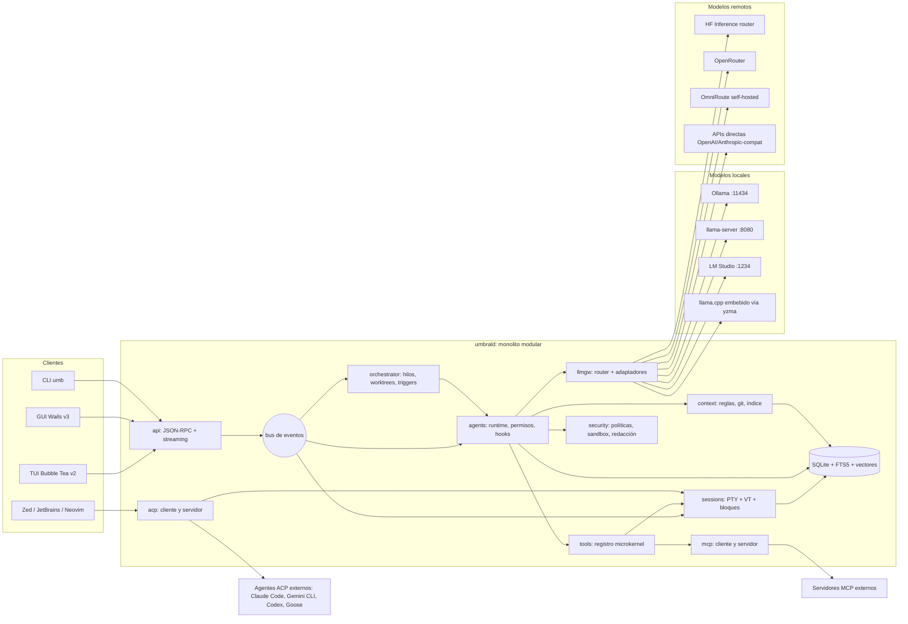
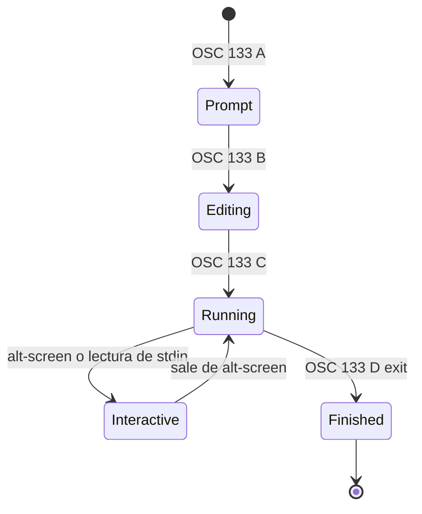
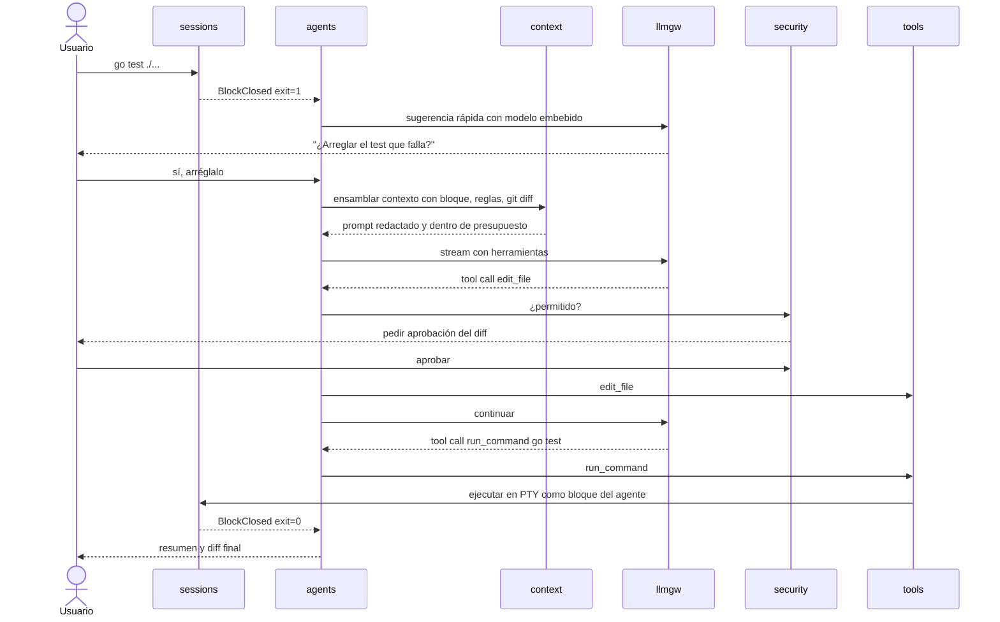
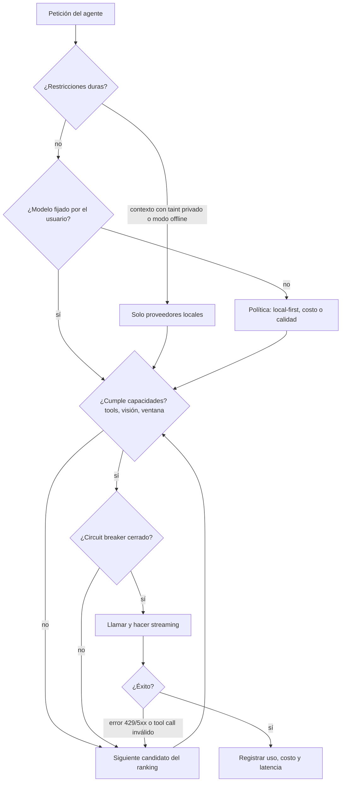

# Umbral — Terminal agéntico (ADE) en Go, desde cero

> Documento conceptual de arquitectura · v0.1 · 2026-09-11
> Nombre de trabajo: **Umbral** (daemon `umbrald`, CLI `umb`). Cámbialo cuando quieras.

## 0. Resumen ejecutivo

Umbral es un terminal "born agentic": un emulador de terminal moderno (bloques, entrada tipo editor,
sesiones durables) cuyo núcleo es un **daemon local en Go** que aloja PTYs, un runtime de agentes,
un gateway de modelos y los protocolos del ecosistema (MCP y ACP). Las interfaces (GUI nativa, GUI
WebView o TUI) son **clientes delgados** del daemon.

Decisiones clave:

1. **Base**: cliente-servidor local (`umbrald` + clientes) con el daemon como **monolito modular**;
   interior **hexagonal** por módulo; **microkernel** para herramientas, proveedores y plugins;
   **bus de eventos** interno; **agentic** como estilo de la capa de agentes.
2. **Emulación VT**: `go-libghostty` (bindings de libghostty-vt) como motor de referencia, con un
   puerto `vt.Emulator` que permite un motor puro-Go de reserva.
3. **Modelos**: un puerto `llm.Provider` único con adaptadores para Ollama, llama.cpp
   (`llama-server` y embebido vía yzma), LM Studio, Hugging Face (router de inferencia + Hub de
   GGUF), OpenRouter, OmniRoute y cualquier endpoint OpenAI/Anthropic-compatible. Un **router de
   políticas** decide local vs. remoto por privacidad, costo, capacidades y salud.
4. **Local-first**: todo funciona sin cuenta ni nube; los agentes en background corren en tu máquina
   (o en contenedores tuyos), no en un orquestador SaaS.

---

## 1. Catálogo de funcionalidades a replicar

Leyenda de prioridad: **MVP** (primer release usable), **v1**, **v2** (diferenciadores).
Columna "Referencia": dónde existe hoy la capacidad (Warp, Wave, Crush, Zed, OmniRoute, etc.).

### 1.1 Núcleo de terminal

| ID | Funcionalidad | Referencia | Prioridad |
|---|---|---|---|
| T-01 | Emulación VT completa (xterm-256color, truecolor, alt-screen, mouse, bracketed paste, Kitty keyboard/graphics) | Ghostty/libghostty | MVP |
| T-02 | PTY multiplataforma (Linux/macOS con pty, Windows con ConPTY) | todos | MVP |
| T-03 | Render GPU con ligaduras, emoji y CJK correctos | Warp, Ghostty | v1 |
| T-04 | Pestañas, splits, workspaces, paleta de comandos | Warp, Wave | MVP |
| T-05 | Sesiones durables: la shell sobrevive al cierre de la UI y a caídas SSH | Wave (Durable Sessions), zmx | v1 |
| T-06 | SSH de primera clase con agente remoto ligero (tipo `wsh`) | Wave | v1 |
| T-07 | Temas, fuentes, keybindings configurables y recargables en caliente | todos | MVP |

### 1.2 Bloques y entrada

| ID | Funcionalidad | Referencia | Prioridad |
|---|---|---|---|
| B-01 | **Bloques**: cada comando + salida + exit code + cwd + duración es un objeto navegable | Warp, Wave, GenieTerm | MVP |
| B-02 | Entrada como editor real: multilínea, multi-cursor, undo/redo, selección con ratón | Warp | MVP |
| B-03 | Entrada universal: detección automática shell vs. lenguaje natural | Warp (Universal Input) | v1 |
| B-04 | `@` para adjuntar archivos, carpetas, símbolos o bloques como contexto | Warp | MVP |
| B-05 | `/` slash commands y prompts guardados | Warp, Crush | MVP |
| B-06 | Completions de comandos/flags con descripciones, sugerencias basadas en historial | Warp | v1 |
| B-07 | Búsqueda dentro de bloques, salto entre bloques, compartir un bloque como artefacto | Warp | v1 |
| B-08 | Entrada por voz (dictado → modo agente) | Warp | v2 |

### 1.3 Agente local

| ID | Funcionalidad | Referencia | Prioridad |
|---|---|---|---|
| A-01 | Modo agente con plan → ejecución paso a paso → aprobación | Warp Agent Mode, Crush | MVP |
| A-02 | Herramientas nativas: bash, leer/editar archivos, grep, glob, diff, fetch web | Crush, Claude Code | MVP |
| A-03 | **Full Terminal Use**: el agente maneja comandos interactivos (REPLs, `psql`, `vim`, prompts) dentro del PTY y el usuario puede "tomar el control" | Warp | v1 |
| A-04 | **Active AI**: sugerencias proactivas a partir de exit codes, errores de compilador y conflictos de merge | Warp | v1 |
| A-05 | Revisión de código: vista de diffs, aceptar/rechazar por hunk, editor integrado | Warp Code, Zed | v1 |
| A-06 | Archivos de reglas por proyecto: `AGENTS.md`, `CLAUDE.md`, `WARP.md`, `CRUSH.md` + reglas globales | Warp Rules, Crush | MVP |
| A-07 | Cambio de modelo a mitad de sesión preservando contexto | Crush | MVP |
| A-08 | Hooks (PreToolUse/PostToolUse…) compatibles con los de Claude Code | Crush | v1 |
| A-09 | Sub-agentes (tareas delegadas con contexto propio) | Crush, Claude Code | v1 |
| A-10 | Skills (carpetas de instrucciones + scripts cargadas bajo demanda) | Crush, Claude | v1 |

### 1.4 Contexto

| ID | Funcionalidad | Referencia | Prioridad |
|---|---|---|---|
| C-01 | Bloques como contexto (adjuntar salida/errores) | Warp, Wave AI | MVP |
| C-02 | Lectura de scrollback y de widgets/paneles | Wave AI | MVP |
| C-03 | Contexto de codebase: índice de símbolos (LSP + tree-sitter) y búsqueda semántica | Warp Codebase Context, Crush (LSP) | v1 |
| C-04 | Contexto git (rama, diff, status, historial reciente) | Warp Active AI | MVP |
| C-05 | Memoria persistente por proyecto/usuario (base de conocimiento local) | Warp Drive como contexto | v2 |
| C-06 | Gestión de ventana de contexto: compactación, resumen, conteo de tokens | Crush, Claude Code | MVP |

### 1.5 Protocolos y extensibilidad

| ID | Funcionalidad | Referencia | Prioridad |
|---|---|---|---|
| P-01 | **Cliente MCP** (stdio, streamable HTTP, SSE) con carga dinámica a mitad de sesión | Warp, Crush | MVP |
| P-02 | **Servidor MCP**: exponer el terminal (bloques, PTYs, sesiones) como herramientas para otros agentes | diferenciador | v1 |
| P-03 | **Cliente ACP**: alojar agentes externos (Claude Code, Gemini CLI, Codex, Goose, OpenCode…) en la UI de Umbral | Zed | v1 |
| P-04 | **Servidor ACP**: que Zed/JetBrains/Neovim usen el agente de Umbral | Crush-like | v2 |
| P-05 | CLI `umb` para pipear al agente (`cmd | umb ai "..."`), controlar paneles y variables | Wave `wsh` | MVP |
| P-06 | Plugins sandboxed (WASM) y archivo de settings programable por usuario y agente | Warp settings file | v2 |

### 1.6 Orquestación multi-agente

| ID | Funcionalidad | Referencia | Prioridad |
|---|---|---|---|
| O-01 | Varios hilos de agente en paralelo con panel de estado/atención | Warp 2.0, cmux, Superset | v1 |
| O-02 | Aislamiento por **git worktree** por agente | Superset | v1 |
| O-03 | Agentes en background disparados por cron, webhooks, CI o eventos de archivos (versión local de Oz) | Warp Oz | v2 |
| O-04 | Múltiples clientes sobre el mismo workspace (compartir sesión, cola de permisos, LSP, MCP) | `crush serve` | v1 |

### 1.7 Conocimiento y colaboración

| ID | Funcionalidad | Referencia | Prioridad |
|---|---|---|---|
| K-01 | Workflows parametrizados (secuencias de comandos documentadas), versionables en el repo | Warp Workflows | v1 |
| K-02 | Notebooks (comando + salida + prosa) exportables a Markdown/Obsidian | Warp Drive | v2 |
| K-03 | Perfiles de entorno (env vars, alias) | Warp Drive | v1 |
| K-04 | Compartir sesión en vivo (solo lectura / control) | Warp Session Sharing | v2 |

### 1.8 Seguridad y privacidad

| ID | Funcionalidad | Referencia | Prioridad |
|---|---|---|---|
| S-01 | Motor de permisos por herramienta/comando/ruta (allow/ask/deny) con cola de aprobaciones | Crush, Warp | MVP |
| S-02 | Redacción de secretos antes de enviar contexto a cualquier LLM | Warp Secret Redaction | MVP |
| S-03 | Log de red / auditoría de todo lo que sale de la máquina | Warp Network Log | v1 |
| S-04 | Sandbox de ejecución (Landlock/bubblewrap en Linux, contenedores para background) | Codex, Oz | v1 |
| S-05 | Almacén de secretos en el keyring del SO | Wave | MVP |

### 1.9 Modelos

| ID | Funcionalidad | Referencia | Prioridad |
|---|---|---|---|
| M-01 | Proveedores locales: Ollama, llama.cpp, LM Studio | Wave, Crush | MVP |
| M-02 | Hugging Face: router de Inference Providers + descarga de GGUF del Hub | — | v1 |
| M-03 | Meta-proveedores: OpenRouter y OmniRoute | Crush (OpenRouter) | MVP |
| M-04 | Endpoints OpenAI- y Anthropic-compatibles genéricos | Crush | MVP |
| M-05 | Inferencia **embebida** (llama.cpp dentro del binario, sin servidor) para tareas pequeñas: auto-detección NL/shell, títulos, resúmenes | Fantasy/Kronk + yzma | v1 |
| M-06 | Router de políticas: local-first, privacidad, costo, capacidades, fallback | OmniRoute, OpenRouter | v1 |
| M-07 | Catálogo de modelos auto-descubierto (`/v1/models`, `/api/tags`) con metadatos (contexto, tools, visión, precio) | catwalk, OpenClaw | MVP |

---

## 2. Drivers de arquitectura

| Atributo | Requisito concreto | Implicación |
|---|---|---|
| Latencia de entrada/render | tecla → glifo < 10 ms; scroll fluido con salidas de MB/s | VT y render fuera del camino del agente; parser nativo; render GPU o WebGL |
| Resiliencia | cerrar/crashear la UI no mata shells ni agentes | PTYs y agentes viven en un daemon, no en la UI |
| Privacidad | poder operar 100 % offline con modelos locales | gateway local-first, redacción, auditoría de egreso |
| Extensibilidad | nuevos proveedores, herramientas y agentes sin tocar el núcleo | microkernel + protocolos abiertos (MCP, ACP) |
| Portabilidad | Linux (Wayland/X11), macOS, Windows | PTY y render detrás de puertos; builds por plataforma |
| Seguridad | un agente no debe poder exfiltrar ni destruir sin consentimiento | permisos explícitos, sandbox, mínimo privilegio |
| No determinismo | modelos locales pequeños fallan en tool-calling | validación de esquemas, reparación, reintentos, fallback de modelo |
| Operabilidad | depurar "¿por qué el agente hizo X?" | trazas OpenTelemetry por turno y por herramienta; transcript persistente |

Supuestos: un solo desarrollador/equipo pequeño al inicio; distribución como binario único por
plataforma; sin requisito de nube propia.

---

## 3. Stack tecnológico en Go (por capa)

| Capa | Recomendado | Alternativas | Notas |
|---|---|---|---|
| PTY | `github.com/creack/pty` (Unix) + `github.com/aymanbagabas/go-pty` (incluye ConPTY en Windows) | `os/exec` + ConPTY propio | Envolver en puerto `pty.Spawner` |
| Emulación VT | `go.mitchellh.com/libghostty` (bindings de libghostty-vt, cgo, enlace estático) | `github.com/charmbracelet/x/vt` (puro Go, experimental), parser propio | Handles no son thread-safe: un goroutine dueño por terminal |
| Shell integration | Scripts bootstrap para bash/zsh/fish/pwsh que emiten OSC 133 (A/B/C/D), OSC 7 (cwd) y OSC 633;E (línea de comando) | hooks DCS estilo Warp | Base de los **bloques** |
| GUI nativa GPU | Gio (`gioui.org`) o Ebitengine + guigui | Fyne (menos apto para terminal intensivo) | Shaping con `go-text/typesetting` |
| GUI híbrida | Wails v3 (beta, API estable) + frontend web con xterm.js (WebGL) | Wails v2 (estable) | Ideal para diff viewer, markdown, árbol de archivos |
| TUI | Bubble Tea v2 + Lip Gloss + Bubbles + Glamour (markdown) + ultraviolet | tcell/tview | Cliente "headless-friendly" y para SSH |
| Agentes / LLM | `charm.land/fantasy` como adaptador principal | `cloudwego/eino`, Genkit Go, `tmc/langchaingo`, SDKs oficiales `openai-go` / `anthropic-sdk-go`, cliente `ollama/api` | Siempre detrás de `llm.Provider` propio |
| Inferencia embebida | `github.com/hybridgroup/yzma` (llama.cpp vía purego, sin cgo; CUDA/Metal/Vulkan/ROCm) | `hybridgroup/gollama.cpp` | Carga la librería llama.cpp en runtime |
| MCP | `github.com/modelcontextprotocol/go-sdk` (oficial) | `mark3labs/mcp-go` | Cliente y servidor |
| ACP | `acp-go-sdk` (SDK Go listado por el proyecto ACP) | `ironpark/acp-go` | JSON-RPC 2.0 sobre stdio |
| Persistencia | SQLite puro Go (`modernc.org/sqlite`) con FTS5 | `ncruces/go-sqlite3` (WASM) | Bloques, transcripts, auditoría |
| Vectores | `chromem-go` (puro Go) | `sqlite-vec` (cgo), Qdrant externo | Búsqueda semántica de código/bloques |
| Código | Cliente LSP propio (como Crush) + `tree-sitter/go-tree-sitter` | solo LSP | Símbolos, outline, chunking semántico |
| RPC UI↔daemon | JSON-RPC 2.0 + streaming (WebSocket o SSE) sobre Unix socket / named pipe | gRPC + ConnectRPC | Mismo protocolo para GUI, TUI y CLI |
| Bus interno | pub/sub en proceso tipado (channels) | NATS embebido (si hay multi-host) | Eventos: BlockClosed, ToolCalled, PermissionAsked… |
| Config | TOML (`pelletier/go-toml/v2`) + JSON Schema + `fsnotify` | HCL, Starlark (config programable) | Settings editables por el agente con aprobación |
| Secretos | `zalando/go-keyring` | `99designs/keyring` | Nunca en texto plano |
| Sandbox | `landlock-lsm/go-landlock`, bubblewrap, Podman/Docker para background | seccomp, `sandbox-exec` en macOS | Por perfil de permisos |
| Plugins | WASM con `wazero` (puro Go) | subprocesos + MCP | Plugins no confiables → WASM |
| SSH | `golang.org/x/crypto/ssh` + binario remoto `umb` auto-desplegado | OpenSSH ControlMaster | Sesiones durables remotas |
| Observabilidad | OpenTelemetry Go (convenciones GenAI) + `log/slog` | Langfuse vía OTLP | Tokens, costo, latencia por proveedor |

---

## 4. Tres arquitecturas candidatas

Las tres comparten el **mismo daemon** (`umbrald`); cambian el cliente de UI y, por tanto, el
camino de render.

### 4.A Nativa GPU (Gio / Ebitengine + libghostty)

- Render de celdas directamente desde el `RenderState` de libghostty a la GPU.
- Máximo rendimiento y binario único sin navegador.
- Costo: construir en Go widgets que en la web son gratis (diff viewer, markdown rico, árbol de
  archivos, editor). Existe una prueba de concepto pública (gostty: Go + libghostty + guigui).

### 4.B Híbrida (Wails v3 + WebView)

- Go para daemon y lógica; UI en TypeScript (Svelte/React/Solid) con xterm.js WebGL o un emulador
  libghostty compilado a WASM.
- Time-to-market más corto para las superficies "ADE" (diffs, chat, notebooks, settings).
- Costo: latencia extra WebView↔Go, dependencia de WebKitGTK en Linux (GTK4 + WebKitGTK 6.0 por
  defecto en v3), memoria mayor que la nativa (pero muy inferior a Electron).
- Es el camino de Wave (Go + Electron) llevado a WebView nativa.

### 4.C TUI-first (Bubble Tea v2 dentro de cualquier terminal)

- Umbral como multiplexor agéntico (tipo tmux + agente) que corre dentro de Ghostty/Kitty/etc.
- Coste mínimo, funciona por SSH, ideal para servidores.
- Costo: sin control del render ni de la entrada (sin bloques "reales" clicables, sin multi-cursor
  gráfico); la emulación anidada añade una capa.

### 4.D Comparación

| Criterio (1-5) | A Nativa | B Híbrida | C TUI |
|---|---|---|---|
| Latencia/rendimiento | 5 | 3 | 4 |
| Riqueza de UI ADE (diffs, markdown, paneles) | 2 | 5 | 3 |
| Time-to-market | 2 | 4 | 5 |
| Consumo de memoria | 5 | 3 | 5 |
| Uso remoto por SSH | 2 | 2 | 5 |
| Riesgo técnico | alto | medio | bajo |

**Estrategia recomendada**: daemon + **TUI (C) como primer cliente** para validar el núcleo
(PTY, bloques, agente, gateway) en semanas; después **cliente B (Wails v3)** como producto de
escritorio; **A** solo si las métricas de latencia de B no cumplen. Como todos hablan el mismo
protocolo con el daemon, ningún paso se tira.

---

## 5. Arquitectura recomendada

### 5.1 Vista de contenedores



**Por qué un daemon**: separa el ciclo de vida de shells y agentes del de la ventana (sesiones
durables, múltiples clientes, agentes en background) y hace que GUI, TUI, CLI e IDEs sean
intercambiables. Es el mismo patrón que `wavesrv` en Wave o `crush serve` en Crush.

### 5.2 Módulos del daemon y reglas de frontera

Cada módulo es un paquete Go con `domain/` (tipos y reglas puras), `ports/` (interfaces) y
`adapters/` (implementaciones). Reglas que se hacen cumplir en CI (con `go-arch-lint` o un test
que inspecciona `go list -deps`):

1. `domain` no importa nada fuera de la stdlib y de otros `domain`.
2. Un módulo solo conoce a otro por sus **puertos publicados** o por **eventos del bus**.
3. `llmgw` no conoce `agents`; `sessions` no conoce `agents`; `agents` depende de puertos de
   `sessions`, `tools`, `context`, `llmgw`, `security`.
4. Solo `cmd/umbrald` hace el cableado (composition root).

| Módulo | Responsabilidad | Eventos que publica |
|---|---|---|
| `sessions` | PTYs, emulación VT, shell integration, bloques, SSH, durabilidad | `BlockStarted`, `BlockClosed`, `ScreenChanged`, `SessionExited` |
| `agents` | loop agéntico, hilos, modos, permisos, hooks, sub-agentes, compactación | `TurnStarted`, `ToolRequested`, `PermissionAsked`, `TurnFinished` |
| `tools` | registro de herramientas (nativas, MCP, WASM), esquemas, ejecución | `ToolExecuted` |
| `context` | reglas (AGENTS.md…), git, LSP, índice semántico, memoria, presupuesto de tokens | `IndexUpdated` |
| `llmgw` | catálogo de modelos, router, adaptadores, streaming normalizado, costo | `ModelHealthChanged`, `UsageRecorded` |
| `mcp` / `acp` | clientes y servidores de protocolo | `McpServerConnected`, `ExternalAgentAttached` |
| `orchestrator` | multi-agente, worktrees, triggers (cron, webhooks, archivos, CI) | `BackgroundRunFinished` |
| `security` | políticas allow/ask/deny, sandbox, redacción, auditoría de egreso, keyring | `EgressRecorded`, `PolicyViolation` |
| `store` | SQLite, migraciones, FTS5, vectores | — |
| `api` | JSON-RPC para clientes, autenticación local por token/socket | — |

### 5.3 Bloques: shell integration

El bootstrap que Umbral inyecta en la shell emite secuencias OSC que el parser intercepta
(en libghostty, vía callbacks de efectos) para delimitar cada comando:

| Secuencia | Significado | Uso en Umbral |
|---|---|---|
| `OSC 133;A` | inicio de prompt | abre un bloque "prompt" |
| `OSC 133;B` | fin de prompt / inicio de entrada | marca dónde empieza el comando |
| `OSC 633;E;<cmd>` | línea de comando exacta | texto del comando sin parsear pantalla |
| `OSC 133;C` | comando ejecutado, empieza la salida | bloque pasa a `Running` |
| `OSC 133;D;<exit>` | comando terminado + exit code | bloque pasa a `Finished`, evento `BlockClosed` |
| `OSC 7;file://host/path` | cwd actual | contexto de directorio y de SSH |



Un bloque guarda: id, sesión, comando, cwd, host, inicio/fin, exit code, salida (chunks
comprimidos con zstd en SQLite) y un snapshot de texto plano generado con el `Formatter` de
libghostty (sin escapes), que es lo que se envía al LLM.

Los programas de pantalla completa (vim, htop) se marcan `Interactive` y no se trocean en bloques.

### 5.4 Runtime agéntico

**Loop por turno** (cada hilo es un goroutine con su propio `context.Context` cancelable):

1. `context` ensambla el prompt (pipeline de filtros, §5.5).
2. `llmgw` hace streaming; los deltas se reenvían al cliente por el bus.
3. Por cada tool call: validar contra JSON Schema → `security` decide allow/ask/deny →
   hooks `PreToolUse` → ejecutar → hooks `PostToolUse` → resultado al historial.
4. Condiciones de parada: respuesta sin tool calls, límite de pasos, presupuesto de tokens o
   costo, cancelación del usuario.

**Modos** (inspirados en Warp/Claude Code): `ask` (solo lectura), `plan` (propone plan, no
ejecuta), `auto-edit` (edita archivos, pide permiso para comandos), `full-auto` (solo dentro de
sandbox o worktree desechable).

**Full Terminal Use** (A-03): la herramienta `terminal.interact` no escribe "a ciegas" en el PTY:

- `send_keys(session, keys)` usa el `KeyEncoder` de libghostty para codificar teclas correctamente.
- `read_screen(session)` devuelve el texto plano de la pantalla actual (no el stream de bytes).
- `wait_for(session, regex | idle_ms | exit)` para sincronizar con prompts interactivos.
- Un **candado de propiedad de entrada** (`Human | Agent`) evita que ambos escriban a la vez;
  el usuario "toma el control" con un atajo y el agente queda en pausa observando.

**Active AI** (A-04): un suscriptor de `BlockClosed` con `exit != 0` (o patrones de error de
compilador / conflicto de merge) pide a un **modelo pequeño embebido** una sugerencia de una
línea; si el usuario la acepta, se abre un hilo con el bloque adjunto. Con límite de frecuencia
y desactivable por proyecto.



### 5.5 Motor de contexto (pipes & filters)

`recolectar → redactar → rankear → presupuestar → renderizar`

- **Recolectar**: reglas globales y de proyecto (`AGENTS.md`, `CLAUDE.md`, `WARP.md`,
  `CRUSH.md` y variantes `.local`), bloques adjuntos con `@`, estado git, diagnósticos LSP,
  resultados semánticos del índice, memoria del proyecto, skills activas.
- **Redactar**: reglas tipo gitleaks + entropía para tokens, claves, `.env`; marca de
  *taint* en contenido no confiable (salidas de web fetch, MCP de terceros).
- **Rankear**: recencia, relevancia semántica, referencias explícitas del usuario primero.
- **Presupuestar**: la ventana de contexto sale del catálogo del modelo elegido; reserva
  para respuesta; compactación automática (resumen del historial) al pasar un umbral.
- **Renderizar**: plantillas Go (`text/template`) por familia de modelo.

Índice de código: chunking por símbolos con tree-sitter, embeddings con un modelo local
(p. ej. vía Ollama o LM Studio `/v1/embeddings`), almacenamiento en `chromem-go`; se actualiza
con `fsnotify` y respeta `.gitignore`. Encaja con tu flujo graph-first: si el repo ya tiene
`.codegraph/`, `graphify-out/` o `lat.md/`, el módulo `context` los consume como fuentes
adicionales en lugar de re-indexar.

### 5.6 Gateway de modelos (`llmgw`)

Casi todo el ecosistema habla **OpenAI Chat Completions**, así que el adaptador
`openaicompat` cubre la mayoría de proveedores; los adaptadores nativos existen solo donde
aportan algo que el protocolo compatible no da.

| Proveedor | Endpoint por defecto | Adaptador | Por qué nativo (si aplica) |
|---|---|---|---|
| Ollama | `http://127.0.0.1:11434` | `ollama` nativo (`/api/chat`) + `openaicompat` (`/v1`) | `keep_alive`, `num_ctx`, `think`, `format` con JSON Schema, `/api/tags` y `/api/pull` (incluye modelos `hf.co/...`) |
| llama.cpp | `http://127.0.0.1:8080/v1` | `openaicompat` | Lanzado con `--jinja` para tool calling; `json_schema`/gramáticas para salidas estructuradas; `-hf repo` descarga GGUF del Hub |
| llama.cpp embebido | en proceso | `embedded` (yzma) | Sin servidor: auto-detección NL/shell, títulos, sugerencias Active AI |
| LM Studio | `http://127.0.0.1:1234/v1` | `openaicompat` + `lmstudio` REST (`/api/v1/models/load`, `unload`) | Carga/descarga JIT de modelos; también expone Messages Anthropic-compatible y `/v1/responses` |
| Hugging Face | `https://router.huggingface.co/v1` | `openaicompat` | Sufijo `modelo:proveedor` para fijar backend (cerebras, together, fireworks…); `GET /v1/models` para descubrir |
| OpenRouter | `https://openrouter.ai/api/v1` | `openrouter` (vía Fantasy) | Fallback del lado servidor, preferencias de proveedor, prompt caching, políticas de datos |
| OmniRoute | `http://127.0.0.1:<puerto>/v1` (autoalojado) | `openaicompat` | Aliases por intención `auto/*`, fallback por cuota, compresión de tokens |
| OpenAI/Anthropic-compat genérico | configurable | `openaicompat` / `anthropic` | DeepSeek, Groq, z.ai, vLLM, TGI, LiteLLM… |

> Nota sobre "omniRouter": el nombre corresponde a dos proyectos distintos. **OmniRoute**
> (`diegosouzapw/OmniRoute`, MIT, gateway autoalojado) es el que encaja con este diseño;
> `omnilabs-ai/OmniRouter` es otro proyecto Python con API OpenAI-compatible. Como ambos
> exponen `/v1/chat/completions`, el mismo adaptador sirve para cualquiera.

**Router de políticas** (se evalúa por cada petición, no por sesión):



Reglas prácticas:

- **Clases de tarea**, no un solo modelo: `fast` (embebido/pequeño), `code` (modelo principal),
  `plan` (razonamiento), `embed`. Cada clase tiene su cadena de fallback.
- **Meta-proveedores** (OpenRouter, OmniRoute) ya enrutan por su cuenta: se tratan como un
  candidato más y se desactiva el fallback propio dentro de ellos para evitar reintentos en
  cascada.
- **Endurecer tool calling con modelos locales**: validar argumentos contra el esquema; si falla,
  un reintento con mensaje de reparación; si vuelve a fallar, subir a la siguiente clase o usar
  salida estructurada forzada (gramática en llama.cpp, `format` en Ollama).
- **Catálogo**: se construye al arrancar consultando `/v1/models` y `/api/tags`, fusionado con
  un catálogo embebido de metadatos (ventana, precio, capacidades); se refresca en caliente.

### 5.7 Protocolos

- **API propia** (`api`): JSON-RPC 2.0 sobre Unix socket (`$XDG_RUNTIME_DIR/umbral.sock`) o
  named pipe; streaming por notificaciones. Un token local por cliente.
- **MCP cliente**: servidores declarados por usuario o por proyecto; conexión y descubrimiento
  de herramientas **a mitad de sesión**; permisos por servidor y por herramienta; herramientas
  prefijadas `mcp_<servidor>_<tool>`.
- **MCP servidor** (diferenciador): Umbral publica `list_sessions`, `read_block`,
  `search_blocks`, `get_screen`, `run_in_session` (siempre con aprobación). Así Claude Code,
  Claude Desktop u otro agente puede "ver" tus terminales con permiso explícito. Solo en socket
  local, nunca expuesto a red por defecto.
- **ACP cliente**: Umbral lanza agentes externos como subprocesos y habla JSON-RPC por stdio.
  Las peticiones del agente para crear terminales se materializan como **bloques de Umbral**
  (visibles, auditables) y sus solicitudes de permiso entran en la misma cola de aprobaciones.
- **ACP servidor**: el runtime de Umbral se ofrece como agente para Zed/JetBrains/Neovim.
- **CLI `umb`**: `cmd | umb ai "explica"`, `umb block last --json`, `umb open archivo`,
  `umb var set K=V`, `umb run --agent fix-tests`.

### 5.8 Orquestación multi-agente y background

- **Hilos paralelos** con panel de atención (quién espera aprobación, quién terminó, quién falló).
- **Aislamiento**: cada hilo con escritura trabaja en un `git worktree` propio bajo
  `.umbral/worktrees/<hilo>`; al terminar ofrece diff, merge o PR.
- **Triggers locales** (versión local de Oz): cron (`robfig/cron`), webhooks HTTP entrantes
  (opcional, con secreto HMAC), cambios de archivos (`fsnotify`), fin de job de CI consultado
  por MCP de GitLab/GitHub.
- **Ejecución en background** dentro de contenedor Podman/Docker con el repo montado en un
  worktree, red restringida y presupuesto de tokens/costo por ejecución.
- Definiciones de agentes como archivos versionables:

```yaml
# .umbral/agents/flaky-tests.yaml
name: flaky-tests
trigger: { cron: "0 22 * * 5" }
model_class: code
sandbox: container
permissions: { edit: allow, bash: ask, network: deny }
prompt: |
  Ejecuta la suite 3 veces, identifica tests intermitentes y propone un fix en una rama.
output: { pr_draft: true, notify: desktop }
```

### 5.9 Persistencia

SQLite (WAL) en `$XDG_DATA_HOME/umbral/umbral.db`, en disco nativo (no en carpetas FUSE).

| Tabla | Contenido |
|---|---|
| `sessions`, `blocks`, `block_chunks` | historial de terminal; `blocks_fts` (FTS5) sobre comando + salida en texto plano |
| `threads`, `messages`, `tool_calls`, `approvals` | transcript completo y auditable de cada agente |
| `models`, `usage` | catálogo y consumo por proveedor/modelo |
| `egress_log` | cada petición saliente: destino, bytes, hash del payload, proveedor |
| `workflows`, `notebooks`, `memories` | conocimiento local |

### 5.10 Seguridad

| Amenaza | Mitigación |
|---|---|
| Prompt injection desde salidas de comandos, web o MCP | contenido de herramientas tratado como datos; *taint tracking*: con contexto contaminado, las herramientas destructivas o de red siempre piden aprobación |
| Exfiltración de secretos | redacción previa, proveedores locales forzados para contexto marcado como privado, `egress_log` |
| Comandos destructivos | políticas por patrón (`rm -rf`, `git push --force`, `kubectl delete`), modo `full-auto` solo en sandbox |
| Servidores MCP maliciosos | allowlist, versiones fijadas, ejecución en subproceso con Landlock, revisión de descripciones de herramientas |
| Acceso de otros procesos al daemon | socket con permisos 0600 + token por cliente |

### 5.11 Observabilidad

- Una traza OpenTelemetry por turno; spans por llamada al modelo (atributos GenAI: modelo,
  tokens de entrada/salida, proveedor) y por herramienta.
- Métricas: latencia p50/p95 por proveedor, tasa de tool calls inválidos por modelo (clave para
  elegir modelos locales), costo acumulado.
- Exportable a cualquier backend OTLP (Jaeger, Langfuse, Grafana).

---

## 6. Contratos Go (forma, no código de producción)

```go
// internal/llmgw/ports/provider.go
package ports

import (
	"context"
	"encoding/json"
	"iter"
)

type TaskClass string // "fast" | "code" | "plan" | "embed"
type Privacy int      // PrivacyAny | PrivacyLocalOnly

type Capabilities struct {
	Tools, Vision, Reasoning, JSONSchema bool
	ContextWindow, MaxOutput             int
}

type ModelInfo struct {
	ID, Provider      string
	Local             bool
	Caps              Capabilities
	PriceInPerMTok    float64
	PriceOutPerMTok   float64
}

type Request struct {
	Model          string // "ollama/gpt-oss:20b", "openrouter/moonshotai/kimi-k2"...
	System         string
	Messages       []Message
	Tools          []ToolSpec
	ResponseSchema json.RawMessage // salida estructurada opcional
	MaxTokens      int
	Class          TaskClass
	Privacy        Privacy
	ThreadID       string
}

// Event normalizado: TextDelta, ReasoningDelta, ToolCallDelta, Usage, Done.
type Event interface{ isEvent() }

type Provider interface {
	Name() string
	Models(ctx context.Context) ([]ModelInfo, error)
	Stream(ctx context.Context, req Request) (iter.Seq2[Event, error], error)
	Health(ctx context.Context) error
}

type Router interface {
	// Devuelve candidatos ordenados; el gateway los recorre con circuit breaker.
	Route(ctx context.Context, req Request) ([]ModelInfo, error)
}

// internal/tools/ports/tool.go
type Risk int // ReadOnly | WriteFS | Exec | Network

type Tool interface {
	Spec() ToolSpec // nombre, descripción, JSON Schema
	Risk() Risk
	Run(ctx context.Context, args json.RawMessage) (Result, error)
}

// internal/sessions/ports/emulator.go
type Emulator interface { // adaptador principal: libghostty
	Write(p []byte) (int, error)
	Resize(cols, rows int) error
	PlainScreen() (string, error)
	EncodeKey(k KeyEvent) ([]byte, error)
	Close() error
}

// internal/security/ports/policy.go
type Decision int // Allow | Ask | Deny

type Action struct {
	Tool    string
	Risk    Risk
	Target  string // ruta, comando o host
	Tainted bool   // el contexto contiene contenido no confiable
}

type Policy interface {
	Decide(ctx context.Context, a Action) Decision
}
```

---

## 7. Configuración de proveedores (ejemplo)

`~/.config/umbral/models.toml` (los secretos se referencian al keyring, nunca en claro):

```toml
[router]
policy = "local-first"          # local-first | cost | quality
offline = false                 # true = solo proveedores locales
max_cost_usd_per_thread = 1.5

[classes]
fast  = ["embedded/qwen3-1.7b-q4_k_m", "ollama/qwen3:4b"]
code  = ["ollama/gpt-oss:20b", "lmstudio/openai/gpt-oss-20b", "omniroute/auto/best-coding", "openrouter/moonshotai/kimi-k2"]
plan  = ["hf/openai/gpt-oss-120b:cerebras", "openrouter/moonshotai/kimi-k2"]
embed = ["ollama/nomic-embed-text"]

[[providers]]
id = "ollama"
type = "ollama"
base_url = "http://127.0.0.1:11434"
[providers.options]
num_ctx = 32768                 # el valor por defecto es corto para agentes
keep_alive = "30m"

[[providers]]
id = "llamacpp"
type = "openai-compat"
base_url = "http://127.0.0.1:8080/v1"
# arrancado con: llama-server -hf <repo-gguf> --jinja -c 32768

[[providers]]
id = "lmstudio"
type = "lmstudio"               # openai-compat + REST de carga/descarga
base_url = "http://127.0.0.1:1234"

[[providers]]
id = "embedded"
type = "yzma"
lib_path = "~/.local/share/umbral/llama/"   # build de llama.cpp con Vulkan
models_dir = "~/.local/share/umbral/models/"

[[providers]]
id = "hf"
type = "openai-compat"
base_url = "https://router.huggingface.co/v1"
api_key = "keyring:umbral/hf_token"          # token fine-grained con permiso de Inference Providers

[[providers]]
id = "openrouter"
type = "openrouter"
base_url = "https://openrouter.ai/api/v1"
api_key = "keyring:umbral/openrouter"

[[providers]]
id = "omniroute"
type = "openai-compat"
base_url = "http://127.0.0.1:3000/v1"        # ajusta al puerto de tu instancia
api_key = "keyring:umbral/omniroute"
```

---

## 8. Perfil de hardware local (ThinkPad P14s Gen 6 AMD)

Con Ryzen AI 9 HX 370, Radeon 890M, NPU XDNA 2 y 96 GB de RAM:

- **Clase `code` por defecto**: `gpt-oss:20b` en Ollama (tu modelo local habitual), con
  LM Studio o `llama-server` como alternativa si necesitas controlar mejor el backend.
- **Backend GPU**: en iGPU AMD, llama.cpp con **Vulkan** suele ser el camino más predecible;
  el soporte ROCm para esta iGPU es más frágil. Verifica en los logs si Ollama realmente
  descarga capas a la GPU; si no, `llama-server` con Vulkan detrás del adaptador `openaicompat`.
- **Modelos grandes**: la memoria unificada abre la puerta a modelos de la clase ~100B
  cuantizados (p. ej. `gpt-oss-120b`), sujeto a cuánta memoria le asignes a la iGPU; valida
  tokens/s antes de ponerlo en la clase `plan`.
- **NPU**: llama.cpp y Ollama no usan la XDNA 2. Si en tu investigación de NPU levantas un
  servidor OpenAI-compatible (por ejemplo la pila de AMD para Ryzen AI), entra como un proveedor
  `openai-compat` más, ideal para la clase `fast` o `embed` sin competir con la iGPU.

---

## 9. Estructura del repositorio

```
umbral/
├── cmd/
│   ├── umbrald/            # composition root del daemon
│   ├── umb/                # CLI (pipes, control de paneles, agentes)
│   ├── umbral-tui/         # cliente Bubble Tea v2
│   └── umbral-desktop/     # cliente Wails v3
├── internal/
│   ├── bus/
│   ├── sessions/{domain,ports,adapters/{pty,ghostty,shellinteg,ssh}}
│   ├── agents/{domain,ports,runtime,modes,hooks,subagents}
│   ├── tools/{ports,builtin,mcptools,wasm}
│   ├── context/{rules,git,lsp,index,memory,budget}
│   ├── llmgw/{ports,catalog,router,adapters/{openaicompat,ollama,lmstudio,openrouter,anthropic,yzma}}
│   ├── mcp/{client,server}
│   ├── acp/{client,server}
│   ├── orchestrator/{threads,worktrees,triggers}
│   ├── security/{policy,sandbox,redact,egress,keyring}
│   ├── store/{migrations,sqlite,vectors}
│   └── api/
├── shell/                  # bootstrap OSC 133/7/633 para bash, zsh, fish, pwsh
├── ui/desktop/             # frontend TypeScript del cliente Wails
└── docs/                   # constitución, PRD, specs, ADRs (SDD)
```

---

## 10. Roadmap por fases

| Fase | Alcance | Criterio de salida |
|---|---|---|
| F0 Núcleo | daemon, PTY, libghostty, bootstrap OSC 133, bloques en SQLite, TUI mínima, CLI `umb block` | `vim`, `htop` y `tmux` funcionan; bloques con exit code correctos en bash/zsh/fish |
| F1 MVP agéntico | runtime con herramientas nativas, permisos + cola, reglas `AGENTS.md`, `@`/`/`, gateway con Ollama, llama.cpp, LM Studio, OpenRouter y openai-compat, cliente MCP, redacción de secretos | "arregla este error" funciona offline con `gpt-oss:20b` de punta a punta |
| F2 ADE | cliente Wails v3 (diffs por hunk, editor, árbol), Full Terminal Use, Active AI con modelo embebido, HF + OmniRoute, router de políticas, hilos paralelos con worktrees, cliente ACP, sesiones durables + SSH, OTel | tres agentes en paralelo (uno externo vía ACP) sin interferencias, trazas por turno |
| F3 Diferenciadores | agentes en background con triggers y contenedores, servidor MCP y ACP, plugins WASM, workflows/notebooks exportables a Obsidian, voz, compartir sesión | un agente programado abre un PR draft sin intervención y queda auditado |

---

## 11. Riesgos principales

| Riesgo | Mitigación |
|---|---|
| API de `go-libghostty` sin garantía de estabilidad | puerto `Emulator`, versión fijada, suite de conformidad VT propia, motor puro-Go de reserva |
| cgo y toolchain (libghostty se construye con Zig) complican la compilación cruzada | builds nativos por plataforma en CI; yzma evita cgo en la parte de inferencia |
| Wails v3 aún en beta | empezar por la TUI; aislar el cliente de escritorio tras el protocolo del daemon |
| Tool calling poco fiable en modelos locales | validación + reparación + fallback por clase; medir tasa de tool calls inválidos por modelo |
| Alcance: Warp es un producto de un equipo grande | fases estrictas; cada fase termina en algo usable a diario |
| Licencias | Warp cliente AGPL-3.0 y Crush FSL-1.1-MIT: estudiar, no copiar código; Wave (Apache-2.0), Fantasy (Apache-2.0) y libghostty (MIT) son reutilizables respetando avisos |
| Servidores MCP de terceros | allowlist, sandbox por subproceso, revisión de herramientas, taint tracking |

---

## 12. ADR-0001: Estilo arquitectónico de Umbral

- **Estado**: Propuesto · **Fecha**: 2026-09-11 · **Alcance**: sistema completo

**Contexto**: terminal agéntico local-first con requisitos de latencia de terminal,
resiliencia (sesiones y agentes que sobreviven a la UI), extensibilidad por protocolos abiertos
y privacidad (operación offline). Equipo pequeño; distribución como binarios por plataforma.
Supuesto: sin backend en la nube propio.

**Decisión**: **Base** cliente-servidor local (daemon `umbrald` + clientes delgados) con el
daemon como **monolito modular** · **Interior** hexagonal por módulo · **Complementos**:
microkernel (herramientas, proveedores, plugins MCP/WASM), bus de eventos en proceso, agentic
en la capa de agentes, pipes & filters en el motor de contexto. Diagrama en §5.1.

**Alternativas**

| Alternativa | A favor | En contra | Por qué no |
|---|---|---|---|
| Aplicación monolítica sin daemon (UI = proceso) | simple | cerrar la UI mata shells y agentes; un solo cliente | contradice resiliencia y multi-cliente |
| Microservicios locales (un proceso por módulo) | aislamiento de fallos | IPC, despliegue y depuración complejos para un equipo pequeño | ningún input exige despliegue independiente |
| Electron + Node (estilo Wave) | ecosistema web maduro | memoria, runtime extra | Go + WebView cubre lo mismo más ligero |

**Consecuencias**: (+) clientes intercambiables, sesiones durables, agentes en background,
protocolos estándar; (−) un protocolo cliente-daemon que versionar, cgo por libghostty.
Anti-patrones a vigilar: "god module" en `agents` (mitigar con puertos estrechos y tests de
dependencias), eventos sin contrato (tipos de evento versionados), fallback en cascada con
meta-proveedores (desactivar fallback interno).

**Revisar cuando**: se requiera colaboración multi-usuario en tiempo real o ejecución de
agentes en infraestructura compartida (ahí aparece un servicio remoto propio).

```
Recomendación: Cliente-servidor local + Monolito modular + Hexagonal (+ Microkernel, bus de eventos, Agentic, Pipes & Filters en contexto)
Por qué: resiliencia de sesiones/agentes, extensibilidad vía MCP/ACP/proveedores, equipo pequeño con binario único
No elegí app sin daemon porque: la UI no puede ser dueña de shells ni de agentes en background
No elegí microservicios porque: no hay equipos ni escalado independientes que lo justifiquen
Riesgos / anti-patrones a vigilar: god module en agents, API inestable de libghostty, tool calling local, fallback en cascada
Revisar cuando: aparezca colaboración en vivo multi-usuario o ejecución remota compartida
```

---

## 13. Fuentes consultadas

- Warp open source y Oz: https://www.warp.dev/newsroom/2026/4/28/warp-open-sources-its-agentic-development-environment
- Warp 2.0 ADE: https://www.warp.dev/blog/reimagining-coding-agentic-development-environment
- Warp docs (Universal Input, Blocks as Context, Full Terminal Use): https://docs.warp.dev/
- Guía Warp 2026 (Active AI, MCP, Warp Drive, Oz): https://www.deployhq.com/guides/warp
- Wave Terminal: https://github.com/wavetermdev/waveterm · https://docs.waveterm.dev/wsh
- Crush: https://github.com/charmbracelet/crush · Fantasy: https://github.com/charmbracelet/fantasy
- go-libghostty: https://pkg.go.dev/go.mitchellh.com/libghostty · awesome-libghostty: https://github.com/Uzaaft/awesome-libghostty
- yzma: https://github.com/hybridgroup/yzma
- MCP Go SDK: https://github.com/modelcontextprotocol/go-sdk
- ACP: https://agentclientprotocol.com · https://zed.dev/acp
- Wails v3 beta: https://v3.wails.io/blog/wails-v3-beta/
- LM Studio APIs: https://lmstudio.ai/docs/developer
- Hugging Face Inference Providers: https://huggingface.co/docs/inference-providers
- OmniRoute: https://github.com/diegosouzapw/OmniRoute
