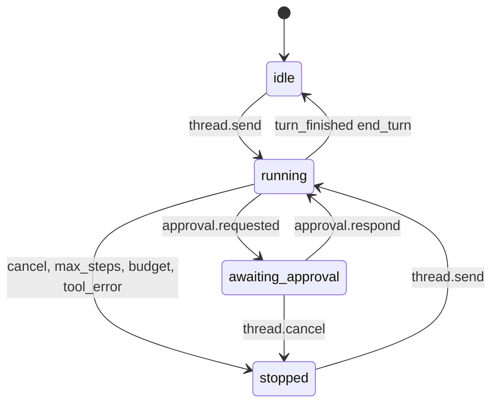
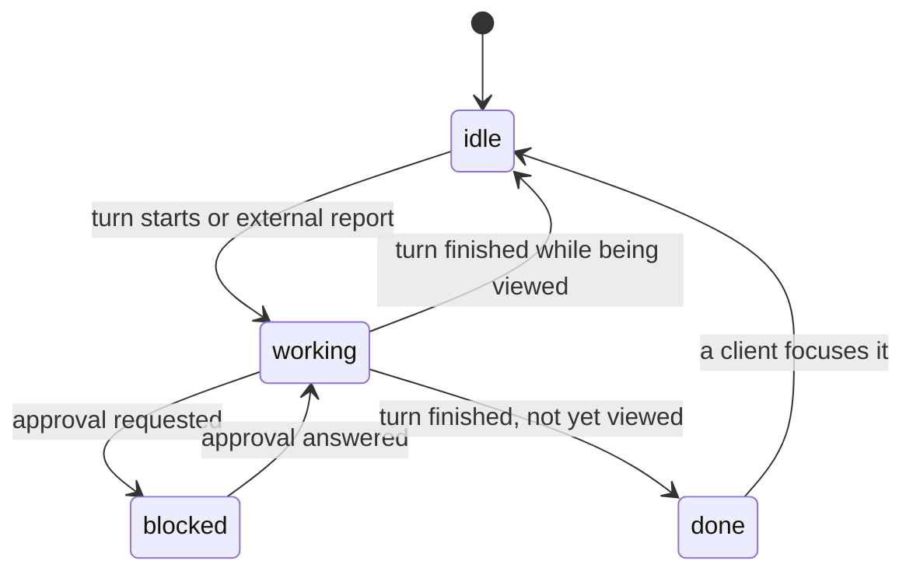
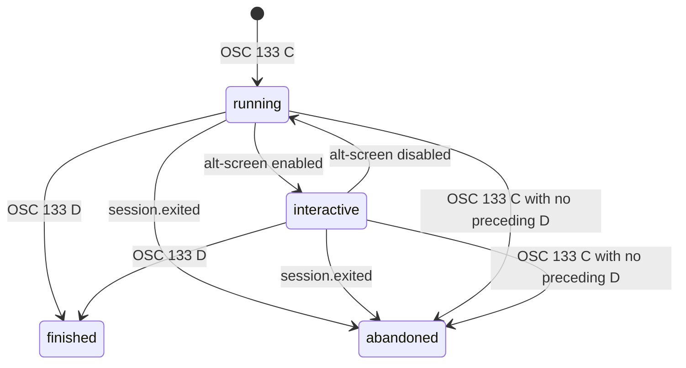

# Umbral Daemon API — API Specification

## Metadata

| Field | Value |
|---|---|
| **Author** | Ernesto Crespo · assisted draft |
| **Status** | `DRAFT` |
| **API version** | v1.12 (`protocol_version = 1`; every version since 1.0 is additive) |
| **Date** | 2026-09-11 |
| **Related PRD** | `specs/prd/umbral-mvp.md` |
| **Transport** | JSON-RPC 2.0 over Unix socket `$XDG_RUNTIME_DIR/umbral/umbral.sock` (macOS: `~/Library/Application Support/Umbral/umbral.sock`; Linux without `XDG_RUNTIME_DIR`: `$TMPDIR/umbral-<uid>/umbral.sock`, see §2) |

---

## 1. Overview

This is the single contract between `umbrald` and its clients: `umbral-tui` (MVP), `umb` (CLI, MVP)
and `umbral-desktop` (F2). There is no public HTTP API.

The channel is bidirectional:

- the client invokes **methods** (request/response);
- the daemon emits **notifications** (no `id`) for output streams and events.

Framing: JSON messages delimited by `\n` (NDJSON). Maximum message size: 4 MiB.

A notification carries a sequence number in its envelope, beside `jsonrpc`, `method` and
`params`:

```json
{"jsonrpc":"2.0","method":"workspace.created","seq":42,"params":{"id":"w1","label":"api"}}
```

§6 says what `seq` counts. A client that ignores the member behaves exactly as one written
before it existed, which is why adding it left `protocol_version` at 1 (§9).

## 2. Authentication and Authorization

1. On installation the daemon creates `$XDG_RUNTIME_DIR/umbral/token` (32 random bytes in hex,
   permissions `0600`).
2. The first call on every connection MUST be `system.hello` with that token (REQ-SEC-003).
3. Any earlier call, or a call with an invalid token, receives `UNAUTHORIZED` and the connection is
   closed.
4. The socket is created with permissions `0600` (REQ-SEC-007).
5. THE SYSTEM SHALL compare the token before validating any other `system.hello` parameter.
   REQ-SEC-003 admits no exception, so no validation error may answer first and leave the
   connection open for another attempt.
6. IF `system.hello` arrives on a connection that already completed the handshake, THEN THE SYSTEM
   SHALL reply `UNAUTHORIZED` and close the connection. That check precedes the token comparison, so
   an authenticated connection cannot be reused to test tokens.

### Runtime directory

The socket and the token live together in a directory only their owner can enter (`0700`):

| Platform | Directory |
|---|---|
| Linux with `XDG_RUNTIME_DIR` | `$XDG_RUNTIME_DIR/umbral` |
| macOS | `~/Library/Application Support/Umbral` |
| Linux without `XDG_RUNTIME_DIR` (bare `su`, container without systemd) | `$TMPDIR/umbral-<uid>` |

The third parent is world-writable, so THE SYSTEM SHALL refuse to use that directory when it
already exists and is not a directory owned by the current user with permissions exactly `0700`.
Without the check another local user could pre-create it and read the token, defeating REQ-SEC-003
before the daemon starts.

### Client kinds

| `client_kind` | Description | Allowed methods |
|---|---|---|
| `tui` | Interactive client | All |
| `desktop` | Wails client (F2) | All |
| `cli` | `umb` | `system.*`, `api.*`, `block.*`, `thread.create`, `thread.send`, `thread.cancel`, `model.list` |

### Handshake

```json
{"jsonrpc":"2.0","id":1,"method":"system.hello",
 "params":{"token":"9f2c…","client_kind":"tui","client_version":"0.1.0","protocol_version":1}}
```

```json
{"jsonrpc":"2.0","id":1,"result":{
  "daemon_version":"0.1.0","protocol_version":1,
  "capabilities":["sessions","blocks","threads","mcp","models","workspaces","layouts","waits","integrations","notifications","policy_explain","wait_admin","rules"],
  "connection_id":"con_01J9Z3K8T2QH6W4V5X7Y8Z9A0B"}}
```

- `protocol_version` is **required**. IF it is missing or not compatible → `UNSUPPORTED_PROTOCOL_VERSION`
  (the daemon reports the accepted versions in `data.supported`). Treating an absent field as
  compatible would silently pair this daemon with a client built for a version it never declared.
- Each entry of `capabilities` names a method namespace (`sessions`, `blocks`, `threads`, `mcp`,
  `models`, `workspaces`, `layouts`, `waits`, `integrations`, `notifications`, `policy_explain`,
  `wait_admin`, `rules`) whose methods the daemon **serves at that moment**. THE SYSTEM SHALL derive
  the list from its method table rather than declaring it statically, SHALL advertise a namespace
  when at least one of its methods is served by this build, and SHALL NOT advertise one whose
  methods are all unserved: a client that branches on the advertisement must not be sent down a path
  that cannot work.
- **Registered is not the same as served.** Every method of the protocol stays in the table whether
  or not this build has the module behind it, which is what lets an unserved one answer
  `NOT_IMPLEMENTED` instead of `METHOD_NOT_FOUND` (§9). So the list is derived from what the daemon
  can do, not from what its table contains — the two differ exactly when a module is missing, which
  is the case the list exists for.
- The grain of a capability is the namespace; the grain of an answer is the method. An absent
  namespace means "this daemon cannot do any of that". A present one does not promise every method
  in it: a client that needs to know about one method calls it and reads the error, or asks
  `api.schema`, which reports `served` per method.
- `system` and `api` are never listed. Every client may always call `system.*`, and `api.schema` is
  how a client finds out what the daemon speaks — a capability that had to be granted before a
  client could ask what it had been granted would be circular. An empty list is valid, and is what a
  daemon serving only those two returns.

## 3. General Conventions

### Identifiers
- Type-prefixed ULIDs: `ses_`, `blk_`, `thr_`, `msg_`, `tc_`, `apr_`, `mcp_`, `con_`
  (Constitution Art. 6). Example: `blk_01J9Z3K8T2QH6W4V5X7Y8Z9A0B`.
- **Structural identifiers** are the documented exception to that rule (Art. 6, amendment of
  2026-09-20): a workspace is `w<n>`, a tab `w<n>:t<m>` and a pane `w<n>:p<m>`, with `n` and `m`
  decimal and starting at 1. Examples: `w1`, `w1:t2`, `w1:p3`. They are allocated by the daemon,
  unique and stable within a session while the object exists, and never reused while it lives
  (REQ-WS-002). A pane's previous identifier stays resolvable as an alias after a move
  (REQ-WS-007), and an alias follows the same grammar.

### Time and money
- Every timestamp is an `integer` in UTC epoch ms (`*_at` fields).
- Every cost is an `integer` in micro-USD (`*_micro_usd` fields).

### Error format

```json
{"jsonrpc":"2.0","id":7,"error":{
  "code":-32004,"message":"permission denied by policy",
  "data":{"domain_code":"PERMISSION_DENIED","details":[{"field":"tool","issue":"deny rule rm-rf"}],
          "trace_id":"4bf92f3577b34da6a3ce929d0e0e4736"}}}
```

`trace_id` carries the OpenTelemetry trace id of the turn that produced the error. Until tracing
exists (T-F1-18) THE SYSTEM SHALL put the `connection_id` there instead, and SHALL leave the field
empty when the error precedes the handshake and there is no connection id yet. THE SYSTEM SHALL NOT
mint an identifier that correlates to nothing: an id appearing in no other log line is worse than an
absent one. The field is present on `INTERNAL_ERROR` only (Art. 7).

### Error codes

| JSON-RPC `code` | `domain_code` | When |
|---|---|---|
| -32700 | `PARSE_ERROR` | Invalid JSON |
| -32600 | `INVALID_REQUEST` | Message is not valid JSON-RPC |
| -32601 | `METHOD_NOT_FOUND` | Method name this build does not know at all, or not allowed for the `client_kind` |
| -32602 | `VALIDATION_ERROR` | Invalid parameters |
| -32001 | `UNAUTHORIZED` | No `system.hello` or invalid token |
| -32002 | `NOT_FOUND` | Unknown ID |
| -32003 | `CONFLICT` | Incompatible state (e.g. `thread.send` while a turn is running) |
| -32004 | `PERMISSION_DENIED` | `deny` policy |
| -32005 | `PROVIDER_UNAVAILABLE` | No model candidate available (includes offline mode) |
| -32006 | `BUDGET_EXCEEDED` | Thread token/cost budget exhausted |
| -32007 | `UNSUPPORTED_PROTOCOL_VERSION` | Incompatible version |
| -32008 | `INPUT_LOCKED` | Input to a session locked by the agent |
| -32009 | `CONFIG_INVALID` | Configuration rejected (e.g. plaintext secret) |
| -32010 | `THREAD_BLOCKED` | `thread.send` with `wait` on a thread awaiting approval |
| -32011 | `TIMEOUT` | A wait reached its deadline (includes the last observed state) |
| -32012 | `NOT_IMPLEMENTED` | A method this build knows by name but whose capability is switched off; see §9 |
| -32013 | `CANCELLED` | The wait was cancelled with `wait.cancel` |
| -32603 | `INTERNAL_ERROR` | Unexpected error (always with `trace_id`) |

### Cursor pagination

Parameters `limit` (1-200, default 50) and `cursor` (opaque). Response:
`{"items":[…],"next_cursor":"…|null"}`. Descending order by `started_at` or `created_at` unless
stated otherwise.

`block.search` is the one method that states otherwise: see §5.18. A cursor belongs to the
method and the ordering that produced it, so one handed to a different method is refused with
`VALIDATION_ERROR` rather than misread.

## 4. Schemas

### Session
```json
{"id":"ses_…","shell":"/usr/bin/zsh","cwd":"/home/u/repo","cols":120,"rows":40,
 "state":"alive","integration":"osc133","input_owner":"human","owner_thread_id":null,
 "exit_code":null,"created_at":1757592000000,"exited_at":null}
```
- `state`: `alive` | `exited`
- `integration`: `pending` | `osc133` | `none`
- `input_owner`: `human` | `agent`
- `owner_thread_id`: `string | null`; the thread that owns this PTY, so a client can tell agent
  sessions from human ones. `null` for a session created by the user (REQ-AGT-003).

### Workspace
```json
{"id":"w1","label":"api","cwd":"/home/u/repo","order_index":0,
 "rollup_state":"blocked","tab_ids":["w1:t1"],"created_at":1757592000000,"closed_at":null}
```
- `rollup_state`: `blocked` | `working` | `done` | `idle` | `unknown` (REQ-WS-006). `unknown` is
  what the requirement's last clause propagates: it appears when every pane and thread of the
  workspace is `unknown`, and a client must render it rather than treat it as `idle`. An *empty*
  workspace is `idle`, not `unknown`. In F0 the two are easy to tell apart, because nothing
  reports a pane state yet and so every workspace holding a pane is `unknown`

### Tab
```json
{"id":"w1:t1","workspace_id":"w1","label":"agents","order_index":0,
 "focused_pane_id":"w1:p1","created_at":1757592000000,"closed_at":null}
```

### Pane
```json
{"id":"w1:p2","tab_id":"w1:t1","workspace_id":"w1","session_id":"ses_…","thread_id":null,
 "label":"tests","cwd":"/home/u/repo","aliases":["w1:p2"],
 "command":["sh","-c","go test ./..."],"env":{"UMBRAL_ROLE":"tests"},
 "attention_state":"working","state_source":"umbral:agent",
 "metadata":{"title":"go test","tokens":{"summary":"unit"}},
 "created_at":1757592000000,"closed_at":null}
```
- `attention_state`: `blocked` | `working` | `done` | `idle` | `unknown`. `unknown` is the
  starting value and the one that survives until some source reports another: it is the absence of
  a report, not a report of nothing. F0 has no producer at all — `pane_state_reports` arrives with
  migration 0005 and threads with F1 — so every F0 pane is `unknown` with a `null` `state_source`
- `state_source`: who owns the state — `umbral:agent` for Umbral's own agent, `umbral:shell` when it is derived from the block lifecycle, or the `source` of an external integration (REQ-INT-002). `null` while nothing has reported. The `umbral:shell` derivation is named here but specified nowhere: which block state maps to which attention state is deferred to the task that owns REQ-INT-002
- `command_pending`: the pane has a `command` that Umbral has not run. Set by `layout.apply` and
  by a restart, never by `pane.split` — a client asking for a command now is asking for it to run,
  while a layout and a restart replay an intention from another time, and REQ-TERM-011 forbids
  acting on one unasked. The command is typed at the pane's prompt without a newline, so the user
  sees it and presses Enter to run it. **Omitted when false**, like `command`
- `command` and `env`: what the pane runs instead of a shell, and the environment overrides it
  runs with. They arrive through `pane.split` or `layout.apply`, are stored, and are what
  `layout.export` carries into a portable tree (REQ-WS-004, REQ-WS-005). **Both are omitted when
  empty**, which is the common case: a pane running a plain shell has neither, and a client should
  read their absence as "a shell" rather than as a field the daemon forgot. A pane with a `command`
  gets no shell integration and therefore no blocks — there is nothing to inject a bootstrap into —
  so it settles on `integration: none` (REQ-BLK-003)
- `metadata` is display-only (REQ-INT-004)

### Layout
```json
{"workspace_id":"w1","tab_id":"w1:t1","focused_pane_id":"w1:p1",
 "root":{"type":"split","direction":"right","ratio":0.6,
         "first":{"type":"pane","pane_id":"w1:p1","label":"editor","cwd":"/repo"},
         "second":{"type":"pane","pane_id":"w1:p2","label":"tests","cwd":"/repo",
                   "command":["sh","-c","go test ./..."],"env":{"UMBRAL_ROLE":"tests"}}}}
```
- `direction`: `right` | `down`; `ratio` is the fraction taken by `first`

### Block
```json
{"id":"blk_…","session_id":"ses_…","origin":"user","thread_id":null,
 "command":"go test ./...","cwd":"/home/u/repo","host":"thinkpad",
 "state":"finished","exit_code":1,"started_at":1757592001000,"ended_at":1757592005200,
 "duration_ms":4200,"output_bytes":1834,"output_truncated":false}
```
- `origin`: `user` | `agent`
- `state`: `running` | `interactive` | `finished` | `abandoned`
- `abandoned` means the block ended without reporting how. There are two ways: the session
  died with the block open, or a second `OSC 133;C` arrived with no `OSC 133;D` in between,
  which is a shell starting a command without saying how the last one finished. `exit_code`
  is `null` on such a block: not knowing how a command ended and knowing it succeeded are
  different facts, and the second one is what reaches the agent's context.

### Thread
```json
{"id":"thr_…","title":"Fix TestParse","mode":"normal","model":"ollama/gpt-oss:20b",
 "model_class":"code","cwd":"/home/u/repo","state":"idle",
 "max_steps":50,"budget_tokens":400000,"tokens_used":12840,"cost_micro_usd":0,
 "created_at":1757592010000,"updated_at":1757592100000}
```
- `mode`: `ask` | `normal` | `auto-edit`
- `state`: `idle` | `running` | `awaiting_approval` | `stopped`
- `attention_state`: `blocked` | `working` | `done` | `idle` | `unknown` — what the sidebar rolls up and what waits observe. `done` is a finished turn no client has viewed yet (REQ-AGT-016)

### Message
```json
{"id":"msg_…","thread_id":"thr_…","role":"assistant","content":"…",
 "attachments":[{"kind":"block","ref":"blk_…","bytes":1834,"truncated_bytes":0}],
 "created_at":1757592020000}
```
- `role`: `user` | `assistant` | `tool` | `system_note`
- `attachments[].kind`: `file` | `dir` | `block` | `stdin`

### ToolCall
```json
{"id":"tc_…","thread_id":"thr_…","message_id":"msg_…","tool":"run_command",
 "risk":"Exec","args":{"command":"go test ./..."},"status":"ok",
 "result_summary":"exit 0","block_id":"blk_…","started_at":1757592030000,"ended_at":1757592034000}
```
- `risk`: `ReadOnly` | `WriteFS` | `Exec` | `Network`
- `status`: `pending` | `ok` | `error` | `denied_by_user` | `denied_by_policy` | `invalid_args`

### Approval
```json
{"id":"apr_…","thread_id":"thr_…","tool_call_id":"tc_…","tool":"run_command","risk":"Exec",
 "reason":"policy","summary":"go test ./...","diff":null,"state":"pending",
 "decision_scope":null,"created_at":1757592029000,"decided_at":null}
```
- `reason`: `policy` | `destructive` | `tainted` | `outside_write_root`
- `state`: `pending` | `approved` | `denied` | `expired`
- `decision_scope`: `once` | `thread` | `always`

### Model
```json
{"id":"ollama/gpt-oss:20b","provider":"ollama","local":true,
 "caps":{"tools":true,"vision":false,"reasoning":true,"json_schema":true,"context_window":32768},
 "price_in_micro_usd_per_mtok":0,"price_out_micro_usd_per_mtok":0,"health":"ok"}
```
- `health`: `ok` | `degraded` | `down` | `unknown`

### McpServer
```json
{"id":"mcp_…","name":"gitlab","transport":"stdio","trust":"trusted","state":"connected",
 "tools":["get_issue","list_mrs"],"last_error":null}
```
- `transport`: `stdio` | `http`
- `trust`: `trusted` | `untrusted`
- `state`: `connecting` | `connected` | `unavailable` | `disabled`

## 5. Methods

### 5.1 `system.hello`
**Params:** `{token, client_kind, client_version, protocol_version}`. See §2 for what each one means
and for the order they are validated in. REQ-SEC-003.

### 5.2 `system.status`
**Params:** `{}`. Returns `{daemon_version, uptime_ms, sessions_alive, threads_running, providers:[{id, health}], mcp:[{name, state}]}`.
Used by `umb status` (REQ-CLI-003).

### 5.3 `session.snapshot` — REQ-API-001, REQ-API-002
**Params:** `{}`.
**Result:** `{seq, focused:{workspace_id|null, tab_id|null, thread_id|null}, workspaces: Workspace[], tabs: Tab[], panes: Pane[], layouts: Layout[], threads: Thread[]}`.

All three members of `focused` are nullable, and all three are null on a daemon that has nothing
focused yet — the state every client meets on a fresh daemon, before the first `workspace.create`.
Null means "nothing is focused", never "unknown".

The `seq` is the envelope counter of §6, read **before** the tree: the daemon persists before it
notifies (DD-007), so an event whose `seq` has been assigned is already stored, and reading the
counter first guarantees that everything at or below the reported number is in this result. The
result may additionally reflect a few events *above* it, which makes a client re-apply something it
already has — safe, because every tree notification carries the whole record. The other direction
is not safe, which is why the order is specified rather than left to an implementation.

The discard rule covers what this result contains: the `workspace.*`, `tab.*`, `pane.*`,
`layout.*` and `thread.*` notifications. It does **not** cover `session.output`, which this result
carries no screen to have contained; a terminal is bootstrapped by `session.subscribe` against that
method's own per-session `seq` (§5.11), and discarding output on the envelope counter would lose
bytes with nothing to notice.

Bootstrap without gaps, for clients that keep their own cache:

1. open a second connection and complete `system.hello` on it; tree notifications go to every
   authenticated connection and need no subscription, so from that point nothing is missed;
2. buffer the stream while calling `session.snapshot`;
3. install the snapshot and apply the buffered events whose `seq` is greater than the snapshot's `seq`;
4. keep streaming. Call `session.snapshot` again after reconnecting.

### 5.4 `workspace.create` / `list` / `focus` / `rename` / `close` — REQ-WS-001, REQ-WS-002, REQ-WS-006
`create` params: `{cwd, label?, tab_label?, focus?: true}`.
`create` result: `{workspace: Workspace, tab: Tab, root_pane: Pane}` — the three objects in one response.
`close` params: `{workspace_id, close_panes?: true}`; it fails with `CONFLICT` if a thread of that workspace is `running`.
`list` params: `{}`. `focus` params: `{workspace_id}`. `rename` params: `{workspace_id, label}`.

### 5.5 `tab.create` / `list` / `focus` / `rename` / `close` — REQ-WS-001
`create` params: `{workspace_id, label?, focus?: true}`. `create` result: `{tab: Tab, root_pane: Pane}`.
`list` params: `{workspace_id}`. `focus` params: `{tab_id}`. `rename` params: `{tab_id, label}`.
`close` params: `{tab_id}`.

### 5.6 `pane.split` / `list` / `get` / `focus` / `rename` / `move` / `close` — REQ-WS-003, REQ-WS-007
`split` params: `{pane_id, direction:"right"|"down", ratio?: 0.1-0.9 (default 0.5), cwd?, command?: string[], env?: object, focus?: true}`.
`split` result: `{pane: Pane, layout: Layout}`.

`move` params: `{pane_id, destination:{type:"tab"|"new_tab"|"new_workspace", …}}`. The pane keeps its terminal and its process; it receives a new identifier and the previous one remains a resolvable alias while that terminal lives (REQ-WS-007). The daemon emits `pane.moved`, never a `pane.closed` / `pane.created` pair.

`list` params: `{tab_id}`. `get` params: `{pane_id}`. `focus` params: `{pane_id}`.
`rename` params: `{pane_id, label}`. `close` params: `{pane_id}`.

`close` terminates the pane's session following the `session.close` rules.

### 5.7 `layout.export` — REQ-WS-004
**Params:** `{tab_id?}` (default: the focused tab). **Result:** `Layout`.

### 5.8 `layout.apply` — REQ-WS-005, REQ-TERM-011
**Params:** `{workspace_id, tab_label?, root, focus?: true}`.
**Result:** `{tab: Tab, panes: Pane[], warnings: ["live processes and scrollback are not reproduced", "commands are pending: they are typed at each pane's prompt and run when you press Enter"]}`.

Every pane it creates runs a **shell**. A node carrying a `command` gets that command stored and
`command_pending` set, typed at the pane's prompt without a newline — REQ-TERM-011: "it returns the
commands as pending, never as launched". A layout is an intention from another time and possibly
another machine, so applying one is not consent to run what it carries; `pane.split`, where a
client asks for a command now, is unaffected. The second warning is present only when the tree
carried at least one command.

### 5.9 `session.create` — REQ-TERM-001, REQ-BLK-005
**Params:**

| Field | Type | Rule |
|---|---|---|
| `shell` | string | Optional; default `$SHELL`; must be executable |
| `cwd` | string | Optional; default `$HOME`; must exist |
| `env` | object<string,string> | Optional; at most 64 keys |
| `cols`, `rows` | integer | 20-1000 and 5-500 |
| `shell_integration` | boolean | Default `true` |

**Result:** `Session`.
**Errors:** `VALIDATION_ERROR` (invalid shell/cwd), `INTERNAL_ERROR` (`forkpty` failure).

### 5.10 `session.list` → `{items: Session[]}`
**Params:** `{}`.

### 5.11 `session.subscribe` — REQ-TERM-003, REQ-TERM-004
**Params:** `{session_id, scrollback_lines?: 0-10000 (default 10000)}`.

**Result:** `{snapshot: {format:"vt", data_b64, cursor:{x,y}}, seq}`.

After the response, the daemon emits `session.output` starting at `seq + 1`.

**Errors:** `NOT_FOUND`.

### 5.12 `session.unsubscribe` → `{}`
**Params:** `{session_id}`. Unsubscribing from a session with no subscription is not an error: the
caller wanted none and has none.

### 5.13 `session.input` — REQ-TERM-008
**Params:** `{session_id, data_b64}` (at most 64 KiB per message).

**Errors:** `INPUT_LOCKED`, `NOT_FOUND`, `CONFLICT` (session `exited`).

### 5.14 `session.resize` — REQ-TERM-007
**Params:** `{session_id, cols, rows}`. Notifies `session.resized`.

### 5.15 `session.close` → `{}`
**Params:** `{session_id}`.
Sends SIGHUP; after 3 s, SIGKILL.

### 5.16 `block.list`
**Params:** `{session_id?, thread_id?, origin?, state?, exit_code?, limit?, cursor?}`.
**Result:** page of `Block`.

### 5.17 `block.get` — REQ-CLI-002, REQ-BLK-007
**Params:** `{block_id | "last", session_id?, include?:"none"|"plain"|"raw"}`.
**Result:** `Block` plus `output_plain` or `output_raw_b64`.

The reserved id `"last"` means the most recent **closed** block: `finished` or `abandoned`,
never one still running. With `session_id` it is that session's last closed block; without
one it is the last closed block of the whole history. Both are useful and they are not
interchangeable, so a client that means "this terminal" has to say which session it is in:
`umb` reads `UMBRAL_SESSION_ID` for exactly that (REQ-CLI-002, REQ-INT-001). `NOT_FOUND`
when there is no closed block to return.

### 5.18 `block.search` — REQ-BLK-006
**Params:** `{query (FTS5, 1-256 chars), session_id?, limit?, cursor?}`.
**Result:** page of `{block: Block, snippet}`.

Hits come back in **descending insertion order**, not by `started_at` as §3 otherwise
specifies, and not by relevance. The two orderings agree in practice, because a block's row is
written when `OSC 133;C` opens it, so insertion order is start order by construction. The
reason for the exception is cost: ordering by `started_at` puts a temporary B-tree over the
whole match set, so a term matching half the history sorts fifty thousand rows to return
fifty (139 ms at 100,000 blocks), and no index helps, because rows arrive from the full-text
index in rowid order. Ordering by that rowid lets SQLite walk the index backwards and stop at
the limit: 0.93 ms, which is how REQ-BLK-006's 200 ms budget is met.

`query` is passed to SQLite as written, so it is FTS5 syntax and not free text: a bare path
such as `internal/sessions` is a syntax error in that grammar, because an unquoted `/` is not
a bareword character. A client offering a search box SHALL quote what the user typed when it
is not already a valid expression. A malformed query returns `VALIDATION_ERROR`.

### 5.19 `thread.create`
**Params:** `{mode?:"normal", model?, model_class?:"code", cwd, title?, ephemeral?:false, max_steps?:1-200, budget_tokens?}`.
**Result:** `Thread`.

### 5.20 `thread.send` — REQ-AGT-001, REQ-AGT-015, REQ-CTX-002, REQ-CLI-001
**Params:** `{thread_id, text (1-100000 chars), attachments?:[{kind, ref | data_b64}], client_msg_id?}`.

- `client_msg_id`: optional ULID chosen by the client, unique per thread. `umbral-tui` and `umb`
  always send it, so that a retry after a disconnect does not duplicate the turn or re-run its
  commands. A repeated `client_msg_id` in the same thread returns the original `{turn_id, message_id}`
  with no new turn (REQ-AGT-015), including while that first turn is still running.

**Optional `wait`:** `{until: ["idle"|"done"|"blocked"|"stopped"], timeout_ms: 1000-3600000}`. Submitting the message and starting the wait in a single request removes the race between two calls (REQ-AUT-001, REQ-AUT-002).

**Result:** `{turn_id, message_id, final_state?}`. The content arrives through notifications; `final_state` is only present when `wait` was requested.

**Errors:**
- `CONFLICT`: a turn is already running (not raised for a duplicate `client_msg_id`).
- `THREAD_BLOCKED`: with `wait`, the thread is already awaiting approval; nothing is persisted or sent.
- `TIMEOUT`: the wait expired; the message was already sent, so do not resend it blindly.
- `BUDGET_EXCEEDED`.
- `PROVIDER_UNAVAILABLE`.
- `VALIDATION_ERROR`: unknown attachment, or `client_msg_id` that is not a ULID.

### 5.21 `thread.cancel` — REQ-AGT-007 → `{stopped_at}`

### 5.22 `thread.update` — REQ-AGT-010
**Params:** `{thread_id, mode?, model?, title?}`.
- A `model` change applies from the next turn.
- **Errors:** `CONFLICT` when changing `mode` during a turn.

### 5.23 `thread.list` / `thread.get`
`thread.get` accepts `{thread_id, include_messages?: bool, limit, cursor}`.

### 5.24 `approval.list` → `{items: Approval[]}` (only `pending` by default)

### 5.25 `approval.respond` — REQ-AGT-004, REQ-AGT-005
**Params:** `{approval_id, decision:"approve"|"deny", scope:"once"|"thread"|"always"}`.

Rules:
- `scope = always` persists an `allow` or `deny` rule (table `policy_rules`).
- Destructive patterns ignore `always` (REQ-SEC-005).
- **Errors:** `NOT_FOUND`; `CONFLICT` if already decided.

### 5.26 `model.list` — REQ-LLM-002
**Params:** `{refresh?: false}`. **Result:** `{items: Model[]}`.

### 5.27 `mcp.server.list` / `mcp.server.add` / `mcp.server.remove` — REQ-MCP-001, REQ-MCP-002
`add` params: `{name, transport, command?, args?, url?, env_refs?, trust?:"untrusted"}`.
`env_refs` maps environment variable names to `keyring:<path>` references (column `mcp_servers.env_refs_json`); plaintext values are rejected with `CONFIG_INVALID` (REQ-SEC-004). When the keyring is unavailable and the fallback is enabled, an `env:<VAR>` reference is accepted instead and the daemon reports the degraded mode (REQ-SEC-012, Art. 5 amendment of 2026-09-20).
Errors: `VALIDATION_ERROR`, `CONFIG_INVALID`.

### 5.28 `config.get` / `config.reload`
- `config.reload` validates before applying.
- **Errors:** `CONFIG_INVALID` with `details` per rejected entry (REQ-SEC-004).

### 5.29 `thread.wait` — REQ-AUT-001, REQ-AUT-004
**Params:** `{thread_id, until: string[], timeout_ms}`.
**Result:** `{thread_id, turn_id, state, waited_ms}`.

The daemon pins the turn in progress when the wait starts: a later turn does not satisfy it. If the thread is already in one of the target states, it returns immediately. On expiry it returns `TIMEOUT` with `data.last_state`.

### 5.30 `block.wait_output` — REQ-AUT-003
**Params:** `{session_id | block_id, regex (RE2), lines?: 1-2000 (default 200), timeout_ms}` —
exactly one of `session_id` or `block_id`; sending both or neither returns `VALIDATION_ERROR`.
Matching includes output already on screen when the wait started.
**Result:** `{block_id, matched_line, line_number}`.

It evaluates the pane's recent output line by line, including what was already on screen when the call started. It does not interpret agent state.

### 5.31 `pane.report_state` / `pane.release_state` — REQ-INT-002, REQ-INT-003, REQ-INT-005
`report_state` params: `{pane_id, source, agent?, state:"idle"|"working"|"blocked"|"done", message?, seq?}`.

- `source` identifies the reporter (1-80 chars, `[A-Za-z0-9:._-]`) and owns the pane's authority while it reports.
- A `seq` lower than or equal to the last accepted one for that `source` returns `ok` and changes nothing.
- Umbral's own agent always owns the panes of its threads; an external `source` cannot take that authority (`PERMISSION_DENIED`).

`release_state` params: `{pane_id, source}` — the pane returns to Umbral's own detection.

### 5.32 `pane.report_metadata` — REQ-INT-004
**Params:** `{pane_id, source, title?, display_name?, state_labels?, tokens?: object, ttl_ms?: 1-86400000, seq?}`.

Display only: it never alters waits, rollups or notifications. Normalization: control characters removed, whitespace collapsed, 80-character cap per value. Limits: at most 16 token keys per report and 32 live keys per pane; a `null` value clears the key.

### 5.33 `wait.list` / `wait.cancel` — REQ-AUT-005, REQ-AUT-006, REQ-AUT-007
`wait.list` result: `{items:[{wait_id, connection_id, target:{thread_id|block_id}, until:[…], age_ms, stalled:bool}]}`.

`wait.cancel` params: `{wait_id}`. It ends the wait with `CANCELLED` for whoever is waiting and does
not touch the turn, the process or the pane being observed. Exceeding the concurrent-wait limit
returns `VALIDATION_ERROR` naming the limit; exceeding the report rate returns `ok` with the report
discarded. Neither closes the connection.

### 5.34 `rules.status` / `rules.key.add|list|remove|rotate` / `rules.rollback` / `rules.reset` — REQ-SEC-011, REQ-SEC-013, REQ-SEC-014, REQ-SEC-015, REQ-SEC-016
`rules.status` result:
```json
{"active_bundle":{"version":7,"sha256":"…","source":"remote","verified_with":"key_2026a"},
 "previous_bundle":{"version":6,"sha256":"…"},
 "local_override":true,
 "remote_updates":"enabled",
 "trust_keys":[{"id":"key_2026a","fingerprint":"SHA256:…","added_at":1758326400000}],
 "last_rejection":{"reason":"unknown_key","at":1758320000000}}
```
- `remote_updates`: `enabled` | `disabled_by_config` | `disabled_fail_closed` (no valid key, or three consecutive failures — REQ-SEC-015).
- `rules.key.add` and `rules.key.rotate` require `confirm_fingerprint` matching the key's SHA-256; otherwise `VALIDATION_ERROR`.
- `rules.key.remove` on the last valid key requires `force: true`; otherwise `CONFLICT`.
- `rules.rollback` reinstalls `previous_bundle` and `rules.reset` returns to the rules built into the binary. Both work offline, need no valid key, and never touch the local override directory (REQ-SEC-016).

### 5.35 `notification.show` — REQ-NTF-001, REQ-NTF-002
**Params:** `{title, body?, source, sound?: "none"|"done"|"request"}`.
**Result:** `{shown: bool, reason: "shown"|"disabled"|"rate_limited"|"no_client"}`.

### 5.36 `policy.explain` — REQ-SEC-009
**Params:** `{thread_id?, mode?, tool, risk, target, tainted?: false}`.
**Result:**
```json
{"decision":"ask",
 "deciding_rule":"destructive_pattern",
 "trace":[{"step":"destructive_pattern","matched":true,"detail":"rm -rf"},
          {"step":"deny_rules","matched":false},
          {"step":"taint","matched":false},
          {"step":"mode","mode":"auto-edit","matched":false},
          {"step":"allow_rules","matched":false,"note":"an allow rule exists but is overridden"},
          {"step":"mode_default","decision":"ask"}]}
```
It is a read-only evaluation: it neither runs the tool nor creates approvals.

### 5.37 `api.schema` — REQ-API-004
**Params:** `{}`. **Result:** `{schema}` — the protocol document built into the binary. Exposed on
the CLI as `umb api schema --json`, which needs no running daemon: the document describes the build,
so a client can read it before it has anywhere to connect.

Every `params` and `result` in it, and every notification payload, is a **JSON Schema (draft
2020-12)** and declares the dialect in its own `$schema`, so a client or a test can take the one it
cares about and hand it straight to a validator — which is what REQ-API-004 asks for. Nullability is
written as JSON Schema spells it, `"type": ["string", "null"]`, and not with OpenAPI's `nullable`
keyword, which a JSON Schema validator ignores: a member ignored that way would be rejected on every
fresh daemon, since §5.3's `focused` is null until something is focused. A member whose shape is not
yet constrained — `threads` until F1 — carries no `type` at all, which is the schema `{}`. CI
validates all of them against the metaschema, because a schema nothing validates is a description
with a misleading name.

The document itself is an index, not a schema: it carries `protocol_version` and the four lists
below.

`methods`, each with its name, the `client_kinds` of §2 allowed to call it — written out in full,
never an empty list standing for "everyone" — whether this build `served` it (§9), and the schemas
of its parameters and result; `notifications`, the §6 table with each payload's schema; and
`errors`, the whole §3 code table rather than the subset this build can currently raise, because a
client switching on `domain_code` needs the complete set to be exhaustive.

THE SYSTEM SHALL generate the document from the types it serves with rather than from a written
copy, and CI SHALL compare it against this specification. The comparison is blocking for method
names, required parameters and error codes, and non-blocking for descriptions and added optional
fields (REQ-API-004); `tools/api_schema_check.py` is the check and `task schema` runs it.

## 6. Notifications (daemon → client)

| Method | Payload | REQ |
|---|---|---|
| `session.output` | `{session_id, seq, data_b64}` | REQ-TERM-006 |
| `session.resized` | `{session_id, cols, rows}` | REQ-TERM-007 |
| `session.exited` | `{session_id, exit_code, exited_at}` | REQ-TERM-005 |
| `session.integration` | `{session_id, integration}` | REQ-BLK-003 |
| `session.input_owner` | `{session_id, input_owner}` | REQ-TERM-008 |
| `session.unsubscribed` | `{session_id, reason}` | REQ-TERM-004 |
| `block.started` | `Block` | REQ-BLK-001 |
| `block.updated` | `{block_id, state}` (e.g. `interactive`) | REQ-BLK-004 |
| `block.closed` | `Block` | REQ-BLK-002 |
| `thread.delta` | `{thread_id, turn_id, kind:"text"\|"reasoning", text}` | REQ-AGT-001 |
| `thread.tool_call` | `ToolCall` (on every `status` change) | REQ-AGT-003 |
| `approval.requested` | `Approval` | REQ-AGT-004 |
| `thread.turn_finished` | `{thread_id, turn_id, stop_reason, usage:{in_tokens,out_tokens,cost_micro_usd}}` | REQ-AGT-008, REQ-LLM-005 |
| `context.compacted` | `{thread_id, before_tokens, after_tokens}` | REQ-CTX-004 |
| `model.health_changed` | `{model_id, health}` | REQ-LLM-003 |
| `mcp.server_state` | `{name, state, last_error}` | REQ-MCP-003 |
| `workspace.created` / `.updated` / `.closed` / `.focused` | `Workspace` | REQ-WS-001, REQ-WS-006 |
| `tab.created` / `.closed` / `.focused` | `Tab` | REQ-WS-001 |
| `pane.created` / `.updated` / `.closed` / `.focused` | `Pane` | REQ-WS-003 |
| `pane.moved` | `{pane, previous_pane_id, previous_workspace_id, layout}` | REQ-WS-007 |
| `pane.state_changed` | `{pane_id, attention_state, state_source}` | REQ-INT-002 |
| `layout.updated` | `Layout` | REQ-WS-004 |
| `thread.attention_changed` | `{thread_id, attention_state}` | REQ-AGT-016 |
| `thread.stalled` | `{thread_id, turn_id, idle_ms, last_event}` | REQ-AUT-008 |
| `rules.update_rejected` | `{reason, version, source}` | REQ-SEC-013 |

Every notification carries `seq` in its envelope (§1): a counter that increases by one per **event
the daemon dispatches**, scoped to **one daemon run** and shared by every connection, so the same
event carries the same number for everyone (REQ-API-002). It starts at 0 when the daemon starts, and
a client SHALL NOT carry one across a reconnect — the connection dies with the daemon, and a number
from the previous run names nothing in this one.

**The counter is monotonic in assignment, not in arrival.** A number is taken when the daemon
dispatches the event; output then travels through the per-client queue of §8, where it may be
batched, while control notifications are written directly. A connection subscribed to a session can
therefore see a higher number before a lower one. The only comparison a client may make is against
the `seq` reported by `session.snapshot`; comparing against the last number it saw would discard
live events. THE SYSTEM does not promise per-connection ordering of `seq`, and a client SHALL NOT
assume it.

**Gaps are expected and are not loss.** A client receives only the notifications it is eligible for
— output for the sessions it subscribed to, nothing for a subscription that was dropped — so its
`seq` values skip. A missing number means "an event that was not yours", never "an event you lost".
Loss has its own signal, `session.unsubscribed`.

**This is not `session.output`'s `seq`.** That one lives in the parameters, counts per PTY session,
and anchors the screen to the byte stream (§5.11, REQ-TERM-004). The two are different numbers with
the same name in different places: the envelope one orders events across the whole daemon, the
parameter one orders bytes within one terminal.

**Nor is it the `seq` of `report_state` and `report_progress`.** That third one is a request
*parameter*, counts per `source`, and exists to drop a stale report (§5.15, §5.16). Three numbers
share the name; only the envelope one is the subject of REQ-API-002.

`session.snapshot` reports the envelope `seq` it contains, and a client applies only the events
above it — for the notifications that snapshot actually carries. §5.3 says which.

`stop_reason`: `end_turn` | `cancelled` | `max_steps` | `budget` | `tool_error` | `provider_error`.

`session.unsubscribed`'s `reason`: `slow_client`.

WHEN THE SYSTEM drops a subscription for exceeding the per-client queue limit of §8, THE
SYSTEM SHALL emit `session.unsubscribed` for that session before it stops delivering. A
client that receives it and still wants the session SHALL call `session.subscribe` again.
Nothing is lost by the drop: the fresh snapshot already contains everything the dropped
subscription had not delivered, so the screen is re-sent rather than the backlog.

## 7. State machines







## 8. Limits

| Limit | Value |
|---|---|
| JSON message | 4 MiB |
| `session.input` | 64 KiB per message |
| Concurrent connections | 32 |
| `session.output` notifications | batched every 4 ms or 32 KiB, whichever comes first |
| Concurrent waits per connection | 32; beyond that `thread.wait` and `block.wait_output` return `VALIDATION_ERROR` |
| Wait timeout | 1 s to 1 h; there is no wait without a deadline |
| State/metadata reports | 10 per second per `source`; the excess returns `ok` and is discarded |
| Live metadata keys | 16 per report, 32 per pane |
| Queue per slow client | 8 MiB; beyond that the daemon drops the subscription, announces it with `session.unsubscribed` (§6), and the client re-subscribes (receiving a new snapshot) |

## 9. Versioning

- `protocol_version` is an integer. Additive changes (optional fields, new methods) do not bump it.
- Removing a field or changing its meaning bumps the major version. The daemon supports N and N-1
  for 6 months.
- **Optional capabilities:** `system.hello` returns the namespaces the daemon **serves** at that
  moment (§2). The protocol's namespaces are `sessions`, `blocks`, `threads`, `mcp`, `models`,
  `workspaces`, `layouts`, `waits`, `integrations`, `notifications`, `policy_explain`, `wait_admin`
  and `rules`; `worktrees`, `graphics`, `plugins` and `federation` are reserved for later. The §2
  example shows the full list and is illustrative: what a given daemon returns is whatever it can
  actually do, which is narrower than what its method table holds whenever a module is absent.
- **Which error a missing method gets.** A name this build does not know receives
  `METHOD_NOT_FOUND`; a name it knows whose capability is switched off in this build receives
  `NOT_IMPLEMENTED`. Both keep the connection open and disable only that action, so neither client
  nor daemon need to be on the same build (REQ-API-003). `TestUnknownMethodKeepsConnection_REQ_API_003`
  and `TestUnservedMethodIsNotImplemented_REQ_API_003` cover the two cases.
- **The mechanism the second case needs.** THE SYSTEM SHALL keep in its method table every method
  **it implements**, whether or not the module behind it is wired into this build. Dropping the
  unwired ones would make their names unknown, and the only honest answer to an unknown name is
  `METHOD_NOT_FOUND` — which would leave the two codes indistinguishable and the client unable to
  tell an old daemon from a partial one.
- **A method a build does not implement at all is a different case, and `METHOD_NOT_FOUND` is right
  for it.** A daemon built before a phase landed genuinely does not know `thread.send`, which is
  exactly what REQ-API-003's first sentence describes: "a method name that this daemon version does
  not know". `NOT_IMPLEMENTED` is narrower — it says "this version has the method and this build was
  assembled without what it needs" — and claiming it for a method that was never written would tell
  a client to retry against a differently-configured daemon of the same version, which cannot help.
  So the two codes divide by *version* and by *build*, not by whether a name appears in some
  document. `api.schema` reports `served` per method for a client that wants the whole picture at
  once, and lists only what this version implements.
- **Published schema:** the binary can print the JSON Schema of the protocol (`umb api schema --json`).
  CI checks it against this document, so the spec and the implementation cannot drift silently
  (REQ-API-004).

## Example with socat

```bash
TOKEN=$(cat "$XDG_RUNTIME_DIR/umbral/token")
printf '%s\n' \
 "{\"jsonrpc\":\"2.0\",\"id\":1,\"method\":\"system.hello\",\"params\":{\"token\":\"$TOKEN\",\"client_kind\":\"cli\",\"client_version\":\"dev\",\"protocol_version\":1}}" \
 '{"jsonrpc":"2.0","id":2,"method":"block.get","params":{"block_id":"last","include":"plain"}}' \
 | socat - UNIX-CONNECT:"$XDG_RUNTIME_DIR/umbral/umbral.sock"
```

## Change History

| Version | Date | Changes |
|---|---|---|
| 1.0 | 2026-09-11 | Initial version |
| 1.1 | 2026-09-11 | delta `2026-09-analyze-fixes`: `client_msg_id` in `thread.send` (A-04), `owner_thread_id` in `Session` (A-05), `env_keyring_refs` → `env_refs` (A-06) |
| 1.2 | 2026-09-11 | delta `2026-09-api-f0-decisions`: runtime-directory fallback and its ownership check, `trace_id` substitute until tracing exists, `capabilities` derived from the method table, `protocol_version` required, repeated handshake closes the connection, token compared before any other parameter |
| 1.3 | 2026-09-11 | delta `2026-09-slow-client-notification`: `session.unsubscribed` in §6 and the pointer to it in §8. delta `2026-09-block-lifecycle-decisions`: `abandoned` widened in §4 and its two new edges in §7 |
| 1.4 | 2026-09-11 | delta `2026-09-block-query-performance`: `block.search` orders by insertion position (§3, §5.18), and §5.18 says what FTS5 syntax means for a client's search box |
| 1.5 | 2026-09-20 | Adds workspaces, tabs, panes, layouts, snapshot with `seq`, waits, integration reports, notifications, `policy.explain` and `api.schema` (ADR-0002). Additive change: `protocol_version` stays at 1 |
| 1.6 | 2026-09-20 | Closes the Analyze findings: `wait.list`/`wait.cancel`, the `rules.*` family, `thread.stalled`, `rules.update_rejected` and `CANCELLED` |
| 1.7 | 2026-09-20 | delta `2026-09-art6-structural-ids`: §3 documents the structural identifier grammar as the Art. 6 exception (C-05) |
| 1.8 | 2026-09-20 | delta `2026-09-cli-surface`: §5.17 says what the reserved id `"last"` means with and without a `session_id` |
| 1.9 | 2026-09-20 | delta `2026-09-notification-sequencing`: §1 shows the notification envelope with `seq`; §6 states its scope, that it counts events rather than notifications, that it is ordered in assignment and not in arrival, and names the two other numbers called `seq`; §5.3 types `focused` nullable throughout, says which notifications the discard rule covers, pins the read order against DD-007, and replaces the `events.subscribe` bootstrap step with a second connection |
| 1.10 | 2026-09-20 | delta `2026-09-capability-degradation`: §2 derives `capabilities` from the methods a build *serves* and excludes `system` and `api`; §9 states that an unserved method keeps its name, which is what makes `NOT_IMPLEMENTED` reachable; §5.37 describes `api.schema`'s document and the blocking CI comparison |
| 1.11 | 2026-09-20 | delta `2026-09-schema-and-degradation-corrections`: §9 scopes the registration rule to what a build *implements* and says when `METHOD_NOT_FOUND` is the right answer; §9's capability bullet matches §2; §2's `cli` row grants `api.*`; `limit`, `cursor` and `include` become optional in §5.12, §5.13 and §5.18; §5.37 states the JSON Schema dialect, the nullability spelling and the full `client_kinds` list; seventeen methods gain the request shapes they never had |
| 1.12 | 2026-09-20 | delta `2026-09-restore-semantics`: §4's `Pane` gains `command_pending` (omitted when false) and §5.8 states that `layout.apply` returns a tree's commands as pending, never as launched. Additive within `protocol_version = 1` |
