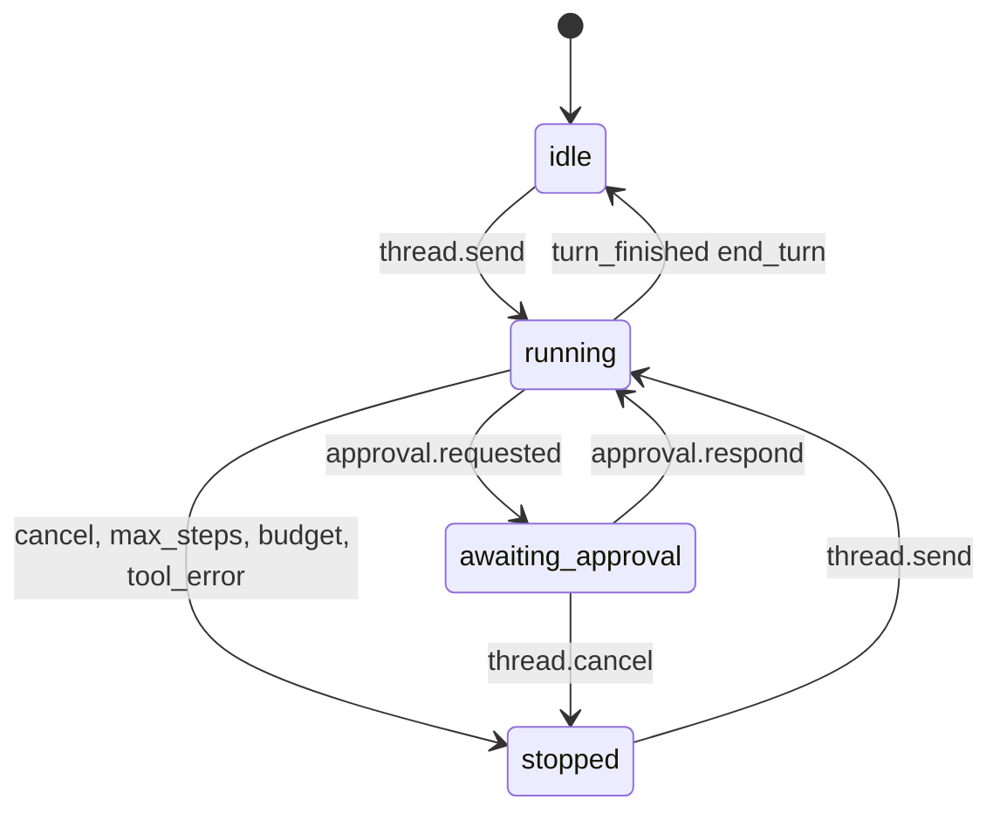
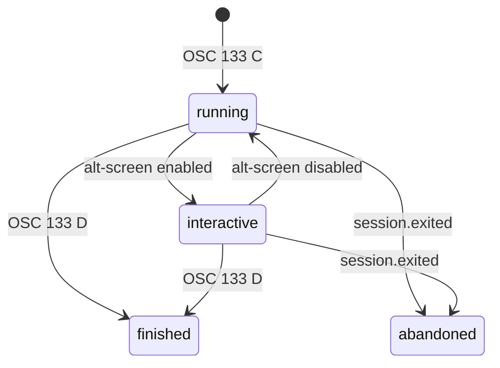

# Umbral Daemon API — API Specification

## Metadata

| Field | Value |
|---|---|
| **Author** | Ernesto Crespo · assisted draft |
| **Status** | `DRAFT` |
| **API version** | v1.2 (`protocol_version = 1`; 1.1 and 1.2 are additive over 1.0) |
| **Date** | 2026-09-11 |
| **Related PRD** | `specs/prd/umbral-mvp.md` |
| **Transport** | JSON-RPC 2.0 over Unix socket `$XDG_RUNTIME_DIR/umbral/umbral.sock` (macOS: `~/Library/Application Support/Umbral/umbral.sock`; Linux without `XDG_RUNTIME_DIR`: `$TMPDIR/umbral-<uid>/umbral.sock`, see §2) |

---

## 1. Overview

This is the single contract between `umbrald` and its clients: `umbral-tui` (MVP), `umb` (CLI, MVP)
and `umbral-desktop` (F2). There is no public HTTP API.

The channel is bidirectional:

- the client invokes **methods** (request/response);
- the daemon emits **notifications** (no `id`) for output streams and events.

Framing: JSON messages delimited by `\n` (NDJSON). Maximum message size: 4 MiB.

## 2. Authentication and Authorization

1. On installation the daemon creates `$XDG_RUNTIME_DIR/umbral/token` (32 random bytes in hex,
   permissions `0600`).
2. The first call on every connection MUST be `system.hello` with that token (REQ-SEC-003).
3. Any earlier call, or a call with an invalid token, receives `UNAUTHORIZED` and the connection is
   closed.
4. The socket is created with permissions `0600` (REQ-SEC-007).
5. THE SYSTEM SHALL compare the token before validating any other `system.hello` parameter.
   REQ-SEC-003 admits no exception, so no validation error may answer first and leave the
   connection open for another attempt.
6. IF `system.hello` arrives on a connection that already completed the handshake, THEN THE SYSTEM
   SHALL reply `UNAUTHORIZED` and close the connection. That check precedes the token comparison, so
   an authenticated connection cannot be reused to test tokens.

### Runtime directory

The socket and the token live together in a directory only their owner can enter (`0700`):

| Platform | Directory |
|---|---|
| Linux with `XDG_RUNTIME_DIR` | `$XDG_RUNTIME_DIR/umbral` |
| macOS | `~/Library/Application Support/Umbral` |
| Linux without `XDG_RUNTIME_DIR` (bare `su`, container without systemd) | `$TMPDIR/umbral-<uid>` |

The third parent is world-writable, so THE SYSTEM SHALL refuse to use that directory when it
already exists and is not a directory owned by the current user with permissions exactly `0700`.
Without the check another local user could pre-create it and read the token, defeating REQ-SEC-003
before the daemon starts.

### Client kinds

| `client_kind` | Description | Allowed methods |
|---|---|---|
| `tui` | Interactive client | All |
| `desktop` | Wails client (F2) | All |
| `cli` | `umb` | `system.*`, `block.*`, `thread.create`, `thread.send`, `thread.cancel`, `model.list` |

### Handshake

```json
{"jsonrpc":"2.0","id":1,"method":"system.hello",
 "params":{"token":"9f2c…","client_kind":"tui","client_version":"0.1.0","protocol_version":1}}
```

```json
{"jsonrpc":"2.0","id":1,"result":{
  "daemon_version":"0.1.0","protocol_version":1,
  "capabilities":["sessions","blocks","threads","mcp","models"],
  "connection_id":"con_01J9Z3K8T2QH6W4V5X7Y8Z9A0B"}}
```

- `protocol_version` is **required**. IF it is missing or not compatible → `UNSUPPORTED_PROTOCOL_VERSION`
  (the daemon reports the accepted versions in `data.supported`). Treating an absent field as
  compatible would silently pair this daemon with a client built for a version it never declared.
- Each entry of `capabilities` names a method namespace (`sessions`, `blocks`, `threads`, `mcp`,
  `models`) whose methods the daemon serves **at that moment**. THE SYSTEM SHALL derive the list
  from its method table rather than declaring it statically, and SHALL NOT advertise a namespace
  whose methods are not registered: a client that branches on the advertisement must not be sent
  down a path that cannot work. `system` is never listed, since every client may always call it.
  An empty list is valid, and is what F0 returns until `session.*` lands.

## 3. General Conventions

### Identifiers
- Type-prefixed ULIDs: `ses_`, `blk_`, `thr_`, `msg_`, `tc_`, `apr_`, `mcp_`, `con_`
  (Constitution Art. 6). Example: `blk_01J9Z3K8T2QH6W4V5X7Y8Z9A0B`.

### Time and money
- Every timestamp is an `integer` in UTC epoch ms (`*_at` fields).
- Every cost is an `integer` in micro-USD (`*_micro_usd` fields).

### Error format

```json
{"jsonrpc":"2.0","id":7,"error":{
  "code":-32004,"message":"permission denied by policy",
  "data":{"domain_code":"PERMISSION_DENIED","details":[{"field":"tool","issue":"deny rule rm-rf"}],
          "trace_id":"4bf92f3577b34da6a3ce929d0e0e4736"}}}
```

`trace_id` carries the OpenTelemetry trace id of the turn that produced the error. Until tracing
exists (T-F1-18) THE SYSTEM SHALL put the `connection_id` there instead, and SHALL leave the field
empty when the error precedes the handshake and there is no connection id yet. THE SYSTEM SHALL NOT
mint an identifier that correlates to nothing: an id appearing in no other log line is worse than an
absent one. The field is present on `INTERNAL_ERROR` only (Art. 7).

### Error codes

| JSON-RPC `code` | `domain_code` | When |
|---|---|---|
| -32700 | `PARSE_ERROR` | Invalid JSON |
| -32600 | `INVALID_REQUEST` | Message is not valid JSON-RPC |
| -32601 | `METHOD_NOT_FOUND` | Unknown method, or not allowed for the `client_kind` |
| -32602 | `VALIDATION_ERROR` | Invalid parameters |
| -32001 | `UNAUTHORIZED` | No `system.hello` or invalid token |
| -32002 | `NOT_FOUND` | Unknown ID |
| -32003 | `CONFLICT` | Incompatible state (e.g. `thread.send` while a turn is running) |
| -32004 | `PERMISSION_DENIED` | `deny` policy |
| -32005 | `PROVIDER_UNAVAILABLE` | No model candidate available (includes offline mode) |
| -32006 | `BUDGET_EXCEEDED` | Thread token/cost budget exhausted |
| -32007 | `UNSUPPORTED_PROTOCOL_VERSION` | Incompatible version |
| -32008 | `INPUT_LOCKED` | Input to a session locked by the agent |
| -32009 | `CONFIG_INVALID` | Configuration rejected (e.g. plaintext secret) |
| -32603 | `INTERNAL_ERROR` | Unexpected error (always with `trace_id`) |

### Cursor pagination

Parameters `limit` (1-200, default 50) and `cursor` (opaque). Response:
`{"items":[…],"next_cursor":"…|null"}`. Descending order by `started_at` or `created_at` unless
stated otherwise.

## 4. Schemas

### Session
```json
{"id":"ses_…","shell":"/usr/bin/zsh","cwd":"/home/u/repo","cols":120,"rows":40,
 "state":"alive","integration":"osc133","input_owner":"human","owner_thread_id":null,
 "exit_code":null,"created_at":1757592000000,"exited_at":null}
```
- `state`: `alive` | `exited`
- `integration`: `pending` | `osc133` | `none`
- `input_owner`: `human` | `agent`
- `owner_thread_id`: `string | null`; the thread that owns this PTY, so a client can tell agent
  sessions from human ones. `null` for a session created by the user.

### Block
```json
{"id":"blk_…","session_id":"ses_…","origin":"user","thread_id":null,
 "command":"go test ./...","cwd":"/home/u/repo","host":"thinkpad",
 "state":"finished","exit_code":1,"started_at":1757592001000,"ended_at":1757592005200,
 "duration_ms":4200,"output_bytes":1834,"output_truncated":false}
```
- `origin`: `user` | `agent`
- `state`: `running` | `interactive` | `finished` | `abandoned` (the session died with the block open)

### Thread
```json
{"id":"thr_…","title":"Fix TestParse","mode":"normal","model":"ollama/gpt-oss:20b",
 "model_class":"code","cwd":"/home/u/repo","state":"idle",
 "max_steps":50,"budget_tokens":400000,"tokens_used":12840,"cost_micro_usd":0,
 "created_at":1757592010000,"updated_at":1757592100000}
```
- `mode`: `ask` | `normal` | `auto-edit`
- `state`: `idle` | `running` | `awaiting_approval` | `stopped`

### Message
```json
{"id":"msg_…","thread_id":"thr_…","role":"assistant","content":"…",
 "attachments":[{"kind":"block","ref":"blk_…","bytes":1834,"truncated_bytes":0}],
 "created_at":1757592020000}
```
- `role`: `user` | `assistant` | `tool` | `system_note`
- `attachments[].kind`: `file` | `dir` | `block` | `stdin`

### ToolCall
```json
{"id":"tc_…","thread_id":"thr_…","message_id":"msg_…","tool":"run_command",
 "risk":"Exec","args":{"command":"go test ./..."},"status":"ok",
 "result_summary":"exit 0","block_id":"blk_…","started_at":1757592030000,"ended_at":1757592034000}
```
- `risk`: `ReadOnly` | `WriteFS` | `Exec` | `Network`
- `status`: `pending` | `ok` | `error` | `denied_by_user` | `denied_by_policy` | `invalid_args`

### Approval
```json
{"id":"apr_…","thread_id":"thr_…","tool_call_id":"tc_…","tool":"run_command","risk":"Exec",
 "reason":"policy","summary":"go test ./...","diff":null,"state":"pending",
 "decision_scope":null,"created_at":1757592029000,"decided_at":null}
```
- `reason`: `policy` | `destructive` | `tainted` | `outside_workspace`
- `state`: `pending` | `approved` | `denied` | `expired`
- `decision_scope`: `once` | `thread` | `always`

### Model
```json
{"id":"ollama/gpt-oss:20b","provider":"ollama","local":true,
 "caps":{"tools":true,"vision":false,"reasoning":true,"json_schema":true,"context_window":32768},
 "price_in_micro_usd_per_mtok":0,"price_out_micro_usd_per_mtok":0,"health":"ok"}
```
- `health`: `ok` | `degraded` | `down` | `unknown`

### McpServer
```json
{"id":"mcp_…","name":"gitlab","transport":"stdio","trust":"trusted","state":"connected",
 "tools":["get_issue","list_mrs"],"last_error":null}
```
- `transport`: `stdio` | `http`
- `trust`: `trusted` | `untrusted`
- `state`: `connecting` | `connected` | `unavailable` | `disabled`

## 5. Methods

### 5.1 `system.hello`
See §2. REQ-SEC-003.

### 5.2 `system.status`
Returns `{daemon_version, uptime_ms, sessions_alive, threads_running, providers:[{id, health}], mcp:[{name, state}]}`.
Used by `umb status` (REQ-CLI-003).

### 5.3 `session.create` — REQ-TERM-001, REQ-BLK-005
**Params:**

| Field | Type | Rule |
|---|---|---|
| `shell` | string | Optional; default `$SHELL`; must be executable |
| `cwd` | string | Optional; default `$HOME`; must exist |
| `env` | object<string,string> | Optional; at most 64 keys |
| `cols`, `rows` | integer | 20-1000 and 5-500 |
| `shell_integration` | boolean | Default `true` |

**Result:** `Session`.
**Errors:** `VALIDATION_ERROR` (invalid shell/cwd), `INTERNAL_ERROR` (`forkpty` failure).

### 5.4 `session.list` → `{items: Session[]}`

### 5.5 `session.subscribe` — REQ-TERM-003, REQ-TERM-004
**Params:** `{session_id, scrollback_lines?: 0-10000 (default 10000)}`.

**Result:** `{snapshot: {format:"vt", data_b64, cursor:{x,y}}, seq}`.

After the response, the daemon emits `session.output` starting at `seq + 1`.

**Errors:** `NOT_FOUND`.

### 5.6 `session.unsubscribe` → `{}`

### 5.7 `session.input` — REQ-TERM-008
**Params:** `{session_id, data_b64}` (at most 64 KiB per message).

**Errors:** `INPUT_LOCKED`, `NOT_FOUND`, `CONFLICT` (session `exited`).

### 5.8 `session.resize` — REQ-TERM-007
**Params:** `{session_id, cols, rows}`. Notifies `session.resized`.

### 5.9 `session.close` → `{}`
Sends SIGHUP; after 3 s, SIGKILL.

### 5.10 `block.list`
**Params:** `{session_id?, thread_id?, origin?, state?, exit_code?, limit, cursor}`.
**Result:** page of `Block`.

### 5.11 `block.get` — REQ-CLI-002, REQ-BLK-007
**Params:** `{block_id | "last", session_id?, include:"none"|"plain"|"raw"}`.
**Result:** `Block` plus `output_plain` or `output_raw_b64`.

### 5.12 `block.search` — REQ-BLK-006
**Params:** `{query (FTS5, 1-256 chars), session_id?, limit, cursor}`.
**Result:** page of `{block: Block, snippet}`.

### 5.13 `thread.create`
**Params:** `{mode?:"normal", model?, model_class?:"code", cwd, title?, ephemeral?:false, max_steps?:1-200, budget_tokens?}`.
**Result:** `Thread`.

### 5.14 `thread.send` — REQ-AGT-001, REQ-AGT-015, REQ-CTX-002, REQ-CLI-001
**Params:** `{thread_id, text (1-100000 chars), attachments?:[{kind, ref | data_b64}], client_msg_id?}`.

- `client_msg_id`: optional ULID chosen by the client, unique per thread. `umbral-tui` and `umb`
  always send it, so that a retry after a disconnect does not duplicate the turn or re-run its
  commands. A repeated `client_msg_id` in the same thread returns the original `{turn_id, message_id}`
  with no new turn (REQ-AGT-015), including while that first turn is still running.

**Result:** `{turn_id, message_id}`. The content arrives through notifications.

**Errors:**
- `CONFLICT`: a turn is already running (not raised for a duplicate `client_msg_id`).
- `BUDGET_EXCEEDED`.
- `PROVIDER_UNAVAILABLE`.
- `VALIDATION_ERROR`: unknown attachment, or `client_msg_id` that is not a ULID.

### 5.15 `thread.cancel` — REQ-AGT-007 → `{stopped_at}`

### 5.16 `thread.update` — REQ-AGT-010
**Params:** `{thread_id, mode?, model?, title?}`.
- A `model` change applies from the next turn.
- **Errors:** `CONFLICT` when changing `mode` during a turn.

### 5.17 `thread.list` / `thread.get`
`thread.get` accepts `{thread_id, include_messages?: bool, limit, cursor}`.

### 5.18 `approval.list` → `{items: Approval[]}` (only `pending` by default)

### 5.19 `approval.respond` — REQ-AGT-004, REQ-AGT-005
**Params:** `{approval_id, decision:"approve"|"deny", scope:"once"|"thread"|"always"}`.

Rules:
- `scope = always` persists an `allow` or `deny` rule (table `policy_rules`).
- Destructive patterns ignore `always` (REQ-SEC-005).
- **Errors:** `NOT_FOUND`; `CONFLICT` if already decided.

### 5.20 `model.list` — REQ-LLM-002
**Params:** `{refresh?: false}`. **Result:** `{items: Model[]}`.

### 5.21 `mcp.server.list` / `mcp.server.add` / `mcp.server.remove` — REQ-MCP-001, REQ-MCP-002
`add` params: `{name, transport, command?, args?, url?, env_refs?, trust?:"untrusted"}`.
`env_refs` maps environment variable names to `keyring:<path>` references (column `mcp_servers.env_refs_json`); plaintext values are rejected with `CONFIG_INVALID` (REQ-SEC-004).
Errors: `VALIDATION_ERROR`, `CONFIG_INVALID`.

### 5.22 `config.get` / `config.reload`
- `config.reload` validates before applying.
- **Errors:** `CONFIG_INVALID` with `details` per rejected entry (REQ-SEC-004).

## 6. Notifications (daemon → client)

| Method | Payload | REQ |
|---|---|---|
| `session.output` | `{session_id, seq, data_b64}` | REQ-TERM-006 |
| `session.resized` | `{session_id, cols, rows}` | REQ-TERM-007 |
| `session.exited` | `{session_id, exit_code, exited_at}` | REQ-TERM-005 |
| `session.integration` | `{session_id, integration}` | REQ-BLK-003 |
| `session.input_owner` | `{session_id, input_owner}` | REQ-TERM-008 |
| `block.started` | `Block` | REQ-BLK-001 |
| `block.updated` | `{block_id, state}` (e.g. `interactive`) | REQ-BLK-004 |
| `block.closed` | `Block` | REQ-BLK-002 |
| `thread.delta` | `{thread_id, turn_id, kind:"text"\|"reasoning", text}` | REQ-AGT-001 |
| `thread.tool_call` | `ToolCall` (on every `status` change) | REQ-AGT-003 |
| `approval.requested` | `Approval` | REQ-AGT-004 |
| `thread.turn_finished` | `{thread_id, turn_id, stop_reason, usage:{in_tokens,out_tokens,cost_micro_usd}}` | REQ-AGT-008, REQ-LLM-005 |
| `context.compacted` | `{thread_id, before_tokens, after_tokens}` | REQ-CTX-004 |
| `model.health_changed` | `{model_id, health}` | REQ-LLM-003 |
| `mcp.server_state` | `{name, state, last_error}` | REQ-MCP-003 |

`stop_reason`: `end_turn` | `cancelled` | `max_steps` | `budget` | `tool_error` | `provider_error`.

## 7. State machines





## 8. Limits

| Limit | Value |
|---|---|
| JSON message | 4 MiB |
| `session.input` | 64 KiB per message |
| Concurrent connections | 32 |
| `session.output` notifications | batched every 4 ms or 32 KiB, whichever comes first |
| Queue per slow client | 8 MiB; beyond that the daemon drops the subscription and the client re-subscribes (receiving a new snapshot) |

## 9. Versioning

- `protocol_version` is an integer. Additive changes (optional fields, new methods) do not bump it.
- Removing a field or changing its meaning bumps the major version. The daemon supports N and N-1
  for 6 months.

## Example with socat

```bash
TOKEN=$(cat "$XDG_RUNTIME_DIR/umbral/token")
printf '%s\n' \
 "{\"jsonrpc\":\"2.0\",\"id\":1,\"method\":\"system.hello\",\"params\":{\"token\":\"$TOKEN\",\"client_kind\":\"cli\",\"client_version\":\"dev\",\"protocol_version\":1}}" \
 '{"jsonrpc":"2.0","id":2,"method":"block.get","params":{"block_id":"last","include":"plain"}}' \
 | socat - UNIX-CONNECT:"$XDG_RUNTIME_DIR/umbral/umbral.sock"
```

## Change History

| Version | Date | Changes |
|---|---|---|
| 1.0 | 2026-09-11 | Initial version |
| 1.1 | 2026-09-11 | delta `2026-09-analyze-fixes`: `client_msg_id` in `thread.send` (A-04), `owner_thread_id` in `Session` (A-05), `env_keyring_refs` → `env_refs` (A-06) |
| 1.2 | 2026-09-11 | delta `2026-09-api-f0-decisions`: runtime-directory fallback and its ownership check, `trace_id` substitute until tracing exists, `capabilities` derived from the method table, `protocol_version` required, repeated handshake closes the connection, token compared before any other parameter |
