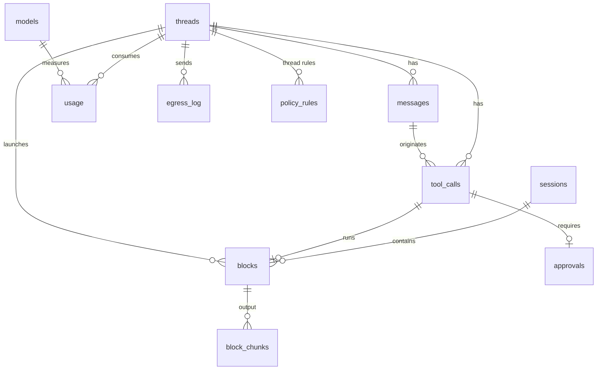

# Umbral — Data Model Specification

## Metadata

| Field | Value |
|---|---|
| **Author** | Ernesto Crespo · assisted draft |
| **Status** | `DRAFT` |
| **Version** | 1.6 |
| **Date** | 2026-09-11 |
| **Database** | SQLite 3 (`modernc.org/sqlite`), WAL, FTS5 |
| **Location** | `$XDG_DATA_HOME/umbral/umbral.db` (native disk; never on FUSE/network mounts) |
| **Related Tech Design** | `specs/technical/umbral-architecture.md` |

---

## 1. Model Overview

There are two subdomains:

- **terminal**: sessions, blocks and their output;
- **agent**: threads, messages, tool calls, approvals and rules.

The model catalog, usage, egress audit and MCP servers cut across both.

The hot access patterns are:

1. writing block output while streaming;
2. reading the last block of a session;
3. full-text search over blocks;
4. reading a thread's history;
5. listing pending approvals.

Conventions (Constitution Art. 6):

- `*_at` = `INTEGER` UTC epoch ms;
- costs = `INTEGER` micro-USD;
- IDs = `TEXT` prefixed ULID, except the workspace tree, whose structural identifiers are `w<n>`, `w<n>:t<m>` and `w<n>:p<m>` (Art. 6 amendment of 2026-09-20);
- JSON in `*_json` columns (validated in the `store` layer).

### Relationship Diagram



## 2. Tables

### 2.1 `sessions`

**Purpose:** PTY sessions. **Volume:** tens alive, thousands historical.

```sql
CREATE TABLE sessions (
  id           TEXT PRIMARY KEY CHECK (id LIKE 'ses\_%' ESCAPE '\'),
  shell        TEXT NOT NULL,
  cwd          TEXT NOT NULL,
  cols         INTEGER NOT NULL CHECK (cols BETWEEN 20 AND 1000),
  rows         INTEGER NOT NULL CHECK (rows BETWEEN 5 AND 500),
  state        TEXT NOT NULL CHECK (state IN ('alive','exited')),
  integration  TEXT NOT NULL DEFAULT 'pending' CHECK (integration IN ('pending','osc133','none')),
  input_owner  TEXT NOT NULL DEFAULT 'human' CHECK (input_owner IN ('human','agent')),
  owner_thread_id TEXT REFERENCES threads(id),       -- not null when the session is a thread's PTY
  exit_code    INTEGER,
  created_at   INTEGER NOT NULL,
  exited_at    INTEGER
);
CREATE INDEX idx_sessions_state ON sessions(state) WHERE state = 'alive';
```

### 2.2 `blocks`

**Purpose:** one command with its output. **Volume:** ~500/day/user; performance target
with 100,000 rows (REQ-BLK-006).

```sql
CREATE TABLE blocks (
  id               TEXT PRIMARY KEY CHECK (id LIKE 'blk\_%' ESCAPE '\'),
  session_id       TEXT NOT NULL REFERENCES sessions(id),
  origin           TEXT NOT NULL CHECK (origin IN ('user','agent')),
  thread_id        TEXT REFERENCES threads(id),
  command          TEXT NOT NULL DEFAULT '',
  cwd              TEXT NOT NULL DEFAULT '',
  host             TEXT NOT NULL DEFAULT '',
  state            TEXT NOT NULL CHECK (state IN ('running','interactive','finished','abandoned')),
  exit_code        INTEGER,
  started_at       INTEGER NOT NULL,
  ended_at         INTEGER,
  duration_ms      INTEGER,
  output_bytes     INTEGER NOT NULL DEFAULT 0,
  output_truncated INTEGER NOT NULL DEFAULT 0 CHECK (output_truncated IN (0,1)),
  output_plain     TEXT,                    -- text without escapes, max 1 MiB (REQ-BLK-007)
  CHECK (origin = 'user' OR thread_id IS NOT NULL)
);
CREATE INDEX idx_blocks_started         ON blocks(started_at DESC, id DESC);
CREATE INDEX idx_blocks_session_started ON blocks(session_id, started_at DESC);
CREATE INDEX idx_blocks_thread_started  ON blocks(thread_id, started_at DESC) WHERE thread_id IS NOT NULL;
CREATE INDEX idx_blocks_open            ON blocks(state) WHERE state IN ('running','interactive');
```

`idx_blocks_started` exists because `block.list` with no filter is the history pane and
`umb block list`, and the other three indexes all begin with a column such a query does not
name. Without it every page is a full scan and a sort of the table: 141 ms at 100,000 blocks
against 0.18 ms with it. `id` is in the index because it is the tie-breaker the cursor pages
on, and an index covering only the first column of the ordering still sorts. It is created by
migration **0002**, not 0001; §5 says why.

`output_truncated` covers **both** caps: the 16 MiB raw chunk history of §2.3 and the 1 MiB
`output_plain` transcript. A client that sees it `0` is promised the whole of what the
command said, and a transcript cut at 1 MiB breaks that promise just as a cut chunk history
does. REQ-BLK-007 names `output_plain` as the agent's context, so that is the reader the flag
exists for.

### 2.3 `block_chunks`

**Purpose:** raw output (with escapes) in zstd-compressed chunks, for faithful re-rendering and
export.

Two classes of sequence are **not** stored. The shell-integration sequences the daemon
recognises, `OSC 133;A/B/C/D`, `OSC 633;E` and `OSC 7`, are the shell talking to the daemon
rather than output: they are invisible on screen, so keeping them makes no replay more
faithful and every consumer exporting a block would have to filter them. The alternate-screen
mode sequences that bracket an `interactive` stretch are dropped for a different reason:
REQ-BLK-004 already excludes what is painted between them, and an unbalanced `CSI ?1049h` or
`CSI ?1049l` would switch the terminal of whoever replays the block into or out of a screen
it never entered. Every other escape sequence is stored byte for byte.

```sql
CREATE TABLE block_chunks (
  block_id  TEXT NOT NULL REFERENCES blocks(id) ON DELETE CASCADE,
  seq       INTEGER NOT NULL,
  data_zstd BLOB NOT NULL,
  PRIMARY KEY (block_id, seq)
) WITHOUT ROWID;
```

Cap per block: 16 MiB raw. Beyond that, storage stops and `output_truncated = 1` is set; the live
stream to clients is not interrupted.

### 2.4 `blocks_fts` (FTS5, external content)

```sql
CREATE VIRTUAL TABLE blocks_fts USING fts5(
  command, output_plain,
  content='blocks', content_rowid='rowid',
  tokenize='unicode61 remove_diacritics 2'
);
-- the triggers below keep the index in sync
CREATE TRIGGER blocks_fts_ai AFTER INSERT ON blocks BEGIN
  INSERT INTO blocks_fts(rowid, command, output_plain) VALUES (new.rowid, new.command, new.output_plain);
END;
CREATE TRIGGER blocks_fts_ad AFTER DELETE ON blocks BEGIN
  INSERT INTO blocks_fts(blocks_fts, rowid, command, output_plain) VALUES ('delete', old.rowid, old.command, old.output_plain);
END;
CREATE TRIGGER blocks_fts_au AFTER UPDATE OF command, output_plain ON blocks BEGIN
  INSERT INTO blocks_fts(blocks_fts, rowid, command, output_plain) VALUES ('delete', old.rowid, old.command, old.output_plain);
  INSERT INTO blocks_fts(rowid, command, output_plain) VALUES (new.rowid, new.command, new.output_plain);
END;
```

**`VACUUM` invalidates this index.** `blocks_fts` is keyed on `blocks.rowid`, and `blocks` has
a `TEXT` primary key, so its rowids are implicit and SQLite may renumber them when the database
is rewritten. Every row of the full-text index would then describe a different block, and
`block.search` would return the wrong blocks rather than fail. THE SYSTEM SHALL rebuild the
index after any `VACUUM`:

```sql
INSERT INTO blocks_fts(blocks_fts) VALUES('rebuild');
```

The retention job of T-F1-22 is the first thing that will want to reclaim space, and is where
this has to be enforced.

### 2.4b `workspaces`, `tabs`, `panes` (migration 0003)

**Purpose:** the structure the daemon owns and restores (REQ-WS-001, REQ-TERM-009). A pane hosts at
most one live session; `pane_aliases` keeps previous identifiers resolvable after a move
(REQ-WS-007).

```sql
CREATE TABLE workspaces (
  id          TEXT PRIMARY KEY CHECK (id GLOB 'w[0-9]*' AND id NOT GLOB '*[^w0-9]*'),
  label       TEXT NOT NULL,
  cwd         TEXT NOT NULL,
  order_index INTEGER NOT NULL DEFAULT 0,
  -- Which tab is focused inside this workspace, and when the workspace itself was last
  -- focused. The focused workspace is the one with the greatest focused_at. Added by
  -- migration 0004; before it, focus lived only in memory and did not survive a restart.
  focused_tab_id TEXT REFERENCES tabs(id) ON DELETE SET NULL,
  focused_at  INTEGER,
  created_at  INTEGER NOT NULL,
  closed_at   INTEGER
);

CREATE TABLE tabs (
  id           TEXT PRIMARY KEY CHECK (id GLOB 'w[0-9]*:t[0-9]*'),
  workspace_id TEXT NOT NULL REFERENCES workspaces(id) ON DELETE CASCADE,
  label        TEXT NOT NULL,
  order_index  INTEGER NOT NULL DEFAULT 0,
  layout_json  TEXT NOT NULL DEFAULT '{}',   -- portable tree (API Layout)
  created_at   INTEGER NOT NULL,
  closed_at    INTEGER
);
CREATE INDEX idx_tabs_workspace ON tabs(workspace_id, order_index);

CREATE TABLE panes (
  id          TEXT PRIMARY KEY CHECK (id GLOB 'w[0-9]*:p[0-9]*'),
  tab_id      TEXT NOT NULL REFERENCES tabs(id) ON DELETE CASCADE,
  session_id  TEXT REFERENCES sessions(id),   -- NULL while the pane has no live session
  label       TEXT,
  cwd         TEXT NOT NULL,
  command_json TEXT,                          -- argv the pane runs instead of a shell
  -- 1 while that command has not been run by Umbral. Set by `layout.apply` and by restore,
  -- never by `pane.split`: a restart and an applied layout replay an intention from another
  -- time, and REQ-TERM-011 forbids acting on one unasked. Added by migration 0004.
  command_pending INTEGER NOT NULL DEFAULT 0 CHECK (command_pending IN (0,1)),
  env_json    TEXT NOT NULL DEFAULT '{}',
  order_index INTEGER NOT NULL DEFAULT 0,
  created_at  INTEGER NOT NULL,
  closed_at   INTEGER
);
CREATE INDEX idx_panes_tab ON panes(tab_id, order_index);
CREATE UNIQUE INDEX idx_panes_session ON panes(session_id) WHERE session_id IS NOT NULL;

CREATE TABLE pane_aliases (
  alias_id   TEXT PRIMARY KEY CHECK (alias_id GLOB 'w[0-9]*:p[0-9]*'),
  pane_id    TEXT NOT NULL REFERENCES panes(id) ON DELETE CASCADE,
  created_at INTEGER NOT NULL
);
```

### 2.4c `pane_state_reports` and `pane_metadata` (migration 0005)

**Purpose:** external state authority and display metadata, kept apart on purpose (REQ-INT-002 to
REQ-INT-005). Semantic state drives waits, rollups and notifications; metadata never does.

```sql
CREATE TABLE pane_state_reports (
  pane_id    TEXT NOT NULL REFERENCES panes(id) ON DELETE CASCADE,
  source     TEXT NOT NULL,
  agent      TEXT,
  state      TEXT NOT NULL CHECK (state IN ('idle','working','blocked','done')),
  message    TEXT,
  seq        INTEGER NOT NULL DEFAULT 0,
  updated_at INTEGER NOT NULL,
  PRIMARY KEY (pane_id, source)
);

CREATE TABLE pane_metadata (
  pane_id    TEXT NOT NULL REFERENCES panes(id) ON DELETE CASCADE,
  source     TEXT NOT NULL,
  key        TEXT NOT NULL CHECK (length(key) BETWEEN 1 AND 32),
  value      TEXT NOT NULL CHECK (length(value) <= 80),
  expires_at INTEGER,
  updated_at INTEGER NOT NULL,
  PRIMARY KEY (pane_id, source, key)
);
CREATE INDEX idx_pane_metadata_expiry ON pane_metadata(expires_at) WHERE expires_at IS NOT NULL;
```

At most 32 live keys per pane; the `store` layer rejects the excess. Metadata is not restored after
a restart (REQ-INT-004).

### 2.4d `pane_history` (migration 0004, optional content)

**Purpose:** recent screen replay after a restart, disabled by default because pane output can
contain secrets (REQ-TERM-010).

```sql
CREATE TABLE pane_history (
  pane_id    TEXT PRIMARY KEY REFERENCES panes(id) ON DELETE CASCADE,
  screen_zst BLOB NOT NULL,        -- last N rows, zstd
  rows       INTEGER NOT NULL,
  captured_at INTEGER NOT NULL
);
```

Rows are written only while `[experimental] pane_history = true`. Turning the setting off deletes
the table's contents at the next start.

### 2.4e `rule_bundles` and `trust_keys` (migration 0005)

**Purpose:** provenance of the redaction rules and destructive patterns, and the trust store used to
verify them (REQ-SEC-011 to REQ-SEC-016). Private keys never live here: the store holds public keys
only.

```sql
CREATE TABLE trust_keys (
  id          TEXT PRIMARY KEY,
  public_key  BLOB NOT NULL,                 -- Ed25519, 32 bytes
  fingerprint TEXT NOT NULL UNIQUE,          -- SHA-256 shown on add and rotate
  added_at    INTEGER NOT NULL,
  revoked_at  INTEGER
);

CREATE TABLE rule_bundles (
  version      INTEGER PRIMARY KEY,          -- strictly increasing; a downgrade is rejected
  sha256       TEXT NOT NULL,
  source       TEXT NOT NULL CHECK (source IN ('builtin','remote','local')),
  verified_with TEXT REFERENCES trust_keys(id),
  installed_at INTEGER NOT NULL,
  active       INTEGER NOT NULL DEFAULT 0 CHECK (active IN (0,1))
);
CREATE UNIQUE INDEX idx_rule_bundles_active ON rule_bundles(active) WHERE active = 1;
```

Umbral keeps the active bundle and the previous one so `rules.rollback` works offline; older ones
are pruned. A `remote` bundle without `verified_with` cannot exist: the DDL allows it, and the
`store` layer rejects it.

### 2.5 `threads`

```sql
CREATE TABLE threads (
  id             TEXT PRIMARY KEY CHECK (id LIKE 'thr\_%' ESCAPE '\'),
  title          TEXT NOT NULL DEFAULT '',
  mode           TEXT NOT NULL DEFAULT 'normal' CHECK (mode IN ('ask','normal','auto-edit')),
  model          TEXT,                          -- pinned 'provider/model'; NULL = use class
  model_class    TEXT NOT NULL DEFAULT 'code' CHECK (model_class IN ('fast','code','plan')),
  cwd            TEXT NOT NULL,
  state          TEXT NOT NULL DEFAULT 'idle' CHECK (state IN ('idle','running','awaiting_approval','stopped')),
  ephemeral      INTEGER NOT NULL DEFAULT 0 CHECK (ephemeral IN (0,1)),
  max_steps      INTEGER NOT NULL DEFAULT 50 CHECK (max_steps BETWEEN 1 AND 200),
  budget_tokens  INTEGER NOT NULL DEFAULT 400000,
  tokens_used    INTEGER NOT NULL DEFAULT 0,
  cost_micro_usd INTEGER NOT NULL DEFAULT 0,
  created_at     INTEGER NOT NULL,
  updated_at     INTEGER NOT NULL
);
CREATE INDEX idx_threads_updated ON threads(updated_at DESC) WHERE ephemeral = 0;
```

The attention columns of REQ-AGT-016 and REQ-NTF-002 arrive in migration **0005**, not in the
block above. Migration 0001 created `threads` and is applied, and Art. 6 makes migrations
forward-only: a column added to an applied file exists on no database that already ran it.
`attention_state` takes a default rather than being `NOT NULL` without one, because
`ALTER TABLE … ADD COLUMN` has to be able to fill the rows already there. SQLite cannot add a
`CHECK` in an `ALTER`, so the constraint is enforced by the writer and stated here.

```sql
-- migration 0005, alongside the agent tables (T-F1-01)
ALTER TABLE threads ADD COLUMN attention_state TEXT NOT NULL DEFAULT 'idle';  -- REQ-AGT-016
                             -- one of 'idle','working','blocked','done','unknown'
ALTER TABLE threads ADD COLUMN seen_at INTEGER;  -- when a client last focused it; NULL = never
```

### 2.6 `messages`

```sql
CREATE TABLE messages (
  id               TEXT PRIMARY KEY CHECK (id LIKE 'msg\_%' ESCAPE '\'),
  thread_id        TEXT NOT NULL REFERENCES threads(id) ON DELETE CASCADE,
  turn_id          TEXT NOT NULL,
  role             TEXT NOT NULL CHECK (role IN ('user','assistant','tool','system_note')),
  content          TEXT NOT NULL,
  client_msg_id    TEXT,                          -- ULID from the client; idempotency (REQ-AGT-015)
  attachments_json TEXT NOT NULL DEFAULT '[]',   -- [{kind, ref, bytes, truncated_bytes}]
  tainted          INTEGER NOT NULL DEFAULT 0 CHECK (tainted IN (0,1)),  -- REQ-SEC-006
  created_at       INTEGER NOT NULL
);
CREATE INDEX idx_messages_thread_created ON messages(thread_id, created_at);
-- Partial, so the many rows without a client id do not collide with each other (A-04).
CREATE UNIQUE INDEX idx_messages_client_msg ON messages(thread_id, client_msg_id)
  WHERE client_msg_id IS NOT NULL;
```

### 2.7 `tool_calls`

```sql
CREATE TABLE tool_calls (
  id             TEXT PRIMARY KEY CHECK (id LIKE 'tc\_%' ESCAPE '\'),
  thread_id      TEXT NOT NULL REFERENCES threads(id) ON DELETE CASCADE,
  message_id     TEXT NOT NULL REFERENCES messages(id),
  tool           TEXT NOT NULL,
  risk           TEXT NOT NULL CHECK (risk IN ('ReadOnly','WriteFS','Exec','Network')),
  args_json      TEXT NOT NULL,
  status         TEXT NOT NULL CHECK (status IN ('pending','ok','error','denied_by_user','denied_by_policy','invalid_args')),
  result_summary TEXT,
  result_json    TEXT,
  block_id       TEXT REFERENCES blocks(id),
  started_at     INTEGER NOT NULL,
  ended_at       INTEGER
);
CREATE INDEX idx_tool_calls_thread ON tool_calls(thread_id, started_at);
```

### 2.8 `approvals`

```sql
CREATE TABLE approvals (
  id             TEXT PRIMARY KEY CHECK (id LIKE 'apr\_%' ESCAPE '\'),
  thread_id      TEXT NOT NULL REFERENCES threads(id) ON DELETE CASCADE,
  tool_call_id   TEXT NOT NULL UNIQUE REFERENCES tool_calls(id),
  tool           TEXT NOT NULL,
  risk           TEXT NOT NULL,
  reason         TEXT NOT NULL CHECK (reason IN ('policy','destructive','tainted','outside_write_root')),
  summary        TEXT NOT NULL,
  diff           TEXT,                        -- REQ-AGT-012
  state          TEXT NOT NULL DEFAULT 'pending' CHECK (state IN ('pending','approved','denied','expired')),
  decision_scope TEXT CHECK (decision_scope IN ('once','thread','always')),
  created_at     INTEGER NOT NULL,
  decided_at     INTEGER
);
CREATE INDEX idx_approvals_pending ON approvals(created_at) WHERE state = 'pending';
```

### 2.9 `policy_rules`

**Purpose:** decisions persisted with `scope = thread | always`, plus the configuration rules loaded at
startup.

```sql
CREATE TABLE policy_rules (
  id         INTEGER PRIMARY KEY,
  thread_id  TEXT REFERENCES threads(id) ON DELETE CASCADE,   -- NULL = global ('always')
  tool       TEXT NOT NULL,                  -- 'run_command', 'edit_file', 'mcp_gitlab_*'
  pattern    TEXT NOT NULL DEFAULT '*',      -- glob over command or path
  decision   TEXT NOT NULL CHECK (decision IN ('allow','deny')),
  source     TEXT NOT NULL CHECK (source IN ('user_decision','config')),
  created_at INTEGER NOT NULL
);
CREATE INDEX idx_policy_rules_lookup ON policy_rules(tool, thread_id);
```

### 2.10 `models`

```sql
CREATE TABLE models (
  id                           TEXT PRIMARY KEY,   -- 'ollama/gpt-oss:20b'
  provider                     TEXT NOT NULL,
  local                        INTEGER NOT NULL CHECK (local IN (0,1)),
  caps_json                    TEXT NOT NULL,      -- {tools, vision, reasoning, json_schema}
  context_window               INTEGER NOT NULL,
  price_in_micro_usd_per_mtok  INTEGER NOT NULL DEFAULT 0,
  price_out_micro_usd_per_mtok INTEGER NOT NULL DEFAULT 0,
  health                       TEXT NOT NULL DEFAULT 'unknown' CHECK (health IN ('ok','degraded','down','unknown')),
  updated_at                   INTEGER NOT NULL
);
```

### 2.11 `usage`

```sql
CREATE TABLE usage (
  id             INTEGER PRIMARY KEY,
  thread_id      TEXT REFERENCES threads(id) ON DELETE SET NULL,
  turn_id        TEXT,
  model_id       TEXT NOT NULL,
  provider       TEXT NOT NULL,
  status         TEXT NOT NULL CHECK (status IN ('ok','error','timeout','rate_limited','invalid_tool_call')),
  in_tokens      INTEGER NOT NULL DEFAULT 0,
  out_tokens     INTEGER NOT NULL DEFAULT 0,
  first_token_ms INTEGER,
  cost_micro_usd INTEGER NOT NULL DEFAULT 0,
  error          TEXT,
  created_at     INTEGER NOT NULL
);
CREATE INDEX idx_usage_model_created ON usage(model_id, created_at);
CREATE INDEX idx_usage_thread        ON usage(thread_id);
```

### 2.12 `egress_log`

```sql
CREATE TABLE egress_log (
  id             INTEGER PRIMARY KEY,
  thread_id      TEXT,
  provider       TEXT NOT NULL,
  host           TEXT NOT NULL,
  bytes          INTEGER NOT NULL,
  payload_sha256 TEXT NOT NULL CHECK (length(payload_sha256) = 64),
  created_at     INTEGER NOT NULL
);
CREATE INDEX idx_egress_created ON egress_log(created_at DESC);
```

Insert-only table: no `UPDATE` or `DELETE` except for retention.

### 2.13 `mcp_servers`

```sql
CREATE TABLE mcp_servers (
  id            TEXT PRIMARY KEY CHECK (id LIKE 'mcp\_%' ESCAPE '\'),
  name          TEXT NOT NULL UNIQUE CHECK (name GLOB '[a-z0-9_-]*'),
  transport     TEXT NOT NULL CHECK (transport IN ('stdio','http')),
  command       TEXT,
  args_json     TEXT NOT NULL DEFAULT '[]',
  url           TEXT,
  env_refs_json TEXT NOT NULL DEFAULT '{}',   -- {"TOKEN":"keyring:umbral/gitlab"}
  trust         TEXT NOT NULL DEFAULT 'untrusted' CHECK (trust IN ('trusted','untrusted')),
  state         TEXT NOT NULL DEFAULT 'connecting' CHECK (state IN ('connecting','connected','unavailable','disabled')),
  last_error    TEXT,
  created_at    INTEGER NOT NULL,
  updated_at    INTEGER NOT NULL,
  CHECK ((transport = 'stdio' AND command IS NOT NULL) OR (transport = 'http' AND url IS NOT NULL))
);
```

## 3. Indexes ↔ queries

| Query (API / Tech Design) | Index |
|---|---|
| `block.get {block_id:"last", session_id}` and `block.list {session_id}` | `idx_blocks_session_started` |
| `block.list {thread_id}` | `idx_blocks_thread_started` |
| Startup: mark open blocks as `abandoned` | `idx_blocks_open` |
| `block.search` | `blocks_fts` |
| Startup: mark `alive` sessions as `exited` | `idx_sessions_state` |
| `block.list {}` with no filter, the history pane | `idx_blocks_started` |
| `thread.get {include_messages}` | `idx_messages_thread_created` |
| `thread.send` idempotency lookup, REQ-AGT-015 | `idx_messages_client_msg` |
| `thread.list` | `idx_threads_updated` |
| `approval.list` (pending) | `idx_approvals_pending` |
| `security.Decide` (rules per tool) | `idx_policy_rules_lookup` |
| Restore structure on startup (REQ-TERM-009) | `idx_tabs_workspace`, `idx_panes_tab` |
| Resolve a moved pane id (REQ-WS-007) | `pane_aliases` primary key |
| Expire display metadata (REQ-INT-004) | `idx_pane_metadata_expiry` |
| Pane ↔ live session (REQ-WS-003) | `idx_panes_session` |
| Metrics per model, REQ-LLM-005 | `idx_usage_model_created` |
| Egress audit | `idx_egress_created` |

## 4. Retention and size

| Data | Default retention | Configurable |
|---|---|---|
| `block_chunks` | 30 days | `retention.raw_output_days` |
| `blocks.output_plain` | 180 days | `retention.plain_output_days` |
| Non-ephemeral threads | indefinite | manual deletion |
| Ephemeral threads (`umb ai`) | 24 h | — |
| `pane_history` | until the pane closes; cleared when the setting is disabled | `[experimental] pane_history` |
| `pane_metadata` | per-key TTL, at most 24 h | per report |
| Closed workspaces, tabs and panes | 30 days | yes |
| `pane_aliases` | deleted with their pane (cascade); an alias never outlives its terminal | no |
| `egress_log`, `usage` | 365 days | `retention.audit_days` |

A daily maintenance job applies retention and runs `PRAGMA optimize` and
`INSERT INTO blocks_fts(blocks_fts) VALUES('optimize')`.

## 5. Migrations

- Table `schema_migrations(version INTEGER PRIMARY KEY, applied_at INTEGER NOT NULL)`.
- Files `internal/store/migrations/NNNN_description.sql`, forward-only (Art. 6).
- Each migration runs in a transaction, and the daemon refuses to start if the database has a
  higher version than it knows.
- Pragmas on open: `journal_mode=WAL`, `foreign_keys=ON`, `busy_timeout=5000`,
  `synchronous=NORMAL`.

| Migration | Phase | Objects it creates |
|---|---|---|
| `0001_terminal.sql` | F0 | `schema_migrations`, **`threads`** (§2.5) and `idx_threads_updated`, `sessions`, `blocks`, `block_chunks`, `blocks_fts` and its three triggers, plus every index in §2.1-2.5 except `idx_blocks_started` |
| `0002_block_index.sql` | F0 | `idx_blocks_started` (§2.2) |
| `0003_structure.sql` | F0 | `workspaces`, `tabs`, `panes`, `pane_aliases` and their indexes (§2.4b) |
| `0004_restore.sql` | F0 | `pane_history` (§2.4d), `panes.command_pending` and `workspaces.focused_tab_id`/`focused_at` (§2.4b) — everything a restart needs and nothing else (T-F0-18) |
| `0005_agent.sql` | F1 | `messages`, `tool_calls`, `approvals`, `policy_rules`, `models`, `usage`, `egress_log`, `mcp_servers`, `pane_state_reports`, `pane_metadata`, `trust_keys`, `rule_bundles` and their indexes (§2.4c-2.4e, §2.6-2.13), plus the two `ALTER TABLE threads` statements of §2.5 |

`threads` belongs to 0001 even though the agent arrives in F1: `sessions.owner_thread_id` and
`blocks.thread_id` point at it, and with `foreign_keys=ON` SQLite rejects every insert into those
tables while the target does not exist (finding A-01, verified).

`idx_blocks_started`, the structure tables and the attention columns each arrive in a migration
of their own rather than as lines added to 0001, because 0001 had already been applied when each
need was established. Migrations are forward-only (Art. 6) and the runner records only the
version a database reached, so editing an applied file changes nothing for the databases that
ran it: they would have kept the 141 ms scan, or come up without a workspace table, with nothing
to report the divergence. This is why the agent subdomain is `0005` rather than the `0002`
earlier drafts named.

## 6. Recovery after a daemon restart

1. `sessions.state = 'alive'` → `exited`, with `exit_code = NULL` and `exited_at = now`.
2. `blocks.state IN ('running','interactive')` → `abandoned`.
3. `threads.state IN ('running','awaiting_approval')` → `stopped`.
4. `approvals.state = 'pending'` → `expired`.
5. Structure: `workspaces`, `tabs` and `panes` that were not closed are reopened with their labels,
   cwd and `layout_json`; **every pane launches a fresh shell**, whatever it was running before
   (REQ-TERM-009). `panes.session_id` is cleared before relaunching. A pane with a `command_json`
   keeps it, `command_pending` is set, and the command is typed at the new shell's prompt without a
   newline — visible, waiting for the user to press Enter, never executed by the restart
   (REQ-TERM-011). `workspaces.focused_tab_id` and `focused_at` restore which tab and which
   workspace were focused.
6. Screen: if `[experimental] pane_history = true`, the stored screen of each pane is replayed
   before the new shell's output (REQ-TERM-010).
7. Threads keep their full history; those left `running` or `awaiting_approval` become `stopped` and
   accept `thread.send` again without losing context (REQ-AGT-017).
8. `pane_state_reports` and `pane_metadata` are cleared: external authority and display metadata do
   not survive a restart (REQ-INT-002, REQ-INT-004).

## Change History

| Version | Date | Changes |
|---|---|---|
| 1.0 | 2026-09-11 | Initial version |
| 1.1 | 2026-09-11 | delta `2026-09-analyze-fixes`: `threads` moves to migration 0001 and §5 lists each migration (A-01), `blocks_fts` triggers written out (A-07), `client_msg_id` in `messages` (A-04) |
| 1.2 | 2026-09-11 | delta `2026-09-block-lifecycle-decisions`: `output_truncated` covers both caps (§2.2), and §2.3 says which sequences the chunks do not keep |
| 1.3 | 2026-09-11 | delta `2026-09-block-query-performance`: `idx_blocks_started` in §2.2 and §5, the `VACUUM` rebuild rule in §2.4, and `idx_blocks_started` given migration `0002` of its own |
| 1.4 | 2026-09-20 | Adds `workspaces`, `tabs`, `panes`, `pane_aliases`, `pane_state_reports`, `pane_metadata` and `pane_history`; attention columns on `threads`; per-migration table list and restore steps 5-8. The structure tables take migration `0003` and the agent subdomain moves to `0004` (delta `2026-09-structure-migration`) |
| 1.5 | 2026-09-20 | Closes the Analyze findings: `client_msg_id` gains its unique index (A-04) and the `trust_keys` / `rule_bundles` tables arrive |
| 1.6 | 2026-09-20 | delta `2026-09-art6-structural-ids`: `workspaces`, `tabs`, `panes` and `pane_aliases` enforce the structural identifier grammar with a `CHECK` (C-05) |
