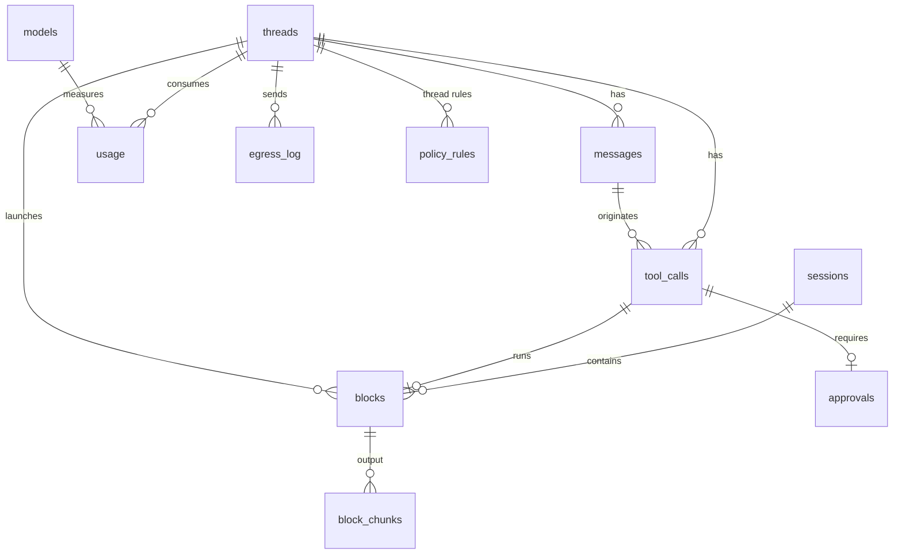

# Umbral — Data Model Specification

## Metadata

| Field | Value |
|---|---|
| **Author** | Ernesto Crespo · assisted draft |
| **Status** | `DRAFT` |
| **Version** | 1.0 |
| **Date** | 2026-09-11 |
| **Database** | SQLite 3 (`modernc.org/sqlite`), WAL, FTS5 |
| **Location** | `$XDG_DATA_HOME/umbral/umbral.db` (native disk; never on FUSE/network mounts) |
| **Related Tech Design** | `specs/technical/umbral-architecture.md` |

---

## 1. Model Overview

There are two subdomains:

- **terminal**: sessions, blocks and their output;
- **agent**: threads, messages, tool calls, approvals and rules.

The model catalog, usage, egress audit and MCP servers cut across both.

The hot access patterns are:

1. writing block output while streaming;
2. reading the last block of a session;
3. full-text search over blocks;
4. reading a thread's history;
5. listing pending approvals.

Conventions (Constitution Art. 6):

- `*_at` = `INTEGER` UTC epoch ms;
- costs = `INTEGER` micro-USD;
- IDs = `TEXT` prefixed ULID;
- JSON in `*_json` columns (validated in the `store` layer).

### Relationship Diagram



## 2. Tables

### 2.1 `sessions`

**Purpose:** PTY sessions. **Volume:** tens alive, thousands historical.

```sql
CREATE TABLE sessions (
  id           TEXT PRIMARY KEY CHECK (id LIKE 'ses\_%' ESCAPE '\'),
  shell        TEXT NOT NULL,
  cwd          TEXT NOT NULL,
  cols         INTEGER NOT NULL CHECK (cols BETWEEN 20 AND 1000),
  rows         INTEGER NOT NULL CHECK (rows BETWEEN 5 AND 500),
  state        TEXT NOT NULL CHECK (state IN ('alive','exited')),
  integration  TEXT NOT NULL DEFAULT 'pending' CHECK (integration IN ('pending','osc133','none')),
  input_owner  TEXT NOT NULL DEFAULT 'human' CHECK (input_owner IN ('human','agent')),
  owner_thread_id TEXT REFERENCES threads(id),       -- not null when the session is a thread's PTY
  exit_code    INTEGER,
  created_at   INTEGER NOT NULL,
  exited_at    INTEGER
);
CREATE INDEX idx_sessions_state ON sessions(state) WHERE state = 'alive';
```

### 2.2 `blocks`

**Purpose:** one command with its output. **Volume:** ~500/day/user; performance target
with 100,000 rows (REQ-BLK-006).

```sql
CREATE TABLE blocks (
  id               TEXT PRIMARY KEY CHECK (id LIKE 'blk\_%' ESCAPE '\'),
  session_id       TEXT NOT NULL REFERENCES sessions(id),
  origin           TEXT NOT NULL CHECK (origin IN ('user','agent')),
  thread_id        TEXT REFERENCES threads(id),
  command          TEXT NOT NULL DEFAULT '',
  cwd              TEXT NOT NULL DEFAULT '',
  host             TEXT NOT NULL DEFAULT '',
  state            TEXT NOT NULL CHECK (state IN ('running','interactive','finished','abandoned')),
  exit_code        INTEGER,
  started_at       INTEGER NOT NULL,
  ended_at         INTEGER,
  duration_ms      INTEGER,
  output_bytes     INTEGER NOT NULL DEFAULT 0,
  output_truncated INTEGER NOT NULL DEFAULT 0 CHECK (output_truncated IN (0,1)),
  output_plain     TEXT,                    -- text without escapes, max 1 MiB (REQ-BLK-007)
  CHECK (origin = 'user' OR thread_id IS NOT NULL)
);
CREATE INDEX idx_blocks_session_started ON blocks(session_id, started_at DESC);
CREATE INDEX idx_blocks_thread_started  ON blocks(thread_id, started_at DESC) WHERE thread_id IS NOT NULL;
CREATE INDEX idx_blocks_open            ON blocks(state) WHERE state IN ('running','interactive');
```

### 2.3 `block_chunks`

**Purpose:** raw output (with escapes) in zstd-compressed chunks, for faithful re-rendering and
export.

```sql
CREATE TABLE block_chunks (
  block_id  TEXT NOT NULL REFERENCES blocks(id) ON DELETE CASCADE,
  seq       INTEGER NOT NULL,
  data_zstd BLOB NOT NULL,
  PRIMARY KEY (block_id, seq)
) WITHOUT ROWID;
```

Cap per block: 16 MiB raw. Beyond that, storage stops and `output_truncated = 1` is set; the live
stream to clients is not interrupted.

### 2.4 `blocks_fts` (FTS5, external content)

```sql
CREATE VIRTUAL TABLE blocks_fts USING fts5(
  command, output_plain,
  content='blocks', content_rowid='rowid',
  tokenize='unicode61 remove_diacritics 2'
);
-- AFTER INSERT / UPDATE OF command, output_plain / DELETE triggers keep the index in sync
```

### 2.5 `threads`

```sql
CREATE TABLE threads (
  id             TEXT PRIMARY KEY CHECK (id LIKE 'thr\_%' ESCAPE '\'),
  title          TEXT NOT NULL DEFAULT '',
  mode           TEXT NOT NULL DEFAULT 'normal' CHECK (mode IN ('ask','normal','auto-edit')),
  model          TEXT,                          -- pinned 'provider/model'; NULL = use class
  model_class    TEXT NOT NULL DEFAULT 'code' CHECK (model_class IN ('fast','code','plan')),
  cwd            TEXT NOT NULL,
  state          TEXT NOT NULL DEFAULT 'idle' CHECK (state IN ('idle','running','awaiting_approval','stopped')),
  ephemeral      INTEGER NOT NULL DEFAULT 0 CHECK (ephemeral IN (0,1)),
  max_steps      INTEGER NOT NULL DEFAULT 50 CHECK (max_steps BETWEEN 1 AND 200),
  budget_tokens  INTEGER NOT NULL DEFAULT 400000,
  tokens_used    INTEGER NOT NULL DEFAULT 0,
  cost_micro_usd INTEGER NOT NULL DEFAULT 0,
  created_at     INTEGER NOT NULL,
  updated_at     INTEGER NOT NULL
);
CREATE INDEX idx_threads_updated ON threads(updated_at DESC) WHERE ephemeral = 0;
```

### 2.6 `messages`

```sql
CREATE TABLE messages (
  id               TEXT PRIMARY KEY CHECK (id LIKE 'msg\_%' ESCAPE '\'),
  thread_id        TEXT NOT NULL REFERENCES threads(id) ON DELETE CASCADE,
  turn_id          TEXT NOT NULL,
  role             TEXT NOT NULL CHECK (role IN ('user','assistant','tool','system_note')),
  content          TEXT NOT NULL,
  attachments_json TEXT NOT NULL DEFAULT '[]',   -- [{kind, ref, bytes, truncated_bytes}]
  tainted          INTEGER NOT NULL DEFAULT 0 CHECK (tainted IN (0,1)),  -- REQ-SEC-006
  created_at       INTEGER NOT NULL
);
CREATE INDEX idx_messages_thread_created ON messages(thread_id, created_at);
```

### 2.7 `tool_calls`

```sql
CREATE TABLE tool_calls (
  id             TEXT PRIMARY KEY CHECK (id LIKE 'tc\_%' ESCAPE '\'),
  thread_id      TEXT NOT NULL REFERENCES threads(id) ON DELETE CASCADE,
  message_id     TEXT NOT NULL REFERENCES messages(id),
  tool           TEXT NOT NULL,
  risk           TEXT NOT NULL CHECK (risk IN ('ReadOnly','WriteFS','Exec','Network')),
  args_json      TEXT NOT NULL,
  status         TEXT NOT NULL CHECK (status IN ('pending','ok','error','denied_by_user','denied_by_policy','invalid_args')),
  result_summary TEXT,
  result_json    TEXT,
  block_id       TEXT REFERENCES blocks(id),
  started_at     INTEGER NOT NULL,
  ended_at       INTEGER
);
CREATE INDEX idx_tool_calls_thread ON tool_calls(thread_id, started_at);
```

### 2.8 `approvals`

```sql
CREATE TABLE approvals (
  id             TEXT PRIMARY KEY CHECK (id LIKE 'apr\_%' ESCAPE '\'),
  thread_id      TEXT NOT NULL REFERENCES threads(id) ON DELETE CASCADE,
  tool_call_id   TEXT NOT NULL UNIQUE REFERENCES tool_calls(id),
  tool           TEXT NOT NULL,
  risk           TEXT NOT NULL,
  reason         TEXT NOT NULL CHECK (reason IN ('policy','destructive','tainted','outside_workspace')),
  summary        TEXT NOT NULL,
  diff           TEXT,                        -- REQ-AGT-012
  state          TEXT NOT NULL DEFAULT 'pending' CHECK (state IN ('pending','approved','denied','expired')),
  decision_scope TEXT CHECK (decision_scope IN ('once','thread','always')),
  created_at     INTEGER NOT NULL,
  decided_at     INTEGER
);
CREATE INDEX idx_approvals_pending ON approvals(created_at) WHERE state = 'pending';
```

### 2.9 `policy_rules`

**Purpose:** decisions persisted with `scope = thread | always`, plus the configuration rules loaded at
startup.

```sql
CREATE TABLE policy_rules (
  id         INTEGER PRIMARY KEY,
  thread_id  TEXT REFERENCES threads(id) ON DELETE CASCADE,   -- NULL = global ('always')
  tool       TEXT NOT NULL,                  -- 'run_command', 'edit_file', 'mcp_gitlab_*'
  pattern    TEXT NOT NULL DEFAULT '*',      -- glob over command or path
  decision   TEXT NOT NULL CHECK (decision IN ('allow','deny')),
  source     TEXT NOT NULL CHECK (source IN ('user_decision','config')),
  created_at INTEGER NOT NULL
);
CREATE INDEX idx_policy_rules_lookup ON policy_rules(tool, thread_id);
```

### 2.10 `models`

```sql
CREATE TABLE models (
  id                           TEXT PRIMARY KEY,   -- 'ollama/gpt-oss:20b'
  provider                     TEXT NOT NULL,
  local                        INTEGER NOT NULL CHECK (local IN (0,1)),
  caps_json                    TEXT NOT NULL,      -- {tools, vision, reasoning, json_schema}
  context_window               INTEGER NOT NULL,
  price_in_micro_usd_per_mtok  INTEGER NOT NULL DEFAULT 0,
  price_out_micro_usd_per_mtok INTEGER NOT NULL DEFAULT 0,
  health                       TEXT NOT NULL DEFAULT 'unknown' CHECK (health IN ('ok','degraded','down','unknown')),
  updated_at                   INTEGER NOT NULL
);
```

### 2.11 `usage`

```sql
CREATE TABLE usage (
  id             INTEGER PRIMARY KEY,
  thread_id      TEXT REFERENCES threads(id) ON DELETE SET NULL,
  turn_id        TEXT,
  model_id       TEXT NOT NULL,
  provider       TEXT NOT NULL,
  status         TEXT NOT NULL CHECK (status IN ('ok','error','timeout','rate_limited','invalid_tool_call')),
  in_tokens      INTEGER NOT NULL DEFAULT 0,
  out_tokens     INTEGER NOT NULL DEFAULT 0,
  first_token_ms INTEGER,
  cost_micro_usd INTEGER NOT NULL DEFAULT 0,
  error          TEXT,
  created_at     INTEGER NOT NULL
);
CREATE INDEX idx_usage_model_created ON usage(model_id, created_at);
CREATE INDEX idx_usage_thread        ON usage(thread_id);
```

### 2.12 `egress_log`

```sql
CREATE TABLE egress_log (
  id             INTEGER PRIMARY KEY,
  thread_id      TEXT,
  provider       TEXT NOT NULL,
  host           TEXT NOT NULL,
  bytes          INTEGER NOT NULL,
  payload_sha256 TEXT NOT NULL CHECK (length(payload_sha256) = 64),
  created_at     INTEGER NOT NULL
);
CREATE INDEX idx_egress_created ON egress_log(created_at DESC);
```

Insert-only table: no `UPDATE` or `DELETE` except for retention.

### 2.13 `mcp_servers`

```sql
CREATE TABLE mcp_servers (
  id            TEXT PRIMARY KEY CHECK (id LIKE 'mcp\_%' ESCAPE '\'),
  name          TEXT NOT NULL UNIQUE CHECK (name GLOB '[a-z0-9_-]*'),
  transport     TEXT NOT NULL CHECK (transport IN ('stdio','http')),
  command       TEXT,
  args_json     TEXT NOT NULL DEFAULT '[]',
  url           TEXT,
  env_refs_json TEXT NOT NULL DEFAULT '{}',   -- {"TOKEN":"keyring:umbral/gitlab"}
  trust         TEXT NOT NULL DEFAULT 'untrusted' CHECK (trust IN ('trusted','untrusted')),
  state         TEXT NOT NULL DEFAULT 'connecting' CHECK (state IN ('connecting','connected','unavailable','disabled')),
  last_error    TEXT,
  created_at    INTEGER NOT NULL,
  updated_at    INTEGER NOT NULL,
  CHECK ((transport = 'stdio' AND command IS NOT NULL) OR (transport = 'http' AND url IS NOT NULL))
);
```

## 3. Indexes ↔ queries

| Query (API / Tech Design) | Index |
|---|---|
| `block.get {block_id:"last", session_id}` y `block.list {session_id}` | `idx_blocks_session_started` |
| `block.list {thread_id}` | `idx_blocks_thread_started` |
| Startup: mark open blocks as `abandoned` | `idx_blocks_open` |
| `block.search` | `blocks_fts` |
| Startup: mark `alive` sessions as `exited` | `idx_sessions_state` |
| `thread.get {include_messages}` | `idx_messages_thread_created` |
| `thread.list` | `idx_threads_updated` |
| `approval.list` (pending) | `idx_approvals_pending` |
| `security.Decide` (rules per tool) | `idx_policy_rules_lookup` |
| Metrics per model, REQ-LLM-005 | `idx_usage_model_created` |
| Egress audit | `idx_egress_created` |

## 4. Retention and size

| Data | Default retention | Configurable |
|---|---|---|
| `block_chunks` | 30 days | `retention.raw_output_days` |
| `blocks.output_plain` | 180 days | `retention.plain_output_days` |
| Non-ephemeral threads | indefinite | manual deletion |
| Ephemeral threads (`umb ai`) | 24 h | — |
| `egress_log`, `usage` | 365 days | `retention.audit_days` |

A daily maintenance job applies retention and runs `PRAGMA optimize` and
`INSERT INTO blocks_fts(blocks_fts) VALUES('optimize')`.

## 5. Migrations

- Tabla `schema_migrations(version INTEGER PRIMARY KEY, applied_at INTEGER NOT NULL)`.
- Files `internal/store/migrations/NNNN_description.sql`, forward-only (Art. 6).
- Each migration runs in a transaction, and the daemon refuses to start if the database has a
  higher version than it knows.
- Pragmas on open: `journal_mode=WAL`, `foreign_keys=ON`, `busy_timeout=5000`,
  `synchronous=NORMAL`.

## 6. Recovery after a daemon restart

1. `sessions.state = 'alive'` → `exited`, with `exit_code = NULL` and `exited_at = now`.
2. `blocks.state IN ('running','interactive')` → `abandoned`.
3. `threads.state IN ('running','awaiting_approval')` → `stopped`.
4. `approvals.state = 'pending'` → `expired`.

## Change History

| Version | Date | Changes |
|---|---|---|
| 1.0 | 2026-09-11 | Initial version |
