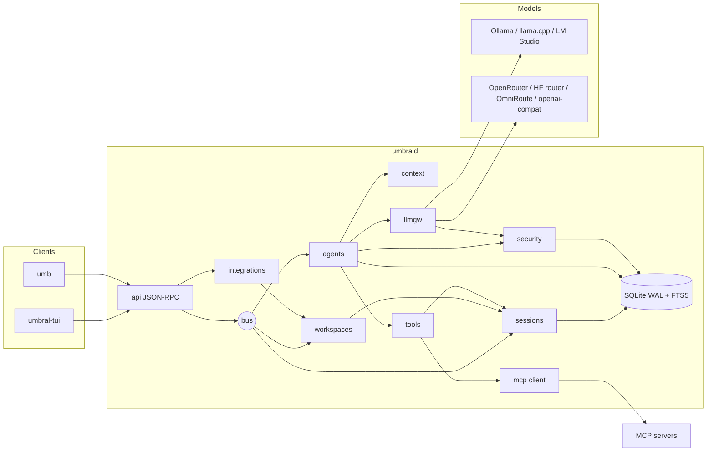
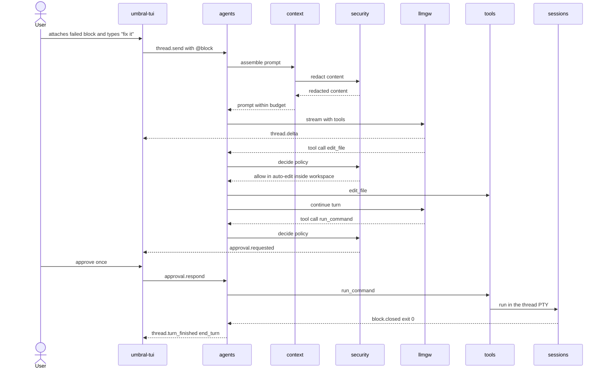

# Umbral MVP — Technical Design Document

## Metadata

| Field | Value |
|---|---|
| **Author** | Ernesto Crespo · assisted draft |
| **Status** | `DRAFT` |
| **Version** | 1.6 |
| **Date** | 2026-09-11 |
| **Related PRD** | `specs/prd/umbral-mvp.md` |
| **Related API Spec** | `specs/api/umbral-daemon-api-v1.md` |
| **Reference architecture** | `docs/ARCHITECTURE.md` · `docs/adr/ADR-0001-architectural-style.md` |

---

## 1. Context

Umbral is a local Go daemon (`umbrald`) that owns:

- the PTYs and their VT emulation;
- the blocks derived from shell integration;
- the agent runtime;
- the model gateway.

The clients (TUI and CLI in the MVP) are thin and speak JSON-RPC over a Unix socket. Separating the
lifecycle of shells and agents from the window's lifecycle is what enables durable sessions,
multiple clients and, later, background agents.

The style follows ADR-0001: local client-server, with the daemon as a **modular monolith**, a
**hexagonal** interior, a **microkernel** for tools and providers, and an in-process **event bus**.

## 2. Technical Goals

- **Correctness:** VT conformance is the foundation; no block loses output; every agent action is
  persisted before it is notified.
- **Performance:** added latency < 5 ms p95; `session.create` < 300 ms p95; search < 200 ms p95 with
  100,000 blocks.
- **Maintainability:** boundaries verified by `go-arch-lint`; unit coverage ≥ 75 % in `domain` and in
  the policy and router packages.
- **Operability:** traces per turn, metrics per provider, `umb status` as the diagnostic entry point.

## 3. Proposed Architecture

### 3.1 High-Level Diagram (MVP)



### 3.2 Components

| Component | Technology | Responsibility | Main REQs |
|---|---|---|---|
| `api` | own JSON-RPC 2.0 over a Unix `net.Listener` | handshake, auth, dispatch, notification fan-out with a per-client queue | SEC-003, SEC-007 |
| `sessions` | `creack/pty`, go-libghostty, `shell/` bootstrap, `klauspost/compress/zstd` | PTY, VT, blocks, input lock, snapshots | TERM-*, BLK-* |
| `agents` | own runtime over ports | per-turn loop, modes, limits, cancellation, persist-first | AGT-* |
| `context` | `text/template`, tiktoken tokenizer in Go | rules, attachments, git, budget, compaction | CTX-* |
| `tools` | microkernel registry | built-in tools and MCP adapter; JSON Schema validation | AGT-002/006, MCP-001 |
| `llmgw` | `charm.land/fantasy` + native Ollama adapter | catalog, candidates per class, fallback, normalized streaming, usage | LLM-* |
| `mcp` | `modelcontextprotocol/go-sdk` | connection, reconnection with backoff, prefixing | MCP-* |
| `security` | own rules + `zalando/go-keyring` | policies, destructive patterns, taint, redaction, egress | SEC-*, AGT-004/009/013/014 |
| `store` | `modernc.org/sqlite` | migrations, repositories, FTS5 | Data Model |
| `workspaces` | own tree + SQLite | workspaces, tabs, panes, identifiers, layouts, rollup, restore | WS-*, TERM-009/010 |
| `waits` | server-owned, event-driven | pinned waits on threads and output | AUT-* |
| `integrations` | socket + env | external state reports, display metadata, authority | INT-* |
| `notify` | client channel | normalization, rate limit, typed reasons | NTF-* |
| `obs` | OpenTelemetry Go, `log/slog` | traces, metrics | OBS-* |

### 3.3 Main flow: US-003 scenario ("fix it")



**Error and compensation flow:**

1. Provider returns 429/5xx or no first token within the deadline → `llmgw` tries the next candidate
   of the class (REQ-LLM-003). No candidates left → `PROVIDER_UNAVAILABLE` and the turn ends with
   `stop_reason = provider_error`.
2. Invalid arguments → one retry with a repair message; if it fails, `tool_error` (REQ-AGT-006).
3. `thread.cancel` → the turn's `context.Context` is cancelled and the thread PTY's process group gets
   `SIGTERM`; after 300 ms, `SIGKILL` (REQ-AGT-007).
4. Daemon crash → messages and tool calls are already persisted (REQ-AGT-011). On restart, `running`
   turns become `stopped` and `pending` approvals become `expired`.

## 4. Design Decisions

### DD-001: The daemon owns the VT state; clients render from bytes

- **Decision:** `umbrald` keeps an authoritative libghostty emulator per session. It is used for
  snapshots, block plain text and alt-screen detection. Clients receive raw bytes
  (`session.output`) and process them with their own renderer.
- **Alternatives:**

| Option | Pros | Cons |
|---|---|---|
| **A: VT in the daemon + bytes to clients (chosen)** | snapshots and blocks independent of the client; simple clients | double parsing (daemon and client) |
| B: the daemon sends cell diffs | single parse | complex custom protocol; couples clients to the cell model |
| C: VT only in the client | simple | no durability and no blocks without a connected client |

- **Consequences:** the snapshot sent on subscribe must be serialized in a format the client can
  replay (**Q-01**).

### DD-002: Blocks from OSC 133 / 633 / 7, with a degraded mode

- **Decision:** blocks derive from OSC sequences emitted by an injected bootstrap
  (`ENV`/`ZDOTDIR`/`--init-file` depending on the shell). No sequences within 5 s →
  `integration: none` (REQ-BLK-003).
- **Discarded alternative:** heuristics on the prompt; they are fragile with custom prompts
  (Starship, p10k).

### DD-003: Per-session input lock (`input_owner`)

- **Decision:** the agent's `run_command` runs in a **PTY dedicated to the thread** (not in the user's
  session). In the MVP the lock applies to that PTY and prepares the ground for Full Terminal Use (F2).
- **Consequence:** REQ-TERM-008 applies to sessions created by the agent when the user tries to type
  into them.

### DD-004: Gateway with task classes and ordered candidates

- **Decision:** the configuration declares classes (`fast`, `code`, `plan`, `embed`), each with an
  ordered list of `provider/model`. The MVP router applies, in order:
  1. offline filter (REQ-LLM-004);
  2. capability filter (tools, window);
  3. health;
  4. declared order.

  Cost and quality policies arrive in F2.
- **Meta-providers** (OpenRouter, OmniRoute) are just another candidate; their internal fallback is
  not duplicated.

### DD-005: Native Ollama adapter in addition to openai-compat

- **Decision:** Ollama uses the native `/api/chat` to send `num_ctx` (REQ-LLM-006), `keep_alive` and
  `format` with a JSON Schema. llama.cpp and LM Studio use openai-compat through Fantasy.
- **Consequence:** one more adapter to maintain, but it avoids Ollama's short default `num_ctx`.

### DD-006: Policy engine as a pure function

- **Decision:** `Decide(Action, Mode, Rules, Taint) → allow|ask|deny` with no I/O, tested with tables.
  Precedence, highest first:
  1. destructive patterns (always `ask`);
  2. `deny` rules;
  3. taint (`ask` for Exec/Network);
  4. mode (`ask` exposes only ReadOnly; `auto-edit` allows WriteFS inside the workspace);
  5. `allow` rules;
  6. mode default.

### DD-007: Persist before notifying

- **Decision:** the runtime writes the message, tool call or approval to SQLite in the turn's own
  goroutine, before publishing it on the bus (REQ-AGT-011). Accepted cost: ~0.2 ms per event with WAL.

### DD-008: Redaction at the egress edge

- **Decision:** redaction happens in `security` right before `llmgw` serializes the request. Local
  providers also receive redacted content (defense in depth and consistent prompts).
- **`egress_log`** only records non-loopback destinations.

### DD-009: The daemon owns the workspace tree; the client only renders it

- **Decision:** `workspaces` owns workspaces, tabs, panes and their layout; the TUI keeps no private
  structure. Public identifiers (`w1`, `w1:t1`, `w1:p1`) are allocated by the daemon and are the
  addressing surface for the CLI, the API and future clients.
- **Alternative rejected:** keeping tabs and splits inside the TUI. That would make the layout
  unreachable from scripts, would force the F2 desktop client to reinvent it, and would leave no
  place to attach the rollup state.
- **Consequence:** a moved pane changes its identifier; the previous one stays an alias while the
  terminal lives (REQ-WS-007), so long-running commands that captured `UMBRAL_PANE_ID` keep working.

### DD-010: Snapshot plus sequenced events, instead of resynchronizing

- **Decision:** every notification carries a `seq` that is monotonic per session, and
  `session.snapshot` reports the `seq` it contains. A client subscribes first, buffers, takes the
  snapshot and then applies the buffered events with a higher `seq`.
- **Rejected:** having the client ask for a full state refresh after each reconnect: it is expensive
  and still leaves a gap.

### DD-011: Waits belong to the server and pin their turn

- **Decision:** `thread.wait` and the `wait` inside `thread.send` are resolved in the daemon with bus
  events, never by client polling. The wait is pinned to the turn in progress, so a later turn does
  not satisfy it, and `thread.send` with `wait` is one ordered submission.
- **Consequence:** a timeout does not prove that nothing was sent. The contract states it and the CLI
  repeats it, because the safe recovery is to read the thread before resending.

### DD-012: One state authority per pane, with a fixed precedence

- **Decision:** the attention state of a pane comes from exactly one source, in this order:
  1. Umbral's own agent, for the panes of its threads (it cannot be displaced);
  2. an external integration that reported with `pane.report_state` and has not released authority;
  3. Umbral's own derivation from the block lifecycle (`running` → `working`, closed → `idle`).
- **Rationale:** the failure mode to avoid is two sources disagreeing. Screen heuristics are
  deliberately left out of the MVP: they are fragile and they would be a third source of truth.
  Third-party agent detection arrives in F2 as the lowest-priority layer, behind hooks and ACP.
- **Consequence:** display metadata is a separate channel (DD-013) precisely so that improving what
  is shown never requires touching the state that drives waits.

### DD-013: Semantic state and presentation are different channels

- **Decision:** `pane.report_state` carries semantics; `pane.report_metadata` carries presentation
  (title, displayed name, state labels, tokens with TTL). Metadata never alters waits, rollups or
  notifications, has bounded size and does not survive a restart.

### DD-014: Restore in tiers, each with a written guarantee

| Case | Processes | Structure | Recent screen | Thread |
|---|---|---|---|---|
| Client detaches | keep running | returns | from the live terminal | keeps running |
| Daemon restart | lost | restored (REQ-TERM-009) | only with `pane_history` (REQ-TERM-010) | history restored, turn `stopped` (REQ-AGT-017) |
| Daemon update | lost in the MVP | restored | as above | as above |

Live PTY handoff between daemon versions is F2: it is worth it only once the daemon is something
people leave running for days.

### DD-015: The protocol schema is generated from the code

- **Decision:** the binary can print the JSON Schema of the protocol and CI compares it against the
  API Spec (methods, error codes, notifications). A method that exists in code but not in the
  document turns CI red.
- **Rationale:** it is the cheapest mechanism that keeps Art. 9 ("code and spec must never diverge
  silently") from depending on discipline alone.

### DD-016: Rule material is signed, and recovery never depends on the network

- **Decision:** the redaction rules and the destructive-pattern list travel as a versioned bundle
  with a detached Ed25519 signature. The daemon verifies the signature against a trust store of
  public keys, refuses downgrades, and on three consecutive failures — or with no valid key — it
  disables remote updates and keeps working with what it already has.
- **Key loss is the case that had to be designed for:** `rules.rollback` returns to the previous
  verified bundle and `rules.reset` returns to the rules built into the binary. Both work offline
  and need no key, so losing the signing key degrades the update channel but never the product.
  The local override directory is never touched by any of this.
- **Rejected:** TLS alone. The threat is a compromised endpoint, and TLS does not address it.
- **Cost accepted:** key management (creation, rotation, revocation) and the release process that
  signs each bundle.

### DD-017: Waits are observable and cancellable, and a stall is not a failure

- **Decision:** the daemon keeps an inventory of active waits (`wait.list`) with age and a stalled
  flag, allows cancelling a wait without touching what it observes (`wait.cancel`), and marks a turn
  `stalled` when it produces no model event, tool call or output within the window.
- **Rationale:** the realistic failure is not an attack, it is a script that leaks waits or a
  provider that stops answering. Exceeding a limit degrades that operation, never the connection.
- **Consequence:** `stalled` is informational. Umbral notifies and offers the choice; it never kills
  a turn on its own, because a local model can legitimately take minutes.

## 5. Patterns and Conventions

### 5.1 Code Structure

```
cmd/umbrald/                 # composition root (the only place with wiring)
cmd/umb/                     # CLI
cmd/umbral-tui/              # Bubble Tea v2 client
internal/<module>/domain/    # pure types and rules
internal/<module>/ports/     # published interfaces
internal/<module>/adapters/  # implementations
internal/bus/                # typed pub/sub
internal/workspaces/         # tree, identifiers, layout, restore
internal/waits/              # pinned waits
internal/integrations/       # external reports and metadata
shell/                       # bash, zsh, fish bootstrap
testdata/vt/                 # VT conformance suite
```

### 5.2 Dependency rules (Art. 3, verified by `go-arch-lint`)

| From | May import |
|---|---|
| `*/domain` | stdlib and other `*/domain` |
| `*/ports` | its own `domain` and other `*/domain` |
| `*/adapters` | its own `ports`, its own `domain` and external libraries |
| `agents` | `ports` of `sessions`, `tools`, `context`, `llmgw`, `security`, `store` |
| `llmgw`, `sessions` | never `agents` |
| `workspaces` | `ports` of `sessions` and `store`; never `agents`, `api` or `waits` |
| `waits` | `ports` of `agents`, `sessions` and `store`, plus `bus`; never `api` |
| `integrations` | `ports` of `workspaces` and `store`, plus `bus`; never `agents` or `api` |
| `notify` | `bus` and stdlib only; it is a sink and imports no other module |
| `cmd/*` | everything |

Each of those four modules needs its own `components` entry and `deps` block in
`.go-arch-lint.yml` before its first file lands, or `task arch` passes by having nothing to
check. T-F0-14, T-F0-15 and T-F0-16 name that file for exactly this reason.

### 5.2b Environment injected into panes (REQ-INT-001)

| Variable | Value |
|---|---|
| `UMBRAL_ENV` | always `1` inside a managed pane |
| `UMBRAL_SOCKET_PATH` | socket of the session that owns the pane |
| `UMBRAL_BIN_PATH` | absolute path of the `umb` binary |
| `UMBRAL_WORKSPACE_ID`, `UMBRAL_TAB_ID`, `UMBRAL_PANE_ID` | location of the pane |
| `UMBRAL_SESSION_ID` | terminal session attached to the pane |

Umbral's values win over any caller-supplied value. An integration reports only when
`UMBRAL_ENV=1`, so the same hook is inert outside Umbral.

### 5.3 Default policies

| Risk | `ask` mode | `normal` mode | `auto-edit` mode |
|---|---|---|---|
| ReadOnly | allow | allow | allow |
| WriteFS (inside the write root) | not exposed | ask (with diff) | allow |
| WriteFS (outside the write root) | not exposed | ask | ask (`outside_write_root`) |
| Exec | not exposed | ask | ask |
| Network | not exposed | ask | ask |
| Destructive pattern | — | ask, ignores `always` | ask, ignores `always` |

**Write root** = the git root of the thread's cwd or, when there is no repo, the cwd itself. It is
the agent's write boundary and has nothing to do with the structural workspace of §3.2 (finding
B-09).

### 5.4 Error Handling

```go
var (
    ErrNotFound            = errors.New("not_found")             // -32002
    ErrConflict            = errors.New("conflict")              // -32003
    ErrPermissionDenied    = errors.New("permission_denied")     // -32004
    ErrProviderUnavailable = errors.New("provider_unavailable")  // -32005
    ErrBudgetExceeded      = errors.New("budget_exceeded")       // -32006
    ErrInputLocked         = errors.New("input_locked")          // -32008
    ErrConfigInvalid       = errors.New("config_invalid")        // -32009
)
// api translates with errors.Is → JSON-RPC code; every INTERNAL_ERROR includes trace_id.
```

## 6. Security

### 6.1 Attack Surface

| Vector | Mitigation | REQ |
|---|---|---|
| Another local process uses the socket | `0600` socket + per-installation token | SEC-003, SEC-007 |
| Prompt injection from web output or MCP | context taint → ask for Exec/Network | SEC-006 |
| Destructive commands | patterns always ask | SEC-005 |
| Secret exfiltration | redaction + `egress_log` + offline mode | SEC-001, SEC-002, LLM-004 |
| Keys on disk | only `keyring:<path>`; plaintext rejected | SEC-004 |
| Malicious MCP server | `trust = untrusted` by default when added; ask by default | MCP-004 |

### 6.2 Sensitive Data

| Data | Classification | Storage | Access |
|---|---|---|---|
| API keys | secret | OS keyring | `llmgw`, in memory |
| Block output | confidential | local SQLite, unredacted | local user |
| Content sent to models | confidential | redacted; hash in `egress_log` | — |
| Socket token | secret | `0600` file | local clients |

## 7. Observability

### 7.1 Logging

`slog` JSON: `{time, level, msg, trace_id, span_id, module, thread_id?, session_id?, duration_ms?}`.
Never prompt contents or output (only sizes and hashes).

### 7.2 Metrics

| Metric | Type | Description |
|---|---|---|
| `umbral_session_output_latency_seconds` | Histogram | PTY read → notification queued (REQ-TERM-006) |
| `umbral_llm_first_token_seconds` | Histogram per provider/model | time to first token |
| `umbral_llm_tokens_total` | Counter per direction/model | input and output tokens |
| `umbral_tool_calls_invalid_total` | Counter per model | REQ-OBS-002 |
| `umbral_approvals_total` | Counter per decision/reason | approvals |

### 7.3 Traces
One root span `agent.turn` per turn, with children `llm.call` (attributes `gen_ai.request.model`,
`gen_ai.system`, `gen_ai.usage.*`) and `tool.<name>` (REQ-OBS-001).

## 8. Testing Strategy

| Level | Target | Tools | What it covers |
|---|---|---|---|
| Unit | ≥ 75 % in domain, policy and router | `go test`, tables | policies, router, redaction, OSC parser, budget |
| VT conformance | 100 % of the MUST cases in §8.1 | `testdata/vt/*.golden` + libghostty Formatter | VT-01 … VT-20: alt-screen, truecolor, bracketed paste, reflow, wide chars, graphemes (REQ-TERM-002) |
| Integration | critical flows | real PTY with bash/zsh/fish in CI; temporary SQLite | blocks, snapshots, cancellation |
| API contract | every method | test JSON-RPC client | errors and notifications from the API Spec |
| Providers | adapters | fake OpenAI-compat and Ollama servers; optionally real Ollama with `-tags live` | streaming, 429/5xx, timeouts |
| E2E | US-003 | fixture repo with a broken test + `ollama/gpt-oss:20b` (`-tags live`) | 70 % target over 20 runs |
| Waits and automation | AUT-* | scripted fake provider + fake PTY | pinning, race between send and wait, timeouts |
| Integrations | INT-* | test process that reports over the socket | authority, stale `seq`, release, metadata limits |
| Rules and signing | SEC-011/013/014/015/016 | test bundles with valid, invalid and unknown-key signatures | verification, downgrade, fail closed, offline recovery |
| Waits under load | AUT-005/006/007/008 | script that leaks waits; provider that stops answering | limits, inventory, cancellation, stall detection |
| Restore | TERM-009/010, AGT-017 | daemon restart in a temporary directory | structure, optional screen, thread history |
| Protocol contract | API-* | generated schema vs. API Spec | drift between code and spec |
| Performance | NFRs | `go test -bench`, 100,000-block fixture | TERM-006, BLK-006, TERM-001 |

Convention: every test that verifies a REQ cites it, e.g. `TestBlockClosedOnOSC133D_REQ_BLK_002`.

### 8.1 Appendix: VT conformance cases (finding A-02)

Closed list that defines "100 % of the MUST cases" in REQ-TERM-002. Each case is a
`testdata/vt/VT-NN-<slug>.in` / `.golden` pair: the `.in` file holds the byte stream fed to the
emulator, the `.golden` file the expected screen as plain text plus the per-cell attributes.
Sources: `vttest`, `esctest` and the Ghostty VT reference.

| ID | Case | Priority |
|---|---|---|
| VT-01 | Cursor movement CUP/CUU/CUD/CUF/CUB and screen bounds | MUST |
| VT-02 | Erase ED/EL (0, 1, 2) | MUST |
| VT-03 | DECSTBM scroll region with IND/RI/NEL | MUST |
| VT-04 | Basic SGR: 16 colors, bold, italic, underline, inverse, reset | MUST |
| VT-05 | SGR 256 colors (38;5 / 48;5) | MUST |
| VT-06 | SGR truecolor (38;2 / 48;2) | MUST |
| VT-07 | Alternate screen 1049: enter, exit and restore content and cursor | MUST |
| VT-08 | Bracketed paste 2004 | MUST |
| VT-09 | SGR 1006 mouse reporting | MUST |
| VT-10 | Wide characters (CJK) with width 2 | MUST |
| VT-11 | Grapheme clusters (ZWJ emoji) as one logical cell | MUST |
| VT-12 | Combining characters | MUST |
| VT-13 | DECAWM autowrap at the right margin | MUST |
| VT-14 | Reflow of wrapped lines on resize | MUST |
| VT-15 | HT/HTS/TBC tabs with default stops | MUST |
| VT-16 | DECSC/DECRC cursor save/restore | MUST |
| VT-17 | IL/DL/ICH/DCH insert/delete | MUST |
| VT-18 | OSC 0/2 (title) | MUST |
| VT-19 | OSC 7 (cwd) | MUST |
| VT-20 | OSC 133 A/B/C/D and OSC 633;E intercepted without visible effects | MUST |
| VT-21 | Kitty keyboard protocol (push/pop of flags) | SHOULD |
| VT-22 | OSC 8 hyperlinks | SHOULD |

A MUST case with no `.in` / `.golden` pair on disk fails the suite; it is never skipped.
Adding or removing a MUST case requires a Delta, because REQ-TERM-002 is measured against this
list. `assertEveryMustCaseIsPresent` in `internal/sessions/adapters/ghostty/conformance_test.go`
enforces both rules, with `mustCases` pinned to the 20 MUST rows above.

## 9. Migration / Rollout Plan

- New project, no data migration.
- 0.1 distribution:
  - Linux binaries (tar.gz + `.deb`) and macOS (tar.gz, unsigned in 0.1);
  - `umbrald` as a user service (`systemd --user` / `launchd`).
- Compatibility: `protocol_version = 1`, N and N-1 supported (API Spec §9).

### 9.3 Visual identity and packaging

Folded from `changes/_archive/2026-09-visual-identity/`.

- **Single source:** `assets/branding/umbral-icons/tools/svgs.py` holds every shape and
  `tools/build.py` renders every format. The 16 and 24 px sizes have their own hand-hinted
  sources; 32 px and above come from the 128 master.
- **Linux:** the `share/icons/hicolor` tree plus `io.github.ecrespo.Umbral.desktop`. The
  Breeze variant is shipped in the kit but not installed by default.
- **Windows (F2):** `umbral.ico` plus the MSIX `Assets/` set.
- **macOS (F2):** the layers in `macos/icon-composer-layers/` are assembled in Icon Composer
  into `appicon.icon`; `umbral.icns` is the fallback for macOS ≤ 15.
- **Verification:** `scripts/icons_check.sh`, run by `task icons` and by the `icons` CI job.
  It verifies `CHECKSUMS.sha256`, regenerates the kit with `build.py` and compares every
  artifact byte for byte, then validates the `.desktop` file and asserts the release 0.1
  launcher. The regeneration step is what REQ-PKG-006 needs: checking the checksums alone
  would pass a source edit committed together with its new checksum.

## 10. Open Questions

- [ ] **Q-01**: does libghostty's `Formatter` serialize the screen in a replayable VT format (with styles) for the snapshot? If not, fallback: replay the raw byte buffer, bounded to the last N lines. — Owner: Tech Lead, before T-F0-06.
- [ ] **Q-02**: which local models meet the < 5 % invalid tool call threshold? Candidates: `gpt-oss:20b`, Qwen3-Coder. — Owner: Tech Lead, during F1.
- [ ] **Q-03**: tokenizer per family (tiktoken for OpenAI/gpt-oss, ×1.1 approximation for the rest). Is it enough for REQ-CTX-004? — F1.

## Constitution check

- **Art. 3:** §5.2 rules encoded in `.go-arch-lint.yml` (T-F0-01).
- **Art. 4 and 5:** DD-006 and DD-008 plus the §5.3 table.
- **Art. 6:** prefixed ULIDs and UTC ms timestamps (Data Model). The workspace tree uses the structural identifiers `w<n>`, `w<n>:t<m>` and `w<n>:p<m>` (DD-009), which is the exception written into Art. 6 by the amendment of 2026-09-20 (delta `2026-09-art6-structural-ids`).
- **Art. 7:** §7.3.
- **No exceptions.**

## Change History

| Version | Date | Author | Changes |
|---|---|---|---|
| 1.0 | 2026-09-11 | E. Crespo (assisted draft) | Initial version |
| 1.1 | 2026-09-11 | E. Crespo (assisted draft) | delta `2026-09-analyze-fixes`: appendix §8.1 with the VT conformance cases VT-01…VT-22 (A-02) |
| 1.2 | 2026-09-11 | E. Crespo (assisted draft) | delta `2026-09-visual-identity`: §9.3 visual identity and packaging |
| 1.3 | 2026-09-11 | E. Crespo (assisted draft) | delta `2026-09-block-lifecycle-decisions`: `klauspost/compress/zstd` recorded as a `sessions` dependency in §3.2 |
| 1.4 | 2026-09-20 | E. Crespo (assisted draft) | Adds the `workspaces`, `waits`, `integrations` and `notify` modules, DD-009 to DD-015, the injected environment and the new test levels |
| 1.6 | 2026-09-20 | E. Crespo (assisted draft) | delta `2026-09-art6-structural-ids`: the Constitution check records the Art. 6 exception behind DD-009 (C-05) |
| 1.5 | 2026-09-20 | E. Crespo (assisted draft) | Closes the Analyze findings: DD-016 (signing and recovery), DD-017 (wait observability), renames the agent's boundary to "write root" (B-09) and adds two test levels. §8.1 was already folded in 1.1 |
