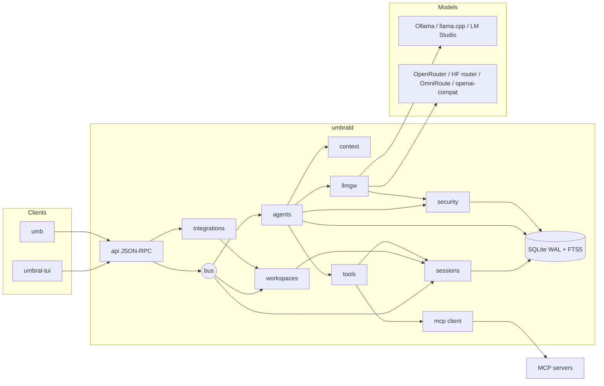
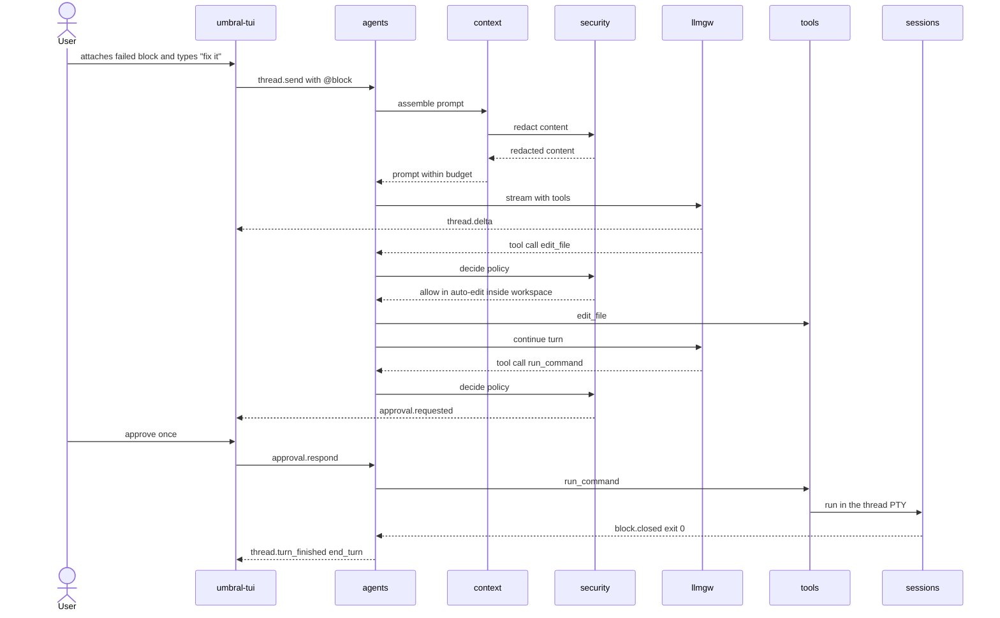

# Umbral MVP — Technical Design Document

## Metadata

| Field | Value |
|---|---|
| **Author** | Ernesto Crespo · assisted draft |
| **Status** | `DRAFT` |
| **Version** | 1.30 |
| **Date** | 2026-09-27 |
| **Related PRD** | `specs/prd/umbral-mvp.md` |
| **Related API Spec** | `specs/api/umbral-daemon-api-v1.md` |
| **Reference architecture** | `docs/ARCHITECTURE.md` · `docs/adr/ADR-0001-architectural-style.md` |

---


> **Pending from F1 (ratified 2026-09-26, not yet written here).** Several sections are still
> to be updated:
> - §3.2 gains the skill store, the catalog and `skill_load` (T-F1-34, T-F1-36);
> - §5.3 gains the destructive patterns `umb skill …` and `umb mcp add` (T-F1-36);
> - §9.4 gains `umb skill` and `umb mcp` (T-F1-35, T-F1-37).
>
> Written by T-F1-33: §5.1's live keys and `[api]` table, §7.2's `umbral_frames_refused_total` and
> §9.4's `umb limits`.
>
> Each task writes its part. Until then, the design is in `changes/_archive/2026-09-*`.

## 1. Context

Umbral is a local Go daemon (`umbrald`) that owns:

- the PTYs and their VT emulation;
- the blocks derived from shell integration;
- the agent runtime;
- the model gateway.

The clients (TUI and CLI in the MVP) are thin and speak JSON-RPC over a Unix socket. Separating the
lifecycle of shells and agents from the window's lifecycle is what enables durable sessions,
multiple clients and, later, background agents.

The style follows ADR-0001: local client-server, with the daemon as a **modular monolith**, a
**hexagonal** interior, a **microkernel** for tools and providers, and an in-process **event bus**.

## 2. Technical Goals

- **Correctness:** VT conformance is the foundation; no block loses output; every agent action is
  persisted before it is notified.
- **Performance:** added latency < 5 ms p95; `session.create` < 300 ms p95; search < 200 ms p95 with
  100,000 blocks.
- **Maintainability:** boundaries verified by `go-arch-lint`; unit coverage ≥ 75 % in `domain` and in
  the policy and router packages.
- **Operability:** traces per turn, metrics per provider, `umb status` as the diagnostic entry point.

## 3. Proposed Architecture

### 3.1 High-Level Diagram (MVP)


```mermaid
flowchart LR
  subgraph Clients
    TUI["umbral-tui"]
    CLI["umb"]
  end
  subgraph D["umbrald"]
    API["api JSON-RPC"]
    BUS(("bus"))
    WSP["workspaces"]
    SES["sessions"]
    AGT["agents"]
    INT["integrations"]
    CTX["context"]
    TOOLS["tools"]
    GW["llmgw"]
    MCPC["mcp client"]
    SEC["security"]
    STORE[("SQLite WAL + FTS5")]
  end
  subgraph Models
    LOC["Ollama / llama.cpp / LM Studio"]
    REM["OpenRouter / HF router / OmniRoute / openai-compat"]
  end
  EXT["MCP servers"]
  TUI --> API
  CLI --> API
  API --> BUS
  BUS --> WSP
  BUS --> SES
  BUS --> AGT
  WSP --> SES
  INT --> WSP
  API --> INT
  AGT --> CTX
  AGT --> TOOLS
  AGT --> GW
  AGT --> SEC
  TOOLS --> SES
  TOOLS --> MCPC
  MCPC --> EXT
  GW --> SEC
  GW --> LOC
  GW --> REM
  SES --> STORE
  AGT --> STORE
  SEC --> STORE
```

### 3.2 Components

| Component | Technology | Responsibility | Main REQs |
|---|---|---|---|
| `api` | own JSON-RPC 2.0 over a Unix `net.Listener` | handshake, auth, dispatch, notification fan-out with a per-client queue | SEC-003, SEC-007 |
| `tui` | Bubble Tea v2 (`charm.land/bubbletea/v2`), go-libghostty for the client's own renderer (DD-001) | tabs, panes, block list, keyboard | TUI-* |
| `sessions` | `creack/pty`, go-libghostty, `shell/` bootstrap, `klauspost/compress/zstd` | PTY, VT, blocks, input lock, snapshots | TERM-*, BLK-* |
| `agents` | own runtime over ports | per-turn loop, modes, limits, cancellation, persist-first | AGT-* |
| `context` | `text/template`, a byte estimate of tokens (Q-03) | rules, attachments, git, budget, compaction | CTX-* |
| `tools` | microkernel registry | built-in tools and MCP adapter; JSON Schema validation | AGT-002/006, MCP-001 |
| `llmgw` | `charm.land/fantasy` + native Ollama adapter | catalog, candidates per class, fallback, normalized streaming, usage | LLM-* |
| `mcp` | `modelcontextprotocol/go-sdk` | connection, reconnection with backoff, prefixing | MCP-* |
| `security` | own rules + `zalando/go-keyring` | policies, destructive patterns, taint, redaction, egress | SEC-*, AGT-004/009/013/014 |
| `store` | `modernc.org/sqlite` | migrations, repositories, FTS5 | Data Model |
| `workspaces` | own tree + SQLite | workspaces, tabs, panes, identifiers, layouts, rollup, restore | WS-*, TERM-009/010 |
| `waits` | server-owned, event-driven | pinned waits on threads and output | AUT-* |
| `integrations` | socket + env | external state reports, display metadata, authority | INT-* |
| `notify` | client channel | normalization, rate limit, typed reasons | NTF-* |
| `obs` | OpenTelemetry Go, `log/slog` | traces, metrics | OBS-* |

### 3.3 Main flow: US-003 scenario ("fix it")


```mermaid
sequenceDiagram
  actor U as User
  participant T as umbral-tui
  participant A as agents
  participant C as context
  participant S as security
  participant G as llmgw
  participant X as tools
  participant P as sessions

  U->>T: attaches failed block and types "fix it"
  T->>A: thread.send with @block
  A->>C: assemble prompt
  C->>S: redact content
  S-->>C: redacted content
  C-->>A: prompt within budget
  A->>G: stream with tools
  G-->>T: thread.delta
  G-->>A: tool call edit_file
  A->>S: decide policy
  S-->>A: allow in auto-edit inside workspace
  A->>X: edit_file
  A->>G: continue turn
  G-->>A: tool call run_command
  A->>S: decide policy
  S-->>T: approval.requested
  U->>T: approve once
  T->>A: approval.respond
  A->>X: run_command
  X->>P: run in the thread PTY
  P-->>A: block.closed exit 0
  A-->>T: thread.turn_finished end_turn
```

**Error and compensation flow:**

1. Provider returns 429/5xx or no first token within the deadline → `llmgw` tries the next candidate
   of the class (REQ-LLM-003). No candidates left → `PROVIDER_UNAVAILABLE` and the turn ends with
   `stop_reason = provider_error`.
2. Invalid arguments → one retry with a repair message; if it fails, `tool_error` (REQ-AGT-006).
3. `thread.cancel` → the turn's `context.Context` is cancelled and the process groups the thread
   PTY's shell launched get `SIGTERM`; after 300 ms, `SIGKILL` (REQ-AGT-007). The shell itself is
   kept (§5.3b; delta `2026-09-builtin-tools`, decision 9).
4. Daemon crash → messages and tool calls are already persisted (REQ-AGT-011). On restart, `running`
   turns become `stopped` and `pending` approvals become `expired`.

## 4. Design Decisions

### DD-001: The daemon owns the VT state; clients render from bytes

- **Decision:** `umbrald` keeps an authoritative libghostty emulator per session. It is used for
  snapshots, block plain text and alt-screen detection. Clients receive raw bytes
  (`session.output`) and process them with their own renderer.
- **Alternatives:**

| Option | Pros | Cons |
|---|---|---|
| **A: VT in the daemon + bytes to clients (chosen)** | snapshots and blocks independent of the client; simple clients | double parsing (daemon and client) |
| B: the daemon sends cell diffs | single parse | complex custom protocol; couples clients to the cell model |
| C: VT only in the client | simple | no durability and no blocks without a connected client |

- **Consequences:** the snapshot sent on subscribe must be serialized in a format the client can
  replay (**Q-01**). The client's renderer is libghostty too, in `internal/tui/adapters/`, not a
  second VT implementation: the two sides parse the same byte stream, so two emulators would be two
  chances to disagree, and what the user sees would drift from what the block history recorded. The
  price is that `umbral-tui` links cgo and needs `task deps:ghostty`, the same as the daemon.

### DD-002: Blocks from OSC 133 / 633 / 7, with a degraded mode

- **Decision:** blocks derive from OSC sequences emitted by an injected bootstrap
  (`ENV`/`ZDOTDIR`/`--init-file` depending on the shell). No sequences within 5 s →
  `integration: none` (REQ-BLK-003).
- **Discarded alternative:** heuristics on the prompt; they are fragile with custom prompts
  (Starship, p10k).

### DD-003: Per-session input lock (`input_owner`)

- **Decision:** the agent's `run_command` runs in a **PTY dedicated to the thread** (not in the user's
  session). In the MVP the lock applies to that PTY and prepares the ground for Full Terminal Use (F2).
- **Consequence:** REQ-TERM-008 applies to sessions created by the agent when the user tries to type
  into them.

### DD-004: Gateway with task classes and ordered candidates

- **Decision:** the configuration declares classes (`fast`, `code`, `plan`, `embed`), each with an
  ordered list of `provider/model`. The MVP router applies, in order:
  1. offline filter (REQ-LLM-004);
  2. capability filter (tools, window);
  3. health;
  4. declared order.

  Cost and quality policies arrive in F2.
- **How the router walks them** (T-F1-07, `internal/llmgw/router.go`):
  - A candidate must be in the catalog: not yet discovered, or `down` for any reason — offline
    included — it is skipped. The capability filter drops it when the request has tools and it
    has none, asks for a response schema or for reasoning it does not advertise, or does not
    fit its window, estimated at four characters a token plus `max_output_tokens`. A class
    with nothing left is `PROVIDER_UNAVAILABLE` before anything is sent (REQ-LLM-004).
  - The request is redacted once, before the first candidate (REQ-SEC-001, all content): the
    system prompt, every message, every tool call's arguments and result, every tool's
    description and every string in its input schema, and every string in the response
    schema (values; a schema's property names are sent as written). The caller's request is
    left as it was. The call's context
    carries its thread, so the egress row of the payload that left — the redacted one — names
    it (REQ-SEC-002).
  - **Fallback is decided before the first event reaches the caller.** A 429, a 5xx, a
    transport failure, a stream that ends empty, or no event within the first-token timeout
    (30 s remote, 120 s local) moves to the next candidate (REQ-LLM-003). The clock starts
    before the request is sent, so a server that holds its headers times out too. A 4xx or a request
    that could not be built ends the call. Once an event is delivered the caller has it, so a
    later failure ends the call rather than starting it again elsewhere. When the last
    candidate fails the call is `PROVIDER_UNAVAILABLE`.
  - An adapter that cannot carry what a request asks for — the Fantasy-based ones and
    reasoning or a response schema, until they do — refuses it before sending, and the
    router moves on without recording a call.
  - **Every call that was made is one `usage` row** (REQ-LLM-005), failures included, with
    status `rate_limited`, `timeout` or `error` and the error text. `first_token_ms` is NULL
    when no event arrived. The cost is `(in × price_in + out × price_out) / 10^6` micro-USD,
    rounded to the nearest unit; a model whose price the provider does not publish costs 0.
    A row that cannot be written is logged and does not fail the call.
  - These choices go beyond REQ-LLM-003 and REQ-LLM-005's text and are delta
    `2026-09-router-fallback`.
- **Meta-providers** (OpenRouter, OmniRoute) are just another candidate; their internal fallback is
  not duplicated.

### DD-005: Native Ollama adapter in addition to openai-compat

- **Decision:** Ollama uses the native `/api/chat` to send `num_ctx` (REQ-LLM-006), `keep_alive` and
  `format` with a JSON Schema. llama.cpp and LM Studio use openai-compat through Fantasy.
- **Consequence:** one more adapter to maintain, but it avoids Ollama's short default `num_ctx`.
- **`num_ctx` in every request** (T-F1-06, REQ-LLM-006): the provider's `[providers.options]
  num_ctx` when models.toml sets it; otherwise 32768, capped at the model's own window once
  discovery (`/api/tags`, `details.context_length`) knows it — never Ollama's default. `keep_alive`
  goes at the request's top level and every other option in `options`; `think` is sent only when
  the call asks (`true`/`false` or an effort level), `format` only with a schema. With tool calls,
  Ollama's `done_reason: stop` is reported as `tool_calls`, as the openai-compat adapter reports it.

### DD-006: Policy engine as a pure function

- **Decision:** `Decide(Action, Mode, Rules, Taint) → allow|ask|deny` with no I/O, tested with tables.
  Precedence, highest first:
  1. destructive patterns (always `ask`);
  2. `deny` rules;
  3. taint (`ask` for Exec/Network);
  4. mode (`ask` exposes only ReadOnly; `auto-edit` allows WriteFS inside the workspace);
  5. `allow` rules;
  6. mode default.
- **How it meets the §5.3 table:** an exposure step comes first, a destructive pattern is a floor a
  `deny` rule still overrides, `auto-edit` asks outside the write root whatever the `allow` rules,
  and rules read each command of a line — §5.3 "How the table and DD-006 meet" (delta
  `2026-09-policy-precedence`).

### DD-007: Persist before notifying

- **Decision:** the runtime writes the message, tool call or approval to SQLite in the turn's own
  goroutine, before publishing it on the bus (REQ-AGT-011). Accepted cost: ~0.2 ms per event with WAL.
  Streamed text is persisted chunk by chunk, reasoning is published only, and a write that fails
  stops the turn with `storage_error` (§5.3d; delta `2026-09-agent-runtime`, decisions 1 and 3).

### DD-008: Redaction at the egress edge

- **Decision:** redaction happens in `security` right before `llmgw` serializes the request. Local
  providers also receive redacted content (defense in depth and consistent prompts).
- **`egress_log`** only records non-loopback destinations. It is written by an HTTP transport
  under every adapter (T-F1-05, `llmgw/adapters/fantasyconv`), so model discovery is recorded as
  well as model calls; the row is written before the request is sent, and a row that cannot be
  written stops the request. The daemon's own requests, such as discovery, carry no thread.
- **The rules** (T-F1-04, `internal/security/domain/redact.go`) run in order, each match — or,
  for a `KEY=value` rule, the value only — becoming `[REDACTED:<rule>]`, and a match that already
  is nothing but placeholders is left alone, so redacting twice changes nothing — any other match
  is replaced whole, placeholders it holds included: `pem_private_key`
  (through `-----END…-----`, or to the end of a truncated text), `anthropic_key` (`sk-ant-`),
  `openrouter_key` (`sk-or-v1-`), `openai_key` (`sk-`, `sk-proj-`…), `github_token` (`gh[pousr]_`,
  `github_pat_`), `gitlab_token` (`glpat-`, `gldt-`…), `huggingface_token` (`hf_`),
  `aws_access_key_id` (`AKIA`, `ASIA`…), `aws_secret_access_key`, `gcp_api_key` (`AIza`),
  `gcp_private_key_id`, `jwt`, `slack_token` (`xox?-`) and `dotenv_secret` (an upper-case name
  with a `_`-separated segment `SECRET(S)`, `TOKEN`, `PASSWORD`, `PASSWD`, `PASS`, `PWD`, `KEY`,
  `APIKEY`, `ACCESSKEY`, `CREDENTIAL(S)` or `AUTH`, followed only by `_KEY`, `_SECRET`, `_TOKEN`,
  `_BASE`, `_VALUE`, `_DATA` or digits, and a value of 6 or more characters — so `MAX_TOKENS`,
  `BYPASS_CACHE`, `SSH_KEY_PATH` and `TOKEN_TTL` are not secrets).
  A rule bundle replaces the list (REQ-SEC-010).
- **The generic detector** (`high_entropy`) looks at runs of `[A-Za-z0-9+/=_-]`. REQ-SEC-001's
  two thresholds, ≥ 4.5 bits per character and ≥ 20 characters, are necessary and not sufficient
  ("only fires on"). Two things above them are still not secrets and are left alone: an Umbral id
  (`thr_` + ULID), which the model needs, and a token built like an identifier — split at `_ - + / =`,
  case changes and letter–digit boundaries, no more than a tenth of its characters in pieces
  shorter than three (`TestPolicyAutoEditWorkspace_REQ_AGT_013` reaches 4.56 bits). Measured on
  random keys: the filter costs about 0.05 %, but the 4.5-bit floor itself passes ~98 % of
  40-character keys, ~70 % at 32 and ~5 % at 24 — entropy over a string's own characters cannot
  reach 4.5 bits below 23 characters (log2 22 ≈ 4.46). Short keys of unknown formats rely on
  the named rules. A key containing a `.` is split into candidates, and a lower-case
  `password: …` is caught by no named rule. Delta `2026-09-redaction-thresholds`
  holds these decisions and the PRD amendment they need.

### DD-009: The daemon owns the workspace tree; the client only renders it

- **Decision:** `workspaces` owns workspaces, tabs, panes and their layout; the TUI keeps no private
  structure. Public identifiers (`w1`, `w1:t1`, `w1:p1`) are allocated by the daemon and are the
  addressing surface for the CLI, the API and future clients.
- **Alternative rejected:** keeping tabs and splits inside the TUI. That would make the layout
  unreachable from scripts, would force the F2 desktop client to reinvent it, and would leave no
  place to attach the rollup state.
- **Consequence:** a moved pane changes its identifier; the previous one stays an alias while the
  terminal lives (REQ-WS-007), so long-running commands that captured `UMBRAL_PANE_ID` keep working.

### DD-010: Snapshot plus sequenced events, instead of resynchronizing

- **Decision:** every notification carries a `seq` that is monotonic per session, and
  `session.snapshot` reports the `seq` it contains. A client subscribes first, buffers, takes the
  snapshot and then applies the buffered events with a higher `seq`.
- **Rejected:** having the client ask for a full state refresh after each reconnect: it is expensive
  and still leaves a gap.

### DD-011: Waits belong to the server and pin their turn

- **Decision:** `thread.wait` and the `wait` inside `thread.send` are resolved in the daemon with bus
  events, never by client polling. The wait is pinned to the turn in progress, so a later turn does
  not satisfy it, and `thread.send` with `wait` is one ordered submission.
- **Consequence:** a timeout does not prove that nothing was sent. The contract states it and the CLI
  repeats it, because the safe recovery is to read the thread before resending.

### DD-012: One state authority per pane, with a fixed precedence

- **Decision:** the attention state of a pane comes from exactly one source, in this order:
  1. Umbral's own agent, for the panes of its threads (it cannot be displaced);
  2. an external integration that reported with `pane.report_state` and has not released authority;
  3. Umbral's own derivation from the block lifecycle (`running` → `working`, closed → `idle`).
- **Rationale:** the failure mode to avoid is two sources disagreeing. Screen heuristics are
  deliberately left out of the MVP: they are fragile and they would be a third source of truth.
  Third-party agent detection arrives in F2 as the lowest-priority layer, behind hooks and ACP.
- **Consequence:** display metadata is a separate channel (DD-013) precisely so that improving what
  is shown never requires touching the state that drives waits.

### DD-013: Semantic state and presentation are different channels

- **Decision:** `pane.report_state` carries semantics; `pane.report_metadata` carries presentation
  (title, displayed name, state labels, tokens with TTL). Metadata never alters waits, rollups or
  notifications, has bounded size and does not survive a restart.

### DD-014: Restore in tiers, each with a written guarantee

| Case | Processes | Structure | Recent screen | Thread |
|---|---|---|---|---|
| Client detaches | keep running | returns | from the live terminal | keeps running |
| Daemon restart | lost | restored (REQ-TERM-009) | only with `pane_history` (REQ-TERM-010) | history restored, turn `stopped` (REQ-AGT-017) |
| Daemon update | lost in the MVP | restored | as above | as above |

Live PTY handoff between daemon versions is F2: it is worth it only once the daemon is something
people leave running for days.

### DD-015: The protocol schema is generated from the code

- **Decision:** the binary can print the JSON Schema of the protocol and CI compares it against the
  API Spec (methods, error codes, notifications). A method that exists in code but not in the
  document turns CI red.
- **Rationale:** it is the cheapest mechanism that keeps Art. 9 ("code and spec must never diverge
  silently") from depending on discipline alone.

### DD-016: Rule material is signed, and recovery never depends on the network

- **Decision:** the redaction rules and the destructive-pattern list travel as a versioned bundle
  with a detached Ed25519 signature. The daemon verifies the signature against a trust store of
  public keys, refuses downgrades, and on three consecutive failures — or with no valid key — it
  disables remote updates and keeps working with what it already has.
- **Key loss is the case that had to be designed for:** `rules.rollback` returns to the previous
  verified bundle and `rules.reset` returns to the rules built into the binary. Both work offline
  and need no key, so losing the signing key degrades the update channel but never the product.
  The local override directory is never touched by any of this.
- **Rejected:** TLS alone. The threat is a compromised endpoint, and TLS does not address it.
- **Cost accepted:** key management (creation, rotation, revocation) and the release process that
  signs each bundle. `docs/runbooks/rule-signing.md` carries it: the Tech Lead is the sole signer,
  the key lives only in an `age`-encrypted offline file with a separate backup, it never enters
  CI, and it rotates yearly. Delta `2026-09-rule-signing-custody` states what follows.
- **Formats:**
  - A bundle is the exact bytes of a UTF-8 JSON document whose top-level `version` is a positive
    integer. The built-in rules are version 0.
  - Its signature is fetched from `[update] rules_url` + `.sig` and holds
    `{"signatures":[{"fingerprint":"SHA256:…","sig":"<base64>"}]}`: Ed25519 over the bundle's
    exact bytes.
  - A public key is its 32 raw bytes in standard base64. Its fingerprint is `SHA256:` and the
    unpadded standard base64 of SHA-256 over those bytes.
  - A bundle verifies when some entry names the fingerprint of a valid key (no `revoked_at`) and
    checks out; `verified_with` records the most recently added such key. It is `unknown_key`
    only when no entry names one.
  - A fetched bundle whose SHA-256 equals the active one's is up to date. It is not a rejection:
    nothing is notified and nothing counts toward the three failures.
  - A fetch that fails — network, HTTP error, 404 — is logged and retried at the next check. It is
    not a failed verification: only a bundle that arrived and was rejected counts.
  - Keys are named by fingerprint on the wire. Their ids are `key_` + ULID (Art. 6).
- **Trust on a fresh install:**
  - The binary embeds the project's public keys, a `retired` list and a `revoked` list
    (`internal/security/rules/trustseed`), matched by fingerprint. `retired` only keeps a
    rotated-out key's `source` as `builtin`.
  - On start the daemon adds each seed key `trust_keys` lacks, and revokes each listed one not
    yet revoked.
  - The seed never re-enables updates that REQ-SEC-015 disabled. Only a manual
    `rules.key.add` does, and it does so even for a key the seed already inserted.
  - Removing a key sets `revoked_at` rather than deleting the row, so a removed seed key stays
    removed.
- **Planned rotation never revokes:** during the overlap, bundles carry both signatures. The
  retired key moves to the seed's `retired` list, but installed stores keep it. Revocation is for a compromise.
- **Revoking a key discards what it verified:**
  - Every bundle the key verified goes, together with the memory of downgrade rejections.
  - The active bundle stays if it survives. Otherwise the newest remaining `remote` bundle, or
    the built-in rules, becomes active. It is never a `local` row, and the override directory is
    never touched.
  - That bundle's version becomes REQ-SEC-013's floor.
  - Without this, a stolen key could sign an enormous version and lock every legitimate bundle
    out.

### DD-017: Waits are observable and cancellable, and a stall is not a failure

- **Decision:** the daemon keeps an inventory of active waits (`wait.list`) with age and a stalled
  flag, allows cancelling a wait without touching what it observes (`wait.cancel`), and marks a turn
  `stalled` when it produces no model event, tool call or output within the window.
- **Rationale:** the realistic failure is not an attack, it is a script that leaks waits or a
  provider that stops answering. Exceeding a limit degrades that operation, never the connection.
- **Consequence:** `stalled` is informational. Umbral notifies and offers the choice; it never kills
  a turn on its own, because a local model can legitimately take minutes.

## 5. Patterns and Conventions

### 5.1 Code Structure

```
cmd/umbrald/                 # composition root (the only place with wiring)
cmd/umb/                     # CLI
cmd/umbral-tui/              # Bubble Tea v2 client
internal/<module>/domain/    # pure types and rules
internal/<module>/ports/     # published interfaces
internal/<module>/adapters/  # implementations
internal/api/                # JSON-RPC server: the only package that knows the wire format
internal/client/             # JSON-RPC client, daemon autostart; used by cmd/umb and the TUI
internal/config/             # runtime file locations and the TOML configuration
internal/store/              # SQLite, migrations, restart recovery
internal/tui/                # Bubble Tea v2 model and views
internal/tui/ports/          # the screen the model renders from
internal/tui/adapters/       # libghostty renderer (DD-001: the client parses for itself)
internal/bus/                # typed pub/sub
internal/workspaces/         # tree, identifiers, layout, restore
internal/waits/              # pinned waits
internal/integrations/       # external reports and metadata
shell/                       # bash, zsh, fish bootstrap
testdata/vt/                 # VT conformance suite
```

### Configuration

`$XDG_CONFIG_HOME/umbral/config.toml`, read once when the daemon starts, **except the keys listed
as live**, which the daemon can change while it runs. Today there is one live key,
`api.max_message_bytes`, and only `limits.set` changes it (API Spec §5.38): it rewrites that one
line and applies the value to new connections. Every other key still needs a restart; a general
`config.reload` is T-F1-02's. Three rules, and the second is the one that matters:

- **Absent is the default configuration, not an error.** Umbral runs with no configuration at all;
  a local-first tool owes a new user a working daemon before it owes them a settings file.
- **Malformed refuses to start.** Falling back to defaults after the user asked for something is
  how `pane_history = true` silently becomes false and someone believes their screens are being
  captured when they are not. This is REQ-SEC-010's "SHALL NOT fall back to an empty rule set"
  pointed the other way: when a user has stated an intention, guessing is worse than stopping.
- **An unknown key warns.** A configuration written for a later version still starts this one.

The daemon reads two sections:

```toml
[experimental]
pane_history = false   # REQ-TERM-010: capture and replay pane screens. Off by default,
                       # because pane output can contain secrets.

[api]
max_message_bytes = 4194304   # live. The frame limit after the handshake (API Spec §1):
                              # bytes, or a quoted "8MiB"/"512KiB"; 1 MiB to 64 MiB.
```

A value outside 1–64 MiB is malformed and stops the daemon like any other. The parser is a subset
of TOML, not a TOML library: comments, `[section]` headers and `key = value` lines, where a quoted
value ends at its closing quote and only a comment may follow it. An inline table or an array is
outside the subset and stops the daemon, naming the line, rather than being read as an unknown key
whose settings are silently ignored. `limits.set` edits the file with
the same honesty: the key's own line under `[api]`, or a new `[api]` section; a dotted key or an
inline table holding it is refused as `CONFIG_INVALID` naming the line, and a symlinked file is
rewritten through its target so the link survives.

`[secrets] allow_env` (off by default) lets `env:<VAR>` stand in for a keyring the machine does
not have (REQ-SEC-012).

`[update] rules_check` (off by default) turns on signed rule updates (REQ-SEC-011, DD-016).
`[update] rules_url` is where they come from. Its default is the project's latest release asset,
`https://github.com/ecrespo/umbral/releases/latest/download/rules.json`, and the signature is at
the same URL plus `.sig`. Neither is contacted while `rules_check` is off (Art. 4).

**Providers: `models.toml`.** Beside `config.toml`, in the same directory. It names the
providers, the model classes and the routing policy, and never a key: a credential is a
reference. The shape is the reference architecture's (`docs/ARCHITECTURE.md` §7):

```toml
[router]
policy = "local-first"          # local-first | cost | quality
offline = false                 # REQ-LLM-004: local providers only
max_cost_usd_per_thread = 1.5   # converted to micro-USD at load (Art. 6)

[classes]                       # fast | code | plan | embed: candidates in order
code = ["ollama/gpt-oss:20b", "openrouter/moonshotai/kimi-k2"]

[[providers]]
id = "ollama"                   # [a-z0-9_-], unique
type = "ollama"                 # ollama | openai-compat | lmstudio | llamacpp | openrouter | yzma
base_url = "http://127.0.0.1:11434"
[providers.options]             # passed to the adapter, e.g. num_ctx, keep_alive
num_ctx = 32768

[[providers]]
id = "openrouter"
type = "openrouter"
base_url = "https://openrouter.ai/api/v1"
api_key = "keyring:umbral/openrouter"   # or "env:<VAR>" where REQ-SEC-012 allows it
```

- **It is real TOML**, read with `pelletier/go-toml/v2` and validated against a JSON Schema
  embedded in the binary (`internal/config/models.schema.json`): unknown keys, unknown types,
  classes or policies, a provider without `id` or `base_url` and duplicate ids are refused. A
  file the schema refuses stops the daemon, like any other malformed setting, and an absent
  file is no providers.
- **A plaintext key refuses its entry, not the file** (REQ-SEC-004). Any `api_key` that is not
  `keyring:<path>` or `env:<VAR>` is a key in the clear: that provider is left out, reported as
  `down` with `plaintext_secret`, and logged with the field and what to write instead, never
  the value. The rest of the file loads. So does an option under `[providers.options]` whose
  name says it is a credential (`key`, `token`, `secret`, `password`, `passwd`, `auth`,
  `credential`, `bearer`): options tune the adapter and never carry a key.
  `max_cost_usd_per_thread` is at most 1e6. A malformed `keyring:` or `env:` reference is a
  malformed file, and its message names the provider and the field, not the value.
- **Credentials resolve at start and on `config.reload`** (API Spec §5.28). `keyring:<path>` is
  `service/account` in the OS keyring (a path without `/` is an account of the `umbral`
  service). The keyring is probed only when a provider names one — asking a locked keyring for
  anything can raise an unlock prompt. If it is unreachable, the daemon starts anyway and every
  keyring provider is `down` with `keyring_unavailable` (REQ-SEC-008). `env:<VAR>` is accepted
  only where the keyring is unavailable and `allow_env` is on, and the provider is then
  `degraded` with `env_secret` (REQ-SEC-012); anywhere else it is `down` with
  `env_secret_not_allowed`. A resolved key lives in memory in a type that prints as
  `[REDACTED]` under every format verb.
- **The catalog** (T-F1-05, `internal/llmgw`). Each provider becomes an adapter —
  `openai-compat`, `lmstudio` and `llamacpp` through Fantasy's openaicompat provider, `openrouter`
  through its OpenRouter provider (whose built-in URL the adapter's HTTP client rewrites to
  `base_url`), `ollama` through the native adapter of DD-005; `yzma` arrives later, and until then
  it is listed with reason `no_adapter`. A provider down for its credential gets no adapter at all, so nothing can
  call it. Discovery reads `<base_url>/models` (`/api/tags` for `ollama`) at start and after every reload, in the background,
  and stores the result in `models`; the models of a provider that does not answer stay, `down`
  with `discovery_failed`. A model's health and reason are its provider's — `ok` once it answered,
  `degraded` when its key came from the environment — with no column of their own. `local` is true
  for a loopback `base_url` only. A gateway on loopback that forwards to the cloud — a self-hosted OmniRoute —
  is therefore local to Umbral: offline mode does not stop it and its onward requests are not in
  `egress_log`, which `examples/models.toml` says next to the preset (delta
  `2026-09-provider-config`, 8e). With `router.offline = true` a remote provider is not contacted
  at all and its models are listed `down` with `offline`. The rows of a provider removed from
  `models.toml` are deleted on the next refresh. A provider's key stays in a type that prints as
  `[REDACTED]` up to the call that puts it in a header.
- **Presets** (T-F1-08, REQ-LLM-007): `config.Presets` holds the Hugging Face router
  (`https://router.huggingface.co/v1`, key `keyring:umbral/huggingface`) and OmniRoute
  (`http://127.0.0.1:20128/v1`, no key), both `openai-compat`. `examples/models.toml` carries
  them beside Ollama and OpenRouter, commented, and a test loads it as shipped.
- **`config.reload` validates both files before applying anything**, and an entry it would
  refuse refuses the reload, with one `details` entry per entry, or one naming the file that
  does not parse. It applies the providers and `allow_env`; the other keys of
  `config.toml` still need a restart, as above.

### 5.2 Dependency rules (Art. 3, verified by `go-arch-lint`)

| From | May import |
|---|---|
| `*/domain` | stdlib and other `*/domain` |
| `*/ports` | its own `domain` and other `*/domain` |
| `*/adapters` | its own `ports`, its own `domain` and external libraries |
| `agents` | `ports` of `sessions`, `tools`, `context`, `llmgw`, `security`, `store` |
| `llmgw`, `sessions` | never `agents` |
| `api` | `bus`, `store`, `config`, and the `ports` **and `domain`** of the modules it serves. The two arrive together and cannot be separated: a port's method signatures are written in domain types, so importing `sessions/ports` without `sessions/domain` does not compile. The grant is per module, not blanket — `api` may not reach the `domain` of a module whose ports it does not hold |
| `client` | `config` only, and never `api`: the client and the server of one protocol must not depend on each other, so what they share — where the socket and the token live — lives in `config` |
| `tui` | `client`, its own `ports`, and the `domain` packages; never `api`, and never its own adapters — `cmd/umbral-tui` wires those, as `cmd/umbrald` does for the daemon |
| `tui/ports` | `sessions/domain`, for the size and cursor types the daemon already defines |
| `tui/adapters/**` | its own `ports`, `client`, `sessions/domain` and external libraries, like every other module's adapters. The `client` allowance is what keeps method names and parameter shapes in one adapter instead of in the model |
| `tools/adapters` | also `sessions/ports`, for `AgentTerminal` alone: `run_command` runs in the thread's PTY, which the sessions module owns (T-F1-10) |
| `workspaces` | `ports` of `sessions` and `store`; never `agents`, `api` or `waits` |
| `waits` | `ports` of `agents`, `sessions` and `store`, plus `bus`; never `api` |
| `integrations` | `ports` of `workspaces` and `store`, plus `bus`; never `agents` or `api` |
| `notify` | `bus` and stdlib only; it is a sink and imports no other module |
| `cmd/*` | everything |

Each of those four modules needs its own `components` entry and `deps` block in
`.go-arch-lint.yml` before its first file lands, or `task arch` passes by having nothing to
check. T-F0-14, T-F0-15 and T-F0-16 name that file for exactly this reason.

### 5.2b Environment injected into panes (REQ-INT-001)

| Variable | Value |
|---|---|
| `UMBRAL_ENV` | always `1` inside a managed pane |
| `UMBRAL_SOCKET_PATH` | socket of the session that owns the pane |
| `UMBRAL_BIN_PATH` | absolute path of the `umb` binary |
| `UMBRAL_WORKSPACE_ID`, `UMBRAL_TAB_ID`, `UMBRAL_PANE_ID` | location of the pane |
| `UMBRAL_SESSION_ID` | terminal session attached to the pane |
| `TERM` | `xterm-256color` (REQ-TERM-013) |
| `COLORTERM` | `truecolor` (REQ-TERM-013) |

Umbral's values win over any caller-supplied value — except `TERM` and `COLORTERM`, which
replace only the daemon's own inherited values: a pane or layout that declares them in its `env`
keeps what it declared. The daemon's terminal is never a pane's; under `systemd` or `launchd` it
has none, and a shell with no `TERM` runs readline as a dumb terminal (delta
`2026-09-pane-term`). An integration reports only when
`UMBRAL_ENV=1`, so the same hook is inert outside Umbral.

### 5.3 Default policies

| Risk | `ask` mode | `normal` mode | `auto-edit` mode |
|---|---|---|---|
| ReadOnly | allow | allow | allow |
| WriteFS (inside the write root) | not exposed | ask (with diff) | allow |
| WriteFS (outside the write root) | not exposed | ask | ask (`outside_write_root`) |
| Exec | not exposed | ask | ask |
| Network | not exposed | ask | ask |
| Destructive pattern | — | ask, ignores `always` | ask, ignores `always` |

**Write root** = the git root of the thread's cwd or, when there is no repo, the cwd itself. It is
the agent's write boundary and has nothing to do with the structural workspace of §3.2 (finding
B-09).

**How the table and DD-006 meet** (T-F1-03, `internal/security/domain/policy*.go`; delta
`2026-09-policy-precedence`):

- **Step 0, exposure, comes first.** A tool the mode does not show the model is `deny` with
  reason `not_exposed`: `ask` shows ReadOnly only (REQ-AGT-009) — a destructive command
  included, which is what the `—` cell means — and an unknown mode shows nothing.
- **A destructive pattern is a floor:** at least `ask`, never offered as `always`, and a matching
  `deny` rule still denies. Otherwise DD-006's order holds.
- **`auto-edit` decides writes at step 4 both ways:** inside the write root `allow`, outside it
  `ask` with `outside_write_root`, whatever the `allow` rules say (REQ-AGT-013). In `normal`, an
  `allow` rule may allow a write anywhere (REQ-AGT-014).
- **Rules** match a glob over the tool name and a glob over the target (the command line, the
  path or the URL); `*` spans `/`. A rule with a `thread_id` applies to that thread only. For a
  command line, split at the separators below: a `deny` rule matches the whole line or any part;
  `allow` rules must match every part; a line with no command is never allowed by a rule.
- **The trace is complete:** every step is evaluated whatever decided; one is marked as
  deciding, and every other match notes that it was overridden (API §5.36, REQ-SEC-009).
- **Destructive patterns** are matched against each simple command of an `Exec` target after
  normalisation: the line is split at `;`, `&&`, `||`, `|`, `&`, newlines, backticks,
  parentheses and braces; quotes are dropped; leading `VAR=value` words and the wrappers `sudo`,
  `doas`, `env`, `xargs`, `nice`, `nohup`, `time`, `command`, `exec` and `builtin` are removed
  with their flags — also `ionice`, `stdbuf`, `timeout` (and its duration), `chroot` (and its root),
  `watch`, `parallel`, `eval` and `busybox`; the program is reduced to its base name; and
  `sh`/`bash`/`zsh -c '…'` and find's `-exec`/`-execdir`/`-ok`/`-okdir` are normalised again as
  lines of their own. The built-in list: recursive `rm`; `git push` with
  `--force`, `-f`, `--force-with-lease`, `--mirror` or a `+refspec`; `git reset --hard`;
  `git clean -f`; `mkfs`; `dd of=`; `kubectl delete`; `terraform destroy`/`apply -destroy`;
  `helm uninstall`; `docker`/`podman system prune` and `volume rm|prune`; `find -delete`;
  `shred`, `wipefs`; `shutdown`, `reboot`, `halt`, `poweroff`; SQL `DROP TABLE|DATABASE|SCHEMA`;
  a redirection onto a block device; recursive `chmod`/`chown` of `/`. A rule bundle replaces
  it (REQ-SEC-010).
- **The write-root test is lexical**: the target is resolved against the thread's cwd and
  cleaned, so `..` cannot escape, and a sibling sharing the root's prefix is outside. Resolving
  symlinks is the caller's (the tool, T-F1-09), which does I/O.

### 5.3b Built-in tools (T-F1-09)

The tools module's registry (`internal/tools/adapters/registry`) holds every tool with a JSON
Schema and a risk (REQ-AGT-002); the built-ins are `internal/tools/adapters/builtin`
with `run_command` from T-F1-10. Delta `2026-09-builtin-tools`:

- **Every call goes through the registry**, which validates the input against the schema
  (`invalid_args` otherwise), refuses a cwd or write root that is not absolute, and runs the
  call only under the grant decided on its own action — recomputed at invoke, so a target that
  moved since is refused — when that grant is an `allow` or an approved `ask`. The risk decided
  on is the one the tool registered with.
- **Targets follow symlinks**: the path the policy sees, and the cwd and write root, are
  resolved through the nearest existing ancestor, so a link out of the write root asks. A write
  goes to the target the grant was checked against, resolving nothing again, inside an
  `os.Root` opened on its nearest existing directory, and fails if a component or the target
  became a link since the check.
- **File tools read only regular files of at most 16 MiB**, opened without blocking.
- **`write_file` and `edit_file` preview a unified diff** for `approval.requested`
  (REQ-AGT-012); `edit_file` needs `old_string` to match exactly once unless `replace_all`;
  a write goes through a temporary file and a rename, and keeps an existing file's mode.
- **`fetch_url` is egress** (Art. 4): a URL the redaction rules would change is refused; every
  request, each redirect hop, is recorded in `egress_log` (`provider = 'fetch_url'`, the URL as
  payload) before it is sent, failing closed. It connects to no loopback, private, link-local,
  shared or multicast address, checked at dial time after resolution, redirected or not, with
  no proxy; `http`/`https` only, five redirects, 10 s, 2 MiB (REQ-AGT-018). Its result is
  tainted (REQ-SEC-006).
- **`run_command` runs in the thread's own PTY** (REQ-AGT-003): a session created on first use
  in the thread's cwd, owned by the thread, its input held by the agent, and reused after, so
  the shell's state carries over. The command — one line — is typed as the agent; the block
  it opens is marked origin `agent` with the thread, and the call returns when that block
  closes, with the exit code and the last 64 KiB of output, marked not persisted when the
  block's row could not be written. 120 s by default, 600 at most. Cancelling sends SIGTERM to
  the process group of every child of the shell and SIGINT to the shell, then SIGKILL 300 ms
  later, returning within 500 ms with the shell alive (REQ-AGT-007).
- **Output is bounded**: `read_file` 256 KiB, `grep` 500 matches of 300 characters, `glob` and
  `list_dir` 1000 entries; searches skip `.git`, binary files and files over 4 MiB.

### 5.3c Context assembly (T-F1-11)

The context module (`internal/context`) gathers what a turn's prompt carries besides the
conversation. The domain renders it with `text/template` (`domain/templates`); the adapter
`adapters/local` reads the machine behind the port `Gatherer`, and `@block` text comes through
the port `Blocks`, which `cmd/umbrald` wires to the block history together with the agent
runtime (T-F1-13).

- **Rules files** (REQ-CTX-001) are searched from the cwd up to the repository root — the same
  root §5.3 calls the write root: the nearest directory at or above the cwd holding `.git`, or the
  cwd alone outside a repository. They are listed in the system prompt highest precedence first,
  and the prompt says the earlier one wins. A candidate is read only if its resolved path stays
  inside the resolved root — a clone can carry `AGENTS.md -> ~/.aws/credentials` — and is a
  regular file with no NUL byte; each is capped like an attachment.
- **Attachments** (REQ-CTX-002, REQ-CTX-005): a `file` is a regular file, opened without
  blocking, relative to the thread's cwd; a `dir` is a one-level listing, sorted, directories
  ending in `/`; a `block` is its command, its exit code (or that it did not report one) and its
  plain text. Each keeps at most 256 KiB, cut on a UTF-8 boundary, and says how many bytes it
  left out, counted against the file's size, not what was read. Content with a NUL byte is
  binary: none of it is included, and the context says so. An attachment that names nothing of
  its kind is `domain.ErrUnknownAttachment`, which `thread.send` answers with `VALIDATION_ERROR`;
  `stdin` arrives with `umb ai` (T-F1-19).
- **Git** (REQ-CTX-003): the repository root, the branch (or `(detached at <sha>)`),
  `git status --short` and `git diff --stat`, run at the repository root, 5 s each, each section
  capped at 32 KiB. **No command the repository's configuration names runs**: in `auto-edit` the
  agent may write `.git/config`, and reading context is not a tool call the policy decides on. Git
  runs with `core.fsmonitor=false`, every configured filter driver overridden empty and not
  required, no external diff or textconv, `--ignore-submodules=dirty`, no optional locks and no
  prompt; a filter name no `-c` override can carry stops git reading the worktree. "Not a
  repository", or no git, means no section; any other failure — a timeout, a `safe.directory`
  refusal — is a section saying the state could not be read, and why.
- **Budget and compaction** (REQ-CTX-004, T-F1-12, `domain/budget.go`; delta
  `2026-09-context-budget`): no model's tokenizer is loaded — a BPE table costs tens of MiB of the
  daemon and covers one family — so everything sent is estimated at a token per three bytes of
  UTF-8, rounded up, plus four a message. That over-counts English and code and matches CJK, so the
  error compacts early rather than overflow; the router's looser four-characters filter (DD-004)
  then passes whatever was compacted to fit. The reserve is the call's `max_output_tokens`, or a
  quarter of the window up to 8192, never over half of it; the window is the smallest known among
  the thread's candidates. Over the window minus the reserve, the oldest messages are summarized
  by the `fast` class and the newest that fit are kept, starting with the user's latest request
  (kept verbatim mid-turn) and never with a tool result apart from its call. The summary, at most
  a fifth of the budget, rides in the system prompt under a header; it is persisted as a
  `system_note`, and a later compaction replaces it by summarizing it again. What must stay not
  fitting, or a summary that cannot be made, is `ErrContextOverflow`, with no request sent.
- **Redaction** is not the context module's: the router redacts everything once before the first
  candidate (DD-004), attachments included.

### 5.3d Agent runtime (T-F1-13)

`internal/agents` runs threads (REQ-AGT-001…015). Its core (`agents-service`) reaches the other
modules only through their ports — the thread store (`adapters/threadstore`), the model router
(`Models`: `Stream` with a thread's model or class, and `Window`), the tool registry, the context
gatherer — and publishes through a `Publisher`; `cmd/umbrald` wires them. Delta
`2026-09-agent-runtime`:

- **`thread.send`** validates, returns the original `{turn_id, message_id}` for a client id the
  thread already has (checked first, under a per-thread lock, and again in the store's
  transaction — REQ-AGT-015), reads the attachments, and persists the user message — its text with
  the attachments rendered after it — while marking the thread `running`, in one transaction. A
  turn already running is `CONFLICT`; a spent budget `BUDGET_EXCEEDED`. The turn then runs on the
  runtime's context, not the request's.
- **A turn** reads its thread once — so a model change applies from the next turn
  (REQ-AGT-010) — along with its rules, the tools its mode exposes (`ask`: ReadOnly only,
  REQ-AGT-009), the system prompt (§5.3c) and the history rebuilt from the stored messages and
  tool calls. Each step compacts if it must (§5.3c), calls the model, and runs the tools asked
  for through `security.Decide` and the registry: `deny` is `denied_by_policy`, `ask` pauses the
  turn on an approval (below), `allow` runs. It ends at the model's
  answer without tools, at `max_steps`, or when the thread's tokens reach its budget
  (REQ-AGT-008).
- **Persist before notify** (DD-007): the assistant message is inserted with its first text
  delta and each later delta appended before it is published; every tool-call status is saved,
  then published; a compaction's summary is a `system_note` before `context.compacted`; the
  turn's usage and state are written before `thread.turn_finished`. Reasoning deltas are
  published only. **A write that fails stops the turn** with `storage_error`, publishing and
  running nothing it could not record (Analyze C-01); `ErrContextOverflow` is `context_overflow`;
  a routing failure `provider_error`.
- **Approvals** (REQ-AGT-004, 005, REQ-SEC-005, T-F1-14; delta `2026-09-approvals`): an `ask`
  persists the approval — target as `summary`, the tool's diff for writes (REQ-AGT-012) — and the
  thread as `awaiting_approval`, publishes `approval.requested`, and waits. `approval.respond`
  writes the decision, and the rule a `thread` or `always` scope remembers (tool plus the exact
  target), in one transaction, then resumes the turn; a destructive command, a target holding
  `*` or `?`, or a compound command line is kept `once`. A denial is a `denied_by_user` result the model reads; a turn
  cancelled while it waits leaves the approval `expired`.

### 5.4 Error Handling

```go
var (
    ErrNotFound            = errors.New("not_found")             // -32002
    ErrConflict            = errors.New("conflict")              // -32003
    ErrPermissionDenied    = errors.New("permission_denied")     // -32004
    ErrProviderUnavailable = errors.New("provider_unavailable")  // -32005
    ErrBudgetExceeded      = errors.New("budget_exceeded")       // -32006
    ErrInputLocked         = errors.New("input_locked")          // -32008
    ErrConfigInvalid       = errors.New("config_invalid")        // -32009
)
// api translates with errors.Is → JSON-RPC code; every INTERNAL_ERROR includes trace_id.
```

## 6. Security

### 6.1 Attack Surface

| Vector | Mitigation | REQ |
|---|---|---|
| Another local process uses the socket | `0600` socket + per-installation token | SEC-003, SEC-007 |
| Prompt injection from web output or MCP | context taint → ask for Exec/Network | SEC-006 |
| Destructive commands | patterns always ask | SEC-005 |
| Secret exfiltration | redaction + `egress_log` + offline mode | SEC-001, SEC-002, LLM-004 |
| Keys on disk | only `keyring:<path>`; plaintext rejected | SEC-004 |
| Malicious MCP server | `trust = untrusted` by default when added; ask by default | MCP-004 |

### 6.2 Sensitive Data

| Data | Classification | Storage | Access |
|---|---|---|---|
| API keys | secret | OS keyring | `llmgw`, in memory |
| Block output | confidential | local SQLite, unredacted | local user |
| Content sent to models | confidential | redacted; hash in `egress_log` | — |
| Socket token | secret | `0600` file | local clients |

## 7. Observability

### 7.1 Logging

`slog` JSON: `{time, level, msg, trace_id, span_id, module, thread_id?, session_id?, duration_ms?}`.
Never prompt contents or output (only sizes and hashes).

### 7.2 Metrics

| Metric | Type | Description |
|---|---|---|
| `umbral_session_output_latency_seconds` | Histogram | PTY read → notification queued (REQ-TERM-006) |
| `umbral_llm_first_token_seconds` | Histogram per provider/model | time to first token |
| `umbral_llm_tokens_total` | Counter per direction/model | input and output tokens |
| `umbral_tool_calls_invalid_total` | Counter per model | REQ-OBS-002 |
| `umbral_approvals_total` | Counter per decision/reason | approvals |
| `umbral_frames_refused_total` | Counter per `direction` (`in`/`out`) | frames over the frame limit (REQ-OBS-005): inbound ones that closed their connection, outbound ones replaced by `RESULT_TOO_LARGE` or `limits.notification_dropped`. Exported when OTel lands (T-F1-18); until then `system.status` and `limits.get` carry the same counts under `frames` |

### 7.3 Traces
One root span `agent.turn` per turn, with children `llm.call` (attributes `gen_ai.request.model`,
`gen_ai.system`, `gen_ai.usage.*`) and `tool.<name>` (REQ-OBS-001).

## 8. Testing Strategy

| Level | Target | Tools | What it covers |
|---|---|---|---|
| Unit | ≥ 75 % in domain, policy and router | `go test`, tables | policies, router, redaction, OSC parser, budget |
| VT conformance | 100 % of the MUST cases in §8.1 | `testdata/vt/*.golden` + libghostty Formatter | VT-01 … VT-20: alt-screen, truecolor, bracketed paste, reflow, wide chars, graphemes (REQ-TERM-002) |
| Integration | critical flows | real PTY with bash/zsh/fish in CI; temporary SQLite | blocks, snapshots, cancellation |
| API contract | every method | test JSON-RPC client | errors and notifications from the API Spec |
| Providers | adapters | fake OpenAI-compat and Ollama servers; optionally real Ollama with `-tags live` | streaming, 429/5xx, timeouts |
| E2E | US-003 | fixture repo with a broken test + `ollama/gpt-oss:20b` (`-tags live`) | 70 % target over 20 runs |
| Waits and automation | AUT-* | scripted fake provider + fake PTY | pinning, race between send and wait, timeouts |
| Integrations | INT-* | test process that reports over the socket | authority, stale `seq`, release, metadata limits |
| Rules and signing | SEC-011/013/014/015/016 | test bundles with valid, invalid and unknown-key signatures | verification, downgrade, fail closed, offline recovery |
| Waits under load | AUT-005/006/007/008 | script that leaks waits; provider that stops answering | limits, inventory, cancellation, stall detection |
| Restore | TERM-009/010, AGT-017 | daemon restart in a temporary directory | structure, optional screen, thread history |
| Protocol contract | API-* | generated schema vs. API Spec | drift between code and spec |
| Performance | NFRs | `go test -bench`, 100,000-block fixture | TERM-006, BLK-006, TERM-001 |

Convention: every test that verifies a REQ cites it, e.g. `TestBlockClosedOnOSC133D_REQ_BLK_002`.

### 8.1 Appendix: VT conformance cases (finding A-02)

Closed list that defines "100 % of the MUST cases" in REQ-TERM-002. Each case is a
`testdata/vt/VT-NN-<slug>.in` / `.golden` pair: the `.in` file holds the byte stream fed to the
emulator, the `.golden` file the expected screen as plain text plus the per-cell attributes.
Sources: `vttest`, `esctest` and the Ghostty VT reference.

| ID | Case | Priority |
|---|---|---|
| VT-01 | Cursor movement CUP/CUU/CUD/CUF/CUB and screen bounds | MUST |
| VT-02 | Erase ED/EL (0, 1, 2) | MUST |
| VT-03 | DECSTBM scroll region with IND/RI/NEL | MUST |
| VT-04 | Basic SGR: 16 colors, bold, italic, underline, inverse, reset | MUST |
| VT-05 | SGR 256 colors (38;5 / 48;5) | MUST |
| VT-06 | SGR truecolor (38;2 / 48;2) | MUST |
| VT-07 | Alternate screen 1049: enter, exit and restore content and cursor | MUST |
| VT-08 | Bracketed paste 2004 | MUST |
| VT-09 | SGR 1006 mouse reporting | MUST |
| VT-10 | Wide characters (CJK) with width 2 | MUST |
| VT-11 | Grapheme clusters (ZWJ emoji) as one logical cell | MUST |
| VT-12 | Combining characters | MUST |
| VT-13 | DECAWM autowrap at the right margin | MUST |
| VT-14 | Reflow of wrapped lines on resize | MUST |
| VT-15 | HT/HTS/TBC tabs with default stops | MUST |
| VT-16 | DECSC/DECRC cursor save/restore | MUST |
| VT-17 | IL/DL/ICH/DCH insert/delete | MUST |
| VT-18 | OSC 0/2 (title) | MUST |
| VT-19 | OSC 7 (cwd) | MUST |
| VT-20 | OSC 133 A/B/C/D and OSC 633;E intercepted without visible effects | MUST |
| VT-21 | Kitty keyboard protocol (push/pop of flags) | SHOULD |
| VT-22 | OSC 8 hyperlinks | SHOULD |

A MUST case with no `.in` / `.golden` pair on disk fails the suite; it is never skipped.
Adding or removing a MUST case requires a Delta, because REQ-TERM-002 is measured against this
list. `assertEveryMustCaseIsPresent` in `internal/sessions/adapters/ghostty/conformance_test.go`
enforces both rules, with `mustCases` pinned to the 20 MUST rows above.

## 9. Migration / Rollout Plan

- New project, no data migration.
- 0.1 distribution:
  - Linux binaries (tar.gz + `.deb`) and macOS (tar.gz, unsigned in 0.1);
  - `umbrald` as a user service (`systemd --user` / `launchd`).
- Compatibility: `protocol_version = 1`, N and N-1 supported (API Spec §9).

### 9.4 The `umb` surface

Commands: `umb status`, `umb block last`, `umb api schema`, `umb limits`, `umb version`,
`umb help`, and the workspace tree below. Flags shared by every command: `--socket PATH` (default: the runtime
directory of API Spec §2), `--daemon-path PATH` (default: `PATH`, then the directory holding
`umb`), `--no-autostart`, and `--json`.

**The frame limit** (REQ-OBS-005, REQ-CLI-007; delta `2026-09-frame-limit-monitoring`).

- `umb limits [--json]` calls `limits.get` and prints the limit new connections get, then the
  `frames` line.
- `umb limits set --max-message <size>` reads the size — bytes, or with `KiB` or `MiB` — and calls
  `limits.set` with it in bytes. A size `umb` cannot read is exit 1 before connecting; the range
  check and the write are the daemon's, so there is nothing for `umb` to roll back.
- `umb status` shows each provider's health with its reason when it has one —
  `providers: hf (down: keyring_unavailable), openrouter (degraded: env_secret)` (REQ-SEC-008,
  REQ-SEC-012).
- `umb status` gains one line, the same one `umb limits` prints:

  ```
  frames: limit 4.0 MiB · largest in 12 KiB, out 3.1 MiB · refused 0 in, 2 out · near limit 5
  ```

- When any command receives `RESULT_TOO_LARGE`, it exits 1 and says, with the smallest
  power-of-two MiB that holds the answer:

  ```
  umb: the answer is larger than the 4.0 MiB frame limit (5.3 MiB).
       Raise it with: umb limits set --max-message 8MiB
  ```

  Past the 64 MiB ceiling there is nothing to raise it to, and the second line says so instead.

**The workspace tree** (REQ-CLI-005, REQ-CLI-006; deltas `2026-09-cli-workspace-surface` and
`2026-09-cli-allowlist`). Every command is one call to the method named `<family>.<subcommand>`
and prints its result; `--json` prints the daemon's answer verbatim. Identifiers are positional
and passed through untouched — resolving them, aliases included, is the daemon's (REQ-WS-007).
Positionals may come before or after the flags.

| Command | Parameters sent |
|---|---|
| `umb workspace create [dir] [--label L] [--tab-label L] [--no-focus]` | `cwd` = `dir` made absolute against the shell's directory, default the shell's directory |
| `umb workspace list` · `focus <w>` · `rename <w> <label>` · `close <w>` | `workspace_id`, `label` |
| `umb tab create <w> [--label L] [--no-focus]` · `list <w>` · `focus <t>` · `rename <t> <label>` · `close <t>` | `workspace_id` / `tab_id`, `label` |
| `umb pane split <p> [--direction right\|down] [--ratio R] [--cwd D] [--no-focus] [-- cmd args…]` | `direction` defaults to `right`; `ratio` only when given, zero included; `cwd` made absolute; everything after `--` is `command`, verbatim |
| `umb pane list <t>` · `get <p>` · `focus <p>` · `rename <p> <label>` · `close <p>` | `tab_id` / `pane_id`, `label` |
| `umb layout export [t]` | `tab_id`; without one the daemon's focused tab (API Spec §5.7) |
| `umb layout apply <w> --from FILE\|- [--tab-label L] [--no-focus]` | `workspace_id`, and `root` read from the file or stdin |

`--no-focus` sends `focus: false`; an omitted flag is an omitted parameter, so the daemon's
default applies. Only `pane split` takes a command after `--`; any other command given one is
exit 1. `layout apply --from` accepts what `layout export --json` writes — a whole Layout, of
which only `root` is portable — or a bare node, and refuses anything else before connecting.
Its warnings (API Spec §5.8) go to stderr in human mode, so a person sees them and a pipe does
not carry them; with `--json` they are in the object. A misspelled subcommand is exit 1 with
the family's usage, and never opens a connection. `pane.move` has no command (the CLI delta's
decision 3). A label that begins with `-` cannot be given, since it parses as a flag.

Exit codes are REQ-CLI-004. Two output rules go with them: `--json` prints one object per
line, so the output composes with a shell loop and with `jq`; and a write that fails is
exit 1 rather than a silent 0, except for `EPIPE`, which is what `| head` does on purpose.

An autostarted daemon is detached (`setsid`) so it outlives the `umb` that started it, and
its stdout and stderr are appended to `umbrald.log` in the runtime directory. They cannot
come back to the terminal, where they would corrupt `--json` output, and they must not go
to the null device, which would discard the structured log Art. 7 requires from every
daemon started the ordinary way.

Before it recovers the database or binds the socket, a daemon takes an exclusive advisory
lock on `umbrald.lock` in the runtime directory, and a daemon that cannot take it exits 0
without serving. Startup recovery (Data Model §6) rewrites live rows on the premise that
the previous process is gone; a second daemon running it over a first one's sessions would
destroy state that is not stale, and autostart makes two daemons starting at once ordinary.
`flock` rather than a pid file, so a killed daemon leaves nothing to clean up.

Recovery's premise is about the database, and that lock is about the runtime directory; the two
coincide only while both are defaulted. So, after the instance lock and before opening the
database, a daemon also takes an exclusive `flock` on `<database>.lock` beside the database file
(`umbral.db.lock` by default) — a file of its own, because SQLite takes POSIX locks on the
database and mixing lock families on one file differs across platforms. A daemon that cannot
take it is one of *another* runtime directory pointed at a database already in use: it logs
which database, does not open it, and exits **75** (`EX_TEMPFAIL`) — not 0, since nothing serves
the caller's socket (delta `2026-09-database-lock`). Neither lock file is ever removed: a daemon
that had opened the file when the holder let go would lock that inode while the removal
unlinked it, and a third would then lock a fresh one — two owners. Under `flock` a leftover
file means nothing. The lock is keyed on the database's directory, so a symlinked data
directory shares it; a symlink to the database *file* from elsewhere does not.

A shell's bootstrap files — the generated rc that injects the OSC 133 markers — live in
`shellinteg-<random>/` inside that same runtime directory, not in the shared temporary
directory. The session removes its own when the shell exits, which is what keeps a
long-running daemon tidy; a daemon killed with `SIGKILL` cannot, and the directory name is
recorded nowhere, so the next start would have no way to learn it existed. Immediately after
taking the instance lock and before restoring the tree, a daemon therefore deletes every
`shellinteg-*` it finds there (REQ-TERM-012).

The lock is what makes the sweep safe rather than an age heuristic: holding it means no other
daemon of this installation is running, so everything under that directory belongs to a
process that is gone. Sweeping the shared temporary directory instead would race a daemon of
another installation starting a session at that moment. A removal that fails is logged and
startup continues — the litter is kilobytes, and refusing to serve over it would turn a
cosmetic problem into an outage.

### 9.3 Visual identity and packaging

Folded from `changes/_archive/2026-09-visual-identity/`.

- **Single source:** `assets/branding/umbral-icons/tools/svgs.py` holds every shape and
  `tools/build.py` renders every format. The 16 and 24 px sizes have their own hand-hinted
  sources; 32 px and above come from the 128 master.
- **Linux:** the `share/icons/hicolor` tree plus `io.github.ecrespo.Umbral.desktop`. The
  Breeze variant is shipped in the kit but not installed by default.
- **Windows (F2):** `umbral.ico` plus the MSIX `Assets/` set.
- **macOS (F2):** the layers in `macos/icon-composer-layers/` are assembled in Icon Composer
  into `appicon.icon`; `umbral.icns` is the fallback for macOS ≤ 15.
- **Verification:** `scripts/icons_check.sh`, run by `task icons` and by the `icons` CI job.
  It verifies `CHECKSUMS.sha256`, regenerates the kit with `build.py` and compares every
  artifact byte for byte, then validates the `.desktop` file and asserts the release 0.1
  launcher. The regeneration step is what REQ-PKG-006 needs: checking the checksums alone
  would pass a source edit committed together with its new checksum.

## 10. Open Questions

- [ ] **Q-01**: does libghostty's `Formatter` serialize the screen in a replayable VT format (with styles) for the snapshot? If not, fallback: replay the raw byte buffer, bounded to the last N lines. — Owner: Tech Lead, before T-F0-06.
- [ ] **Q-02**: which local models meet the < 5 % invalid tool call threshold? Candidates: `gpt-oss:20b`, Qwen3-Coder. — Owner: Tech Lead, during F1.
- [x] **Q-03**: tokenizer per family (tiktoken for OpenAI/gpt-oss, ×1.1 approximation for the rest). Is it enough for REQ-CTX-004? — **Answered by T-F1-12:** no tokenizer is loaded; every family is estimated at a token per three bytes, deliberately high (§5.3c, delta `2026-09-context-budget`).

## Constitution check

- **Art. 3:** §5.2 rules encoded in `.go-arch-lint.yml` (T-F0-01).
- **Art. 4 and 5:** DD-006 and DD-008 plus the §5.3 table.
- **Art. 6:** prefixed ULIDs and UTC ms timestamps (Data Model). The workspace tree uses the structural identifiers `w<n>`, `w<n>:t<m>` and `w<n>:p<m>` (DD-009), which is the exception written into Art. 6 by the amendment of 2026-09-20 (delta `2026-09-art6-structural-ids`).
- **Art. 7:** §7.3.
- **No exceptions.**

## Change History

| Version | Date | Author | Changes |
|---|---|---|---|
| 1.0 | 2026-09-11 | E. Crespo (assisted draft) | Initial version |
| 1.1 | 2026-09-11 | E. Crespo (assisted draft) | delta `2026-09-analyze-fixes`: appendix §8.1 with the VT conformance cases VT-01…VT-22 (A-02) |
| 1.2 | 2026-09-11 | E. Crespo (assisted draft) | delta `2026-09-visual-identity`: §9.3 visual identity and packaging |
| 1.3 | 2026-09-11 | E. Crespo (assisted draft) | delta `2026-09-block-lifecycle-decisions`: `klauspost/compress/zstd` recorded as a `sessions` dependency in §3.2 |
| 1.4 | 2026-09-20 | E. Crespo (assisted draft) | Adds the `workspaces`, `waits`, `integrations` and `notify` modules, DD-009 to DD-015, the injected environment and the new test levels |
| 1.5 | 2026-09-20 | E. Crespo (assisted draft) | Closes the Analyze findings: DD-016 (signing and recovery), DD-017 (wait observability), renames the agent's boundary to "write root" (B-09) and adds two test levels. §8.1 was already folded in 1.1 |
| 1.6 | 2026-09-20 | E. Crespo (assisted draft) | delta `2026-09-art6-structural-ids`: the Constitution check records the Art. 6 exception behind DD-009 (C-05) |
| 1.7 | 2026-09-20 | E. Crespo (assisted draft) | delta `2026-09-cli-surface`: §5.1 lists the packages that existed but were unlisted, §5.2 gains the `api`, `client` and `tui` rows, and §9.4 records the `umb` surface, the daemon log and the instance lock |
| 1.8 | 2026-09-20 | E. Crespo (assisted draft) | delta `2026-09-tui-renderer`: §5.1 lists the TUI's `ports` and `adapters`, §5.2 gains their rows, and DD-001 records which renderer the client uses and why it is the daemon's |
| 1.9 | 2026-09-20 | E. Crespo (assisted draft) | delta `2026-09-restore-semantics`: a Configuration section specifies `$XDG_CONFIG_HOME/umbral/config.toml`, its `[experimental] pane_history` key and that a malformed file stops the daemon rather than falling back to defaults |
| 1.10 | 2026-09-20 | E. Crespo (assisted draft) | delta `2026-09-bootstrap-sweeper`: §9.2 places a shell's bootstrap files in the runtime directory and specifies the sweep at start, with the instance lock as the argument for why it needs no age heuristic |
| 1.11 | 2026-09-26 | E. Crespo (assisted draft) | delta `2026-09-cli-allowlist`: §9.4 writes down the grammar of `umb workspace`/`tab`/`pane`/`layout` — positionals, flags, defaults, the `--` rule for `pane split`, what `layout apply --from` accepts and where its warnings go — and lists `umb api schema`, which it had omitted |
| 1.12 | 2026-09-26 | E. Crespo (assisted draft) | delta `2026-09-database-lock`: §9.4 adds the database lock — `<database>.lock` beside the database, taken after the instance lock and before opening it, exit 75 when a daemon of another runtime directory holds it — so recovery cannot run over live sessions through a shared `--db` |
| 1.13 | 2026-09-26 | E. Crespo (assisted draft) | delta `2026-09-pane-term`: §5.2b gains `TERM` and `COLORTERM` (REQ-TERM-013) and their precedence |
| 1.14 | 2026-09-27 | E. Crespo (assisted draft) | delta `2026-09-frame-limit-monitoring` (T-F1-33): §5.1 names live keys — today only `api.max_message_bytes`, changed by `limits.set` — adds the `[api]` table and says how a quoted value and its comment are read; §7.2 adds `umbral_frames_refused_total`; §9.4 adds `umb limits`, `umb limits set`, the `frames` line of `umb status` and the `RESULT_TOO_LARGE` hint |
| 1.15 | 2026-09-27 | E. Crespo (assisted draft) | T-F1-02: §5.1 specifies `[secrets] allow_env` and `models.toml` — the reference architecture's shape, real TOML validated by an embedded JSON Schema, credentials as references, a plaintext key refusing its entry, the keyring probed only when needed, the REQ-SEC-008/012 outcomes and what `config.reload` applies; §9.4's `umb status` shows each provider's reason. Delta `2026-09-provider-config` (proposed). |
| 1.16 | 2026-09-27 | E. Crespo (assisted draft) | T-F1-03: §5.3 writes down how the table's "not exposed" cells and DD-006's precedence meet — in `ask` mode a tool that is not ReadOnly is denied as `not_exposed` before any step, destructive included — lists the built-in destructive patterns and how a command line is normalised, and states how rules read a compound line and what the trace holds. Delta `2026-09-policy-precedence` (proposed). |
| 1.17 | 2026-09-27 | E. Crespo (assisted draft) | T-F1-04: DD-008 lists the built-in redaction rules and how the generic detector reads REQ-SEC-001's thresholds — as necessary conditions, with Umbral ids and identifier-shaped tokens left alone — and records the recall the 4.5-bit floor allows at each length. Delta `2026-09-redaction-thresholds`. |
| 1.18 | 2026-09-27 | E. Crespo (assisted draft) | T-F1-05: §5.1 gains the `llamacpp` provider type (REQ-LLM-001 names it; the reference architecture's list did not) and describes the catalog: which adapter serves each type, background discovery, a down or offline-remote provider never contacted, and the reasons `discovery_failed`, `no_adapter`, `invalid_config` and `offline`; DD-008 says `egress_log` is written at the HTTP transport, discovery included, and fails closed. Delta `2026-09-provider-config` (proposed). |
| 1.19 | 2026-09-27 | E. Crespo (assisted draft) | T-F1-06: DD-005 says which `num_ctx` every Ollama request carries when models.toml sets none (32768 capped at the model's window), where `keep_alive`, `think` and `format` go, and how a tool call's finish reason is reported; §5.1's catalog serves `ollama`. Delta `2026-09-provider-config` (proposed). |
| 1.20 | 2026-09-27 | E. Crespo (assisted draft) | T-F1-07: DD-004 says how the router walks candidates — which filters drop one, when a failure falls back and when it ends the call, when the first-token clock starts, redaction of all content once before the first candidate, and what `usage` records for each call, failures included. Delta `2026-09-router-fallback`. |
| 1.21 | 2026-09-27 | E. Crespo (assisted draft) | T-F1-08: §5.1 lists the REQ-LLM-007 presets and says that a loopback gateway which forwards to the cloud counts as local. Delta `2026-09-provider-config` (8e, proposed). |
| 1.22 | 2026-09-27 | E. Crespo (assisted draft) | T-F1-09: §5.3b describes the tool registry and the built-ins — the grant every call needs, symlink resolution of targets, the diff preview, `fetch_url` as Art. 4 egress with its address checks, and output bounds. Delta `2026-09-builtin-tools` (proposed). |
| 1.23 | 2026-09-27 | E. Crespo (assisted draft) | T-F1-10: §5.3b adds `run_command` — the thread's PTY made on first use and reused, the command's block marked as the agent's and waited for, its time bound, a result that does not wait on its row, and a cancel that sends SIGTERM then SIGKILL to what the command launched and keeps the shell; §3 step 3 and §5.2 follow. Delta `2026-09-builtin-tools` (decisions 6–10, proposed). |
| 1.24 | 2026-09-27 | E. Crespo (assisted draft) | Ratifies deltas `2026-09-provider-config`, `2026-09-policy-precedence`, `2026-09-redaction-thresholds`, `2026-09-router-fallback` and `2026-09-builtin-tools`: their sections lose "proposed", and DD-006 points at §5.3's reconciliation with the table. |
| 1.25 | 2026-09-27 | E. Crespo (assisted draft) | T-F1-11: §5.3c describes context assembly — rules files from the cwd up to the write root, highest precedence first, never followed out of it; `file`, `dir` and `block` attachments capped at 256 KiB with the omitted bytes stated, binary content left out; git context run without any command a repository's config can name (fsmonitor, filter drivers, diff drivers), bounded, and a failing git stated. Delta `2026-09-context-assembly` (proposed). |
| 1.26 | 2026-09-27 | E. Crespo (assisted draft) | T-F1-12: §5.3c adds the budget and compaction; Q-03 is answered — no tokenizer, a deliberately high byte estimate — and §3's module table says so. Delta `2026-09-context-budget` (proposed). |
| 1.27 | 2026-09-27 | E. Crespo (assisted draft) | T-F1-13: §5.3d describes the agent runtime — `thread.send`'s idempotency and transaction, a turn's loop and limits, persist-before-notify for streamed text and tool calls, and `storage_error` for a failed write (Analyze C-01). Delta `2026-09-agent-runtime` (proposed). |
| 1.28 | 2026-09-27 | E. Crespo (assisted draft) | T-F1-14: §5.3d adds the approval flow — pause, persist-then-resume, what `thread` and `always` remember, which decisions stay `once`, and what a cancel leaves. Delta `2026-09-approvals` (proposed). |
| 1.29 | 2026-09-27 | E. Crespo (assisted draft) | Ratifies the four deltas of T-F1-11…T-F1-14 as written: `2026-09-context-assembly` (§5.3c), `2026-09-context-budget` (§3, §5.3c, Q-03), `2026-09-agent-runtime` (§5.3d, DD-007) and `2026-09-approvals` (§5.3d). Analyze C-01 is closed by `storage_error`. |
| 1.30 | 2026-09-27 | E. Crespo (assisted draft) | Closes Analyze C-02: DD-016 points at `docs/runbooks/rule-signing.md` for custody, and states the bundle and signature formats, the trust seed built into the binary, rotation with two signatures instead of revocation, removal as revocation, and revocation discarding the bundles a key verified; §4 gains `[update] rules_check`/`rules_url`. Delta `2026-09-rule-signing-custody` (ratified). |
